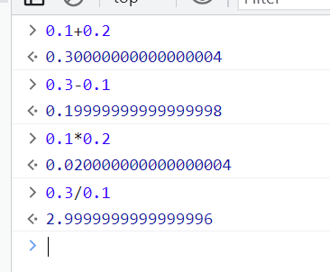

# js中数值计算封装

## 问题

js语言计算精度的有问题：



## 分析

原因在于JS采用IEEE754标准定义的64位浮点格式表示数字，所以JS中的所有数字都是浮点数，而且是一个近似值，计算的时候得出的也是近似值

## 解决

第一种、同时扩大倍数，计算完后再缩小倍数

```js
/**
 * 封装的加、减、乘、除函数
 */

function accAdd(num1, num2) {
    const num1Digits = (num1.toString().split('.')[1] || '').length;
    const num2Digits = (num2.toString().split('.')[1] || '').length;
    const baseNum = Math.pow(10, Math.max(num1Digits, num2Digits));
    return (Math.round(num1 * baseNum) + Math.round(num2 * baseNum)) / baseNum;
}

function accSubtract(num1, num2) {
  const num1Digits = (num1.toString().split('.')[1] || '').length;
  const num2Digits = (num2.toString().split('.')[1] || '').length;
  const baseNum = Math.pow(10, Math.max(num1Digits, num2Digits));
  return (Math.round(num1 * baseNum) - Math.round(num2 * baseNum)) / baseNum;
}


function accMultiply(num1, num2) {
    const num1Digits = (num1.toString().split('.')[1] || '').length;
    const num2Digits = (num2.toString().split('.')[1] || '').length;
    const baseNum = Math.pow(10, Math.max(num1Digits, num2Digits));
    return (Math.round(num1 * baseNum) * Math.round(num2 * baseNum)) / baseNum / baseNum;
}

function accDivide(num1, num2) {
  const num1Digits = (num1.toString().split('.')[1] || '').length;
  const num2Digits = (num2.toString().split('.')[1] || '').length;
  const baseNum = Math.pow(10, Math.max(num1Digits, num2Digits));
  return (Math.round(num1 * baseNum) / Math.round(num2 * baseNum)) / baseNum / baseNum;
}

```

第二种、使用[big.js](https://mikemcl.github.io/big.js/#)或者[mathjs](https://mathjs.org/index.html)
