# console使用方式

转诊地址：https://mp.weixin.qq.com/s/oWu0cLB1GnifT5-eGkA4TQ

console对于前端人员来讲肯定都不陌生，相信大部分开发者都会使用console来进行调试，但它能做的绝不仅限于调试。

## 最常见的控制台方法

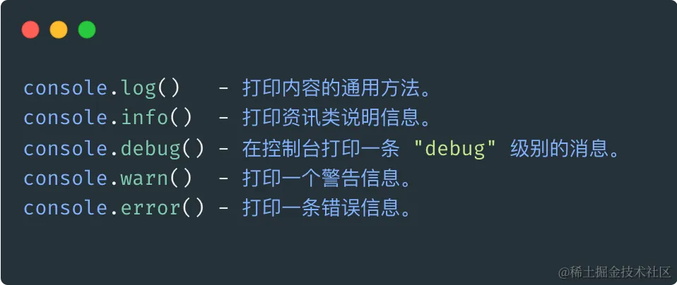

控制台打印结果：

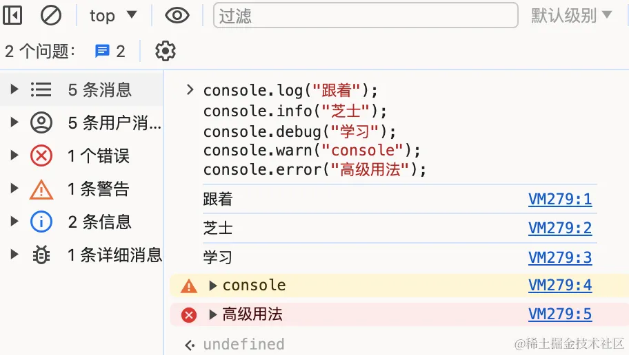

今天我要带大家认识的是一些 console 的高级用法。

首先，我们看一下 console 提供了哪些方法，在控制台打印一下：

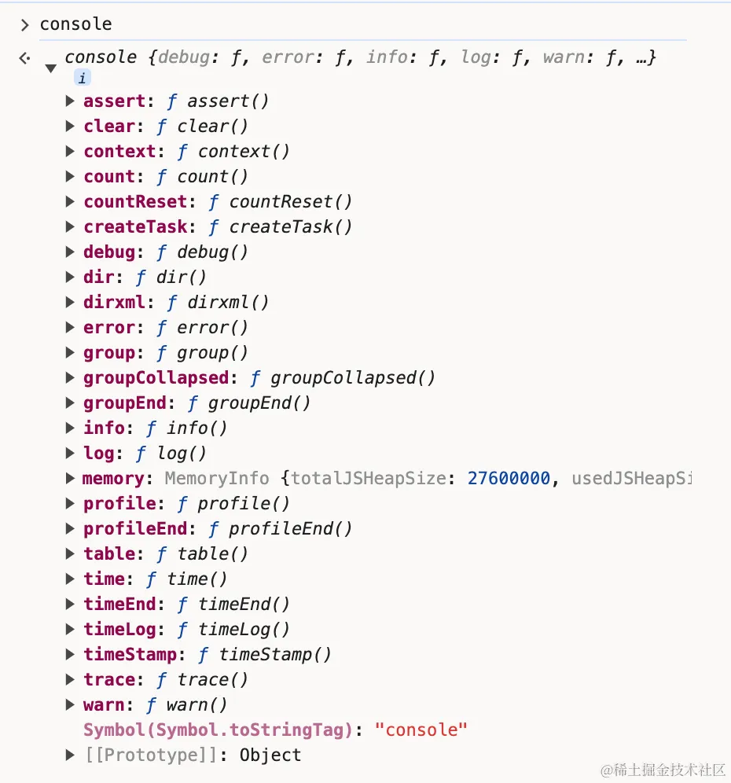

在 Chrome 123 版本，可以看到有 25 个方法。这篇文章将介绍一部分比较实用的方法， 了解专业的前端都怎么运用 console的。

## 打印时间

* console.time()– 使用输入参数的名称启动计时器。在给定页面上最多可以同时运行 10,000 个计时器。

* console.timeEnd()– 停止指定的计时器并记录自启动以来经过的时间（以毫秒为单位）。

常见的一种场景是计算程序执行时间，以跟踪操作所需的时间。这便可以通过使用console.time()启动计时器并传入标签，然后通过相同的标签使用console.timeEnd()结束计时器来实现。甚至还可以使用console.timeLog()在长时间运行的操作中添加标记。

```js
// 定义一个函数，模拟一个耗时的计算过程
function calculateSomething() {
  let sum = 0;
  for (let i = 0; i < 1000000000; i++) {
    sum += i;
  }
  return sum;
}

// 使用 console.time() 开始计时，并给计时器命名
console.time('Calculation Time');

// 执行耗时的函数
const result = calculateSomething();

// 使用 console.timeEnd() 结束计时，并打印经过的时间
console.timeEnd('Calculation Time');

// 如果在计算过程中想要添加额外的标记点，可以使用 console.timeLog()
console.time('Calculation Time');
console.log('中间点输出'); // 假设在某个中间点输出日志
console.timeLog('Calculation Time', '中间点标记'); // 添加标记

// 再次执行耗时的计算
calculateSomething();
console.timeEnd('Calculation Time'); // 结束计时
```

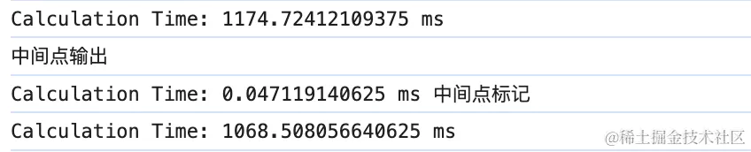

## 性能分析

我们已经知道通过 console.time() 和 console.timeEnd() 我们可以了解一段代码的运行时间。

但是，如果我们需要分析较为复杂的 JavaScript 逻辑代码，想要从中找出程序运行的性能瓶颈，假如继续使用 console.time() 方法，意味着我们需要大量的插入该方法，这显然是笨拙的，不推荐大家这么搞。

相对于复杂逻辑的 JavaScript 程序调优，此时 console.profile() 和 console.profileEnd() 便派上用场了。通过新建一个性能分析器(基于cpu的使用情况)，使之成为函数性能分析的利器。

用法和 console.time() 的一样，console.profile()开始，console.profileEnd()结束，需要传递一个参数作为标签使用，通俗来说，就是为这个性能分析器起个名字。看下如下代码，我们测试几种不同for循环书写方式的耗时情况：

```js
// 简单新建一个数组吧，新建一个一百万个成员为1的数组
let arr = new Array(1000000).fill(1);
    
// 第一种for循环书写方式    
function forFun1 () {
    for (let i = 0, len = arr.length; i < len; i++) {}
}

// 第二种for循环书写方式    
function forFun2 () {
    for (let i = arr.length; i --; ) {}
    forFun1();
}
// 第三种for循环书写方式  
function forFun3 () {
    for (let i = 0, item; item = arr[i++]; ) {}
}
// 执行三个函数  
function fun () {
  forFun1();
  forFun2();
  forFun3();
}

// 立即开始一个性能分析器
console.profile('测试for循环');
fun();
//
console.profileEnd('测试for循环');
```

打开控制台运行如上程序：

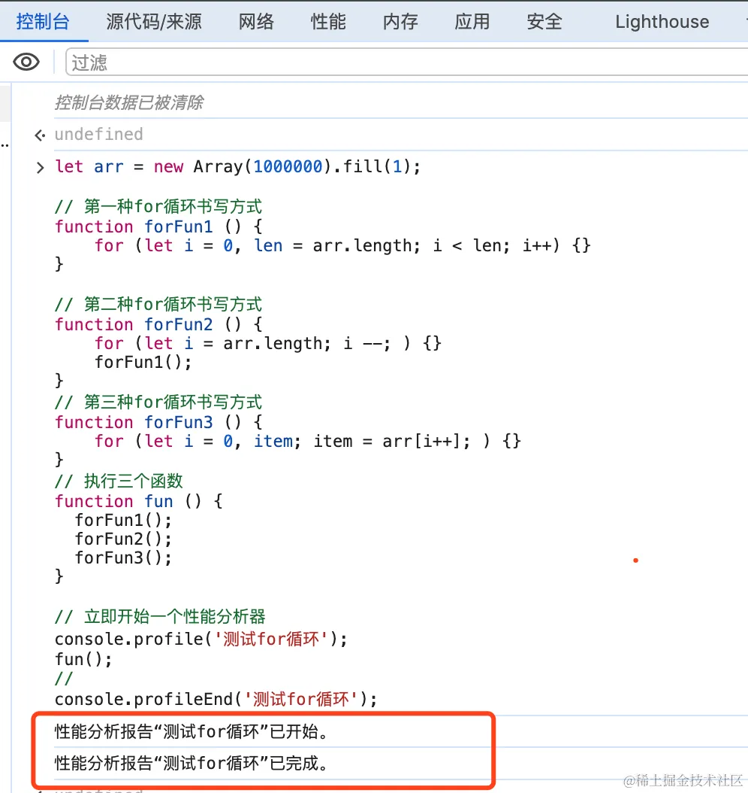

嗯，打印了两句话，性能分析器开启和结束。这就完了？？

在哪儿查看性能分析结果呢？别急，继续往下看⬇️

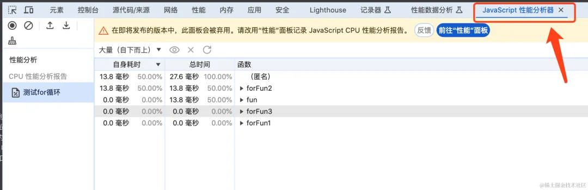

在控制台可以找到这个 javaScript性能分析器，英文 javaScript Profiler, 如果你在自己浏览器找不到， 可能是你没有启动这个试验性功能。

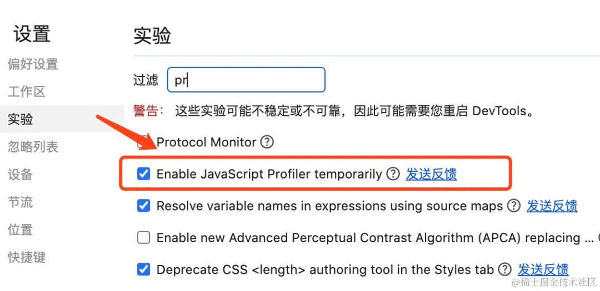

在设置中找到实验, 然后开启即可。

## 打印计次

console.count() 是一个在浏览器控制台中用于计数的 API，它允许开发者在调试过程中跟踪函数调用的次数或某些特定代码块的执行次数。

例如, 在React开发中， 想要跟踪一个子组件被渲染的次数：

```js

class MyComponent extends React.Component {
  render() {
    console.count('MyComponent 渲染次数');
    return (
      <div>这是一个组件</div>
    );
  }
}
```

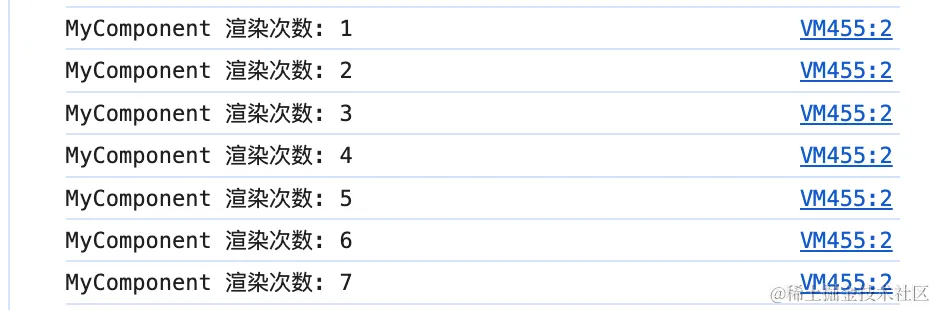

在这个例子中，每次 MyComponent 组件渲染时，控制台都会显示渲染次数的计数器。

## 堆栈跟踪

console.trace() 是一个非常有用的浏览器控制台方法，它可以在代码的特定位置插入一个跟踪点，然后输出一个堆栈跟踪，显示调用堆栈的每一层。这对于调试复杂的函数调用和理解代码执行流程非常有用。

举个例子，在React性能优化中，console.trace() 可以用来追踪性能瓶颈的来源。通过在关键的渲染或更新方法中插入跟踪点，可以了解哪些操作占用了大量时间

```js
class PerformanceComponent extends React.Component {
  shouldComponentUpdate(nextProps, nextState) {
    console.trace('shouldComponentUpdate 跟踪');
    return nextProps.data !== this.props.data;
  }

  componentDidUpdate(prevProps, prevState) {
    console.trace('componentDidUpdate 跟踪');
    // 执行更新后的操作
  }

  render() {
    const { data } = this.props;
    return (
      <div>数据: {data}</div>
    );
  }
}
```

## 打印表格

console.table()方法将对象/数组打印为格式整齐的表格，还是以上面dog对象为例：

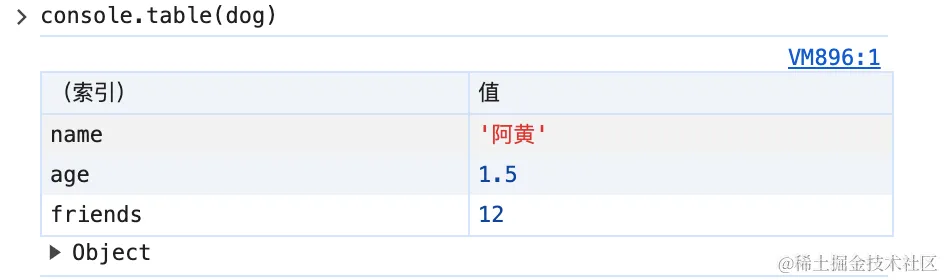

## 分组打印

当存在很多输出信息时，你可能想对它们进行组织。一个小而有用的工具是 console.group()和console.groupEnd()。所有在console.group和console.groupEnd之间的console调用都会被分组在一起。调用groupEnd()减少一个级别(回到上一个层级)。

```js
console.group('Console');
  console.log('warin', "警告");
  console.log('error', "错误");
  console.log('info', "提示");
  console.groupCollapsed('Log');
    console.log('%c 自定义样式', "color:red");
    console.log('%O', {a:1});
    console.log('%d', 12.1);
  console.groupEnd();
console.groupEnd();
```

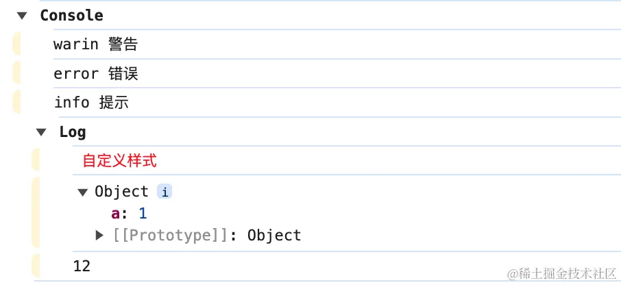

## console.log() 进阶

console.log() 除了上面说的基本用法，还支持下面这些输出方式。

### 自定义CSS样式输出

```js
console.log(`岁月神偷，歌手：%c 金玟岐 `, 'color: #fff;font-size:24px; background:#045133')
```

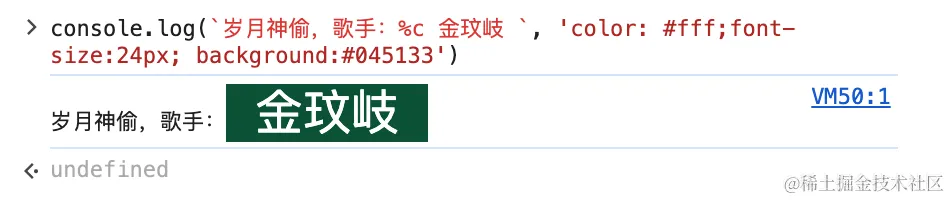

支持占位修饰符 %c来自定义样式。

### 格式化输出内容

输出格式化的字符串，除了使用占位符 %c来定义 css样式， 还支持以下几种占位符:

| 占位符          | 描述            |

|-------------  |---------------- |

| %s    | 字符串 |

| %d / %i    | 整数 |

| %%f    | 浮点数 |

| %o / /%O    | object对象 |
	
```js
const dog = {
    name:"阿黄",
    age: 1.5,
    friends: 12
}
console.log('名字: %s, 年龄: %f, 好友:%d ',dog.name, dog.age, dog.friends)

// 输出：名字: 阿黄, 年龄: 1.5, 好友数:12
```

%o / /%O 虽然都指对象，但%o 表示DOM对象:

::: tip 备注
占位符这种写法在复杂的输出时，能保证模板和数据分离，结构更加清晰。
:::
