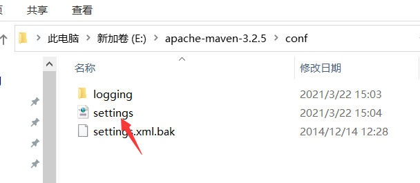
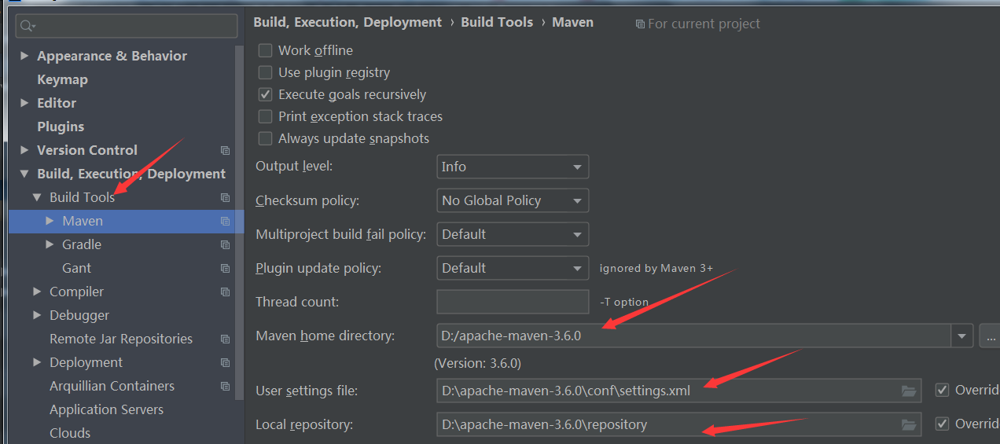

# 修改maven仓库路径

maven默认仓库路径在C盘\用户名\.m2文件夹里，时间越长文件夹越大，所以换到其他文件夹

自定义的仓库文件夹：E:\apache-maven-3.2.5\localRepository

打开E:\apache-maven-3.2.5\conf\settings文件



找到：localRepository，修改为自定义的位置

```xml
  <localRepository>E:\apache-maven-3.2.5\localRepository</localRepository>
```

在IDEA里面进行配置


