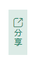

# 实现分享功能

小程序里的[分享功能](https://developers.weixin.qq.com/miniprogram/dev/framework/open-ability/share.html#%E4%BD%BF%E7%94%A8%E6%8C%87%E5%BC%95)，有俩种：

* 点击右上角三点分享
* 页面内分享

[onShareAppMessage](https://developers.weixin.qq.com/miniprogram/dev/reference/api/Page.html#onshareappmessageobject-object)

监听用户点击页面内转发按钮（button 组件 open-type="share"）或右上角菜单“转发”按钮的行为，并自定义转发内容。

```js
Page({
  onShareAppMessage() {
    const promise = new Promise(resolve => {
      setTimeout(() => {
        resolve({
          title: '自定义转发标题'
        })
      }, 2000)
    })
    return {
      title: '自定义转发标题',
      path: '/page/user?id=123',
      promise 
    }
  }
})
```

## 自定义组件内分享

微信小程序里，要想在页面实现自定义的组件分享，必须用button组件，但button组件样式难看，想自定义样式，有以下集中方式：

* 直接修改button样式

难度大，而且效果也不好看

* 隐藏button，在上面悬浮一层样式

这种方式项目里常用，点击还是button组件

* 使用UI组件库

如果是微信小程序原生开发，推荐使用lin-ui组件库里的[button组件](https://doc.mini.talelin.com/component/basic/button.html#%E6%8C%89%E9%92%AE%E5%BE%AE%E4%BF%A1%E5%BC%80%E6%94%BE%E8%83%BD%E5%8A%9B)

```
<l-button special open-type="share">
    <view class="inner">
        <l-icon color="#157658" name="share" size="24"></l-icon>
        <text>分</text>
        <text>享</text>
    </view>
</l-button>
```

效果如下：



::: tip 备注
一、要设置special属性，这样就可以使用插槽

二、使用插槽自定义样式
:::

::: tip 备注
在页面里实现分享和点击右上角三点分享，都是触发onShareAppMessage方法的，在这个方法里可以自定义分享的标题、转发路径、图片
:::


