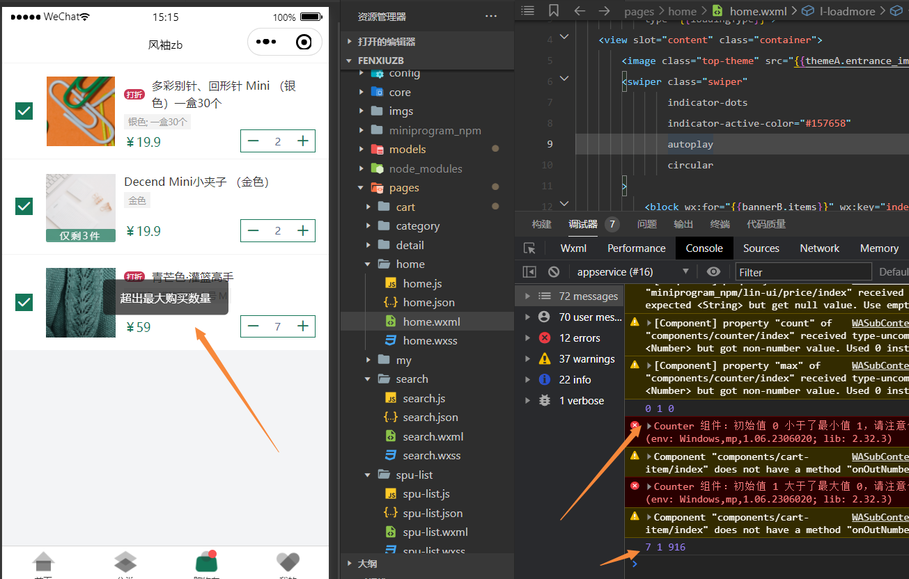

# 不稳定变量引起的问题

## 问题描述



刚进入购物车页面，会弹出错误提示：超出最大购买数量

## 调试过程

1、先打开counter组件：

```wxml
<l-counter l-count-class="all-background input-size"
           l-symbol-class="all-background font-color"
           l-disabled-class="all-background"
           l-class="container"
           count = "{{count}}"
           min = "{{min}}"
           max = "{{max}}"
           bind:linout="onOverStep"
>

</l-counter>

```

上面的错误提示是说count值大于max值

2、打开count.js文件

```js
Component({
  /**
   * 组件的属性列表
   */
  properties: {
    count: {
      type: Number,
      value: 1
    },
    min: {
      type: Number,
      value: 77
    },
    max: {
      type: Number,
      value: 77
    }
  },
  observers: {
    'count, min, max': function (count, min, max) {
      console.log(count, min, max)
    }
  }
})

```

可以看见count、min、max是在properties里定义的，并且有默认值

新加observers，输出count、min、max，可以看到结果有俩次，第一次是0 1 0，第二次是7 1 916

::: tip 备注
第一次输出count和max值不对，min的默认值正确，就是在count.js定义的默认值
:::

这时我们可以确定是第一次值引起的错误提示，现在打开父组件cartItem.wxml，看引用count的代码

3、打开cartItem.wxml和cartItem.js  

```wxml
<s-counter bind:linout="onOutNumber"
           bind:lintap="onSelectCount"
           max="{{cartItem.sku.stock}}"
           count="{{cartItem.count}}">
</s-counter>
```

```wxml
  properties: {
    cartItem: Object
  },
```

把max和count传的值改成固定数字传入，测试正常

那就是传入值引起的错误，即cartItem.sku.stock和cartItem.count

## 结论

1、自定义组件，如果有组件使用这个组件的时候，没有设置这个属性，那就会取默认值，但如果设置了属性，就不会再取默认值

2、因为cartItem也是父组件传递的，一开始的时候是空，所以cartItem.sku.stock就不存在，这时候会给count和max设置类型的默认值0（count和max是Number默认值是0）

## 解决办法

在父组件（cartItem.wxml）里定义count和max对应的变量stock和skuCount，设置默认值并赋值给count组件，当cartItem变量有值以后，再赋值给stock和skuCount

```wxml
 <s-counter bind:linout="onOutNumber"
            bind:lintap="onSelectCount"
            max="{{stock}}"
            count="{{skuCount}}">
</s-counter>       
```

```js
data: {
    stock: Cart.SKU_MAX_COUNT,
    skuCount: 1
},

observers: {
  cartItem: function (cartItem) {
    if (!cartItem) {
      return
    }
    
    this.setData({
      stock: cartItem.sku.stock,
      skuCount: cartItem.count
    })
  }
},
```

## 总结

在小程序里，定义的变量会setData俩次，第一次是初始化的时候，第二次是接口请求返回后赋值

如果把变量传递给子组件，那有可能会在第一次初始化的时候报错

对于这种情况，我们可以定义变量并设置默认值，当接口请求返回后，再重新赋值

::: tip 备注
上面的问题是小程序里出现的，我觉得在Vue里，也会有同样的问题
:::
