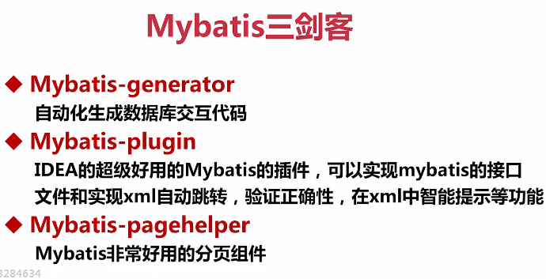
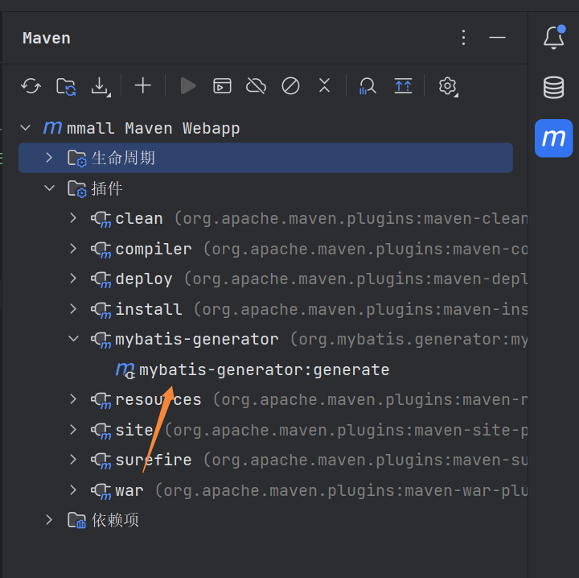
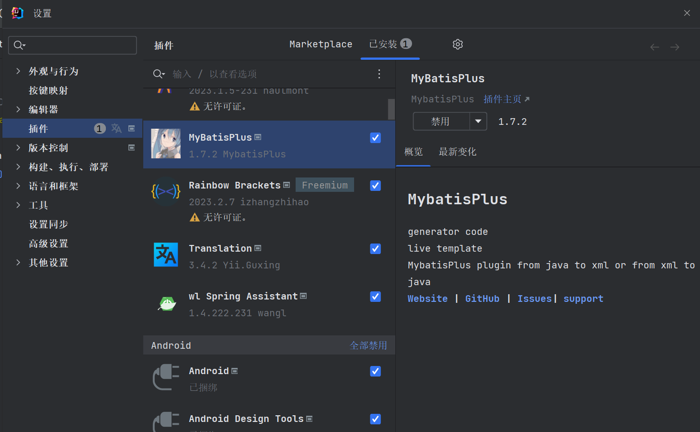

# mybatis三剑客



## mybatis-generator

### 作用

根据表自动生成pojo、dao、mappers

### 配置

1、新建pojo、dao文件夹

2、在resources文件夹下新建mappers文件夹

3、在resources文件夹下创建generatorConfig.xml，里面放置配置文件

```xml
<?xml version="1.0" encoding="UTF-8"?>
<!DOCTYPE generatorConfiguration
        PUBLIC "-//mybatis.org//DTD MyBatis Generator Configuration 1.0//EN"
        "http://mybatis.org/dtd/mybatis-generator-config_1_0.dtd">

<generatorConfiguration>
    <!--导入属性配置-->
    <properties resource="datasource.properties"/>

    <!--指定特定数据库的jdbc驱动jar包的位置-->
    <classPathEntry location="E:\apache-maven-3.9.1\localRepository\mysql\mysql-connector-java\5.1.6\mysql-connector-java-5.1.6.jar"/>

    <context id="default" targetRuntime="MyBatis3">

        <!-- optional，旨在创建class时，对注释进行控制 -->
        <commentGenerator>
            <property name="suppressDate" value="true"/>
            <property name="suppressAllComments" value="true"/>
        </commentGenerator>

        <!--jdbc的数据库连接 -->
        <jdbcConnection
                driverClass="${db.driverClassName}"
                connectionURL="${db.url}"
                userId="${db.username}"
                password="${db.password}">
        </jdbcConnection>


        <!-- 非必需，类型处理器，在数据库类型和java类型之间的转换控制-->
        <javaTypeResolver>
            <property name="forceBigDecimals" value="false"/>
        </javaTypeResolver>


        <!-- Model模型生成器,用来生成含有主键key的类，记录类 以及查询Example类
            targetPackage     指定生成的model生成所在的包名
            targetProject     指定在该项目下所在的路径
        -->
        <!--<javaModelGenerator targetPackage="com.mmall.pojo" targetProject=".\src\main\java">-->
        <javaModelGenerator targetPackage="com.mmall.pojo" targetProject="./src/main/java">
            <!-- 是否允许子包，即targetPackage.schemaName.tableName -->
            <property name="enableSubPackages" value="false"/>
            <!-- 是否对model添加 构造函数 -->
            <property name="constructorBased" value="true"/>
            <!-- 是否对类CHAR类型的列的数据进行trim操作 -->
            <property name="trimStrings" value="true"/>
            <!-- 建立的Model对象是否 不可改变  即生成的Model对象不会有 setter方法，只有构造方法 -->
            <property name="immutable" value="false"/>
        </javaModelGenerator>

        <!--mapper映射文件生成所在的目录 为每一个数据库的表生成对应的SqlMap文件 -->
        <!--<sqlMapGenerator targetPackage="mappers" targetProject=".\src\main\resources">-->
        <sqlMapGenerator targetPackage="mappers" targetProject="./src/main/resources">
            <property name="enableSubPackages" value="false"/>
        </sqlMapGenerator>

        <!-- 客户端代码，生成易于使用的针对Model对象和XML配置文件 的代码
                type="ANNOTATEDMAPPER",生成Java Model 和基于注解的Mapper对象
                type="MIXEDMAPPER",生成基于注解的Java Model 和相应的Mapper对象
                type="XMLMAPPER",生成SQLMap XML文件和独立的Mapper接口
        -->

        <!-- targetPackage：mapper接口dao生成的位置 -->
        <!--<javaClientGenerator type="XMLMAPPER" targetPackage="com.mmall.dao" targetProject=".\src\main\java">-->
        <javaClientGenerator type="XMLMAPPER" targetPackage="com.mmall.dao" targetProject="./src/main/java">
            <!-- enableSubPackages:是否让schema作为包的后缀 -->
            <property name="enableSubPackages" value="false" />
        </javaClientGenerator>


        <table tableName="mmall_shipping" domainObjectName="Shipping" enableCountByExample="false" enableUpdateByExample="false" enableDeleteByExample="false" enableSelectByExample="false" selectByExampleQueryId="false"/>
        <table tableName="mmall_cart" domainObjectName="Cart" enableCountByExample="false" enableUpdateByExample="false" enableDeleteByExample="false" enableSelectByExample="false" selectByExampleQueryId="false"/>
        <table tableName="mmall_cart_item" domainObjectName="CartItem" enableCountByExample="false" enableUpdateByExample="false" enableDeleteByExample="false" enableSelectByExample="false" selectByExampleQueryId="false"/>
        <table tableName="mmall_category" domainObjectName="Category" enableCountByExample="false" enableUpdateByExample="false" enableDeleteByExample="false" enableSelectByExample="false" selectByExampleQueryId="false"/>
        <table tableName="mmall_order" domainObjectName="Order" enableCountByExample="false" enableUpdateByExample="false" enableDeleteByExample="false" enableSelectByExample="false" selectByExampleQueryId="false"/>
        <table tableName="mmall_order_item" domainObjectName="OrderItem" enableCountByExample="false" enableUpdateByExample="false" enableDeleteByExample="false" enableSelectByExample="false" selectByExampleQueryId="false"/>
        <table tableName="mmall_pay_info" domainObjectName="PayInfo" enableCountByExample="false" enableUpdateByExample="false" enableDeleteByExample="false" enableSelectByExample="false" selectByExampleQueryId="false"/>
        <table tableName="mmall_product" domainObjectName="Product" enableCountByExample="false" enableUpdateByExample="false" enableDeleteByExample="false" enableSelectByExample="false" selectByExampleQueryId="false">
            <columnOverride column="detail" jdbcType="VARCHAR" />
            <columnOverride column="sub_images" jdbcType="VARCHAR" />
        </table>
        <table tableName="mmall_user" domainObjectName="User" enableCountByExample="false" enableUpdateByExample="false" enableDeleteByExample="false" enableSelectByExample="false" selectByExampleQueryId="false"/>


        <!-- geelynote mybatis插件的搭建 -->
    </context>
</generatorConfiguration>
```

datasource.properties文件，配置数据库等其他信息，供generatorConfig.xml文件使用

```
db.driverClassName=com.mysql.jdbc.Driver

db.url=jdbc:mysql://127.0.0.1:3306/mmall?characterEncoding=utf-8
db.username=
db.password=


db.initialSize = 20
db.maxActive = 50
db.maxIdle = 20
db.minIdle = 10
db.maxWait = 10
db.defaultAutoCommit = true
db.minEvictableIdleTimeMillis = 3600000

```

::: tip 备注
jdbc驱动jar包的配置放在了generatorConfig.xml中，因为放在datasource.properties中的话，获取不到
:::

4、打开右侧M标志，在插件里找到mybatis-generator，双击，生成相应的文件



## mybatis-plugin

IDEA超级好用的mybatis插件，可以实现mybatis的接口文件和实现xml自动跳转，验证正确性，在xml中智能提示等功能

在插件里面搜索MyBatisPlus安装就可以



## mybatis-pageHelper

[mybatis-pageHelper](https://github.com/pagehelper/Mybatis-PageHelper/blob/master/wikis/zh/HowToUse.md)是非常好用的分页组件

使用方法：

1、引入分页插件

（1）、使用 Maven

在 pom.xml 中添加如下依赖：

```xml
<dependency>
    <groupId>com.github.pagehelper</groupId>
    <artifactId>pagehelper</artifactId>
    <version>最新版本</version>
</dependency>
```

（2）、使用 Gradle

在 build.gradle 中添加：

```
dependencies {
    compile("com.github.pagehelper:pagehelper:最新版本")
}
```

（3）、使用 Spring Boot 时

Maven：

```xml
<dependency>
    <groupId>com.github.pagehelper</groupId>
    <artifactId>pagehelper-spring-boot-starter</artifactId>
    <version>最新版本</version>
</dependency>
```

Gradle:

```
dependencies {
    compile("com.github.pagehelper:pagehelper-spring-boot-starter:最新版本")
}
```

2、配置拦截器插件

特别注意，新版拦截器是 com.github.pagehelper.PageInterceptor。 com.github.pagehelper.PageHelper 现在是一个特殊的 dialect 实现类，是分页插件的默认实现类，提供了和以前相同的用法。

（1）、 在 MyBatis 配置 xml 中配置拦截器插件

```xml
<!--
    plugins在配置文件中的位置必须符合要求，否则会报错，顺序如下:
    properties?, settings?,
    typeAliases?, typeHandlers?,
    objectFactory?,objectWrapperFactory?,
    plugins?,
    environments?, databaseIdProvider?, mappers?
-->
<plugins>
    <!-- com.github.pagehelper为PageHelper类所在包名 -->
    <plugin interceptor="com.github.pagehelper.PageInterceptor">
        <!-- 使用下面的方式配置参数，后面会有所有的参数介绍 -->
        <property name="param1" value="value1"/>
    </plugin>
</plugins>
```

（2）. 在 Spring 配置文件中配置拦截器插件

使用 spring 的 XML 配置方式，可以使用 plugins 属性像下面这样配置：

```xml
<bean id="sqlSessionFactory" class="org.mybatis.spring.SqlSessionFactoryBean">
  <!-- 注意其他配置 -->
  <property name="plugins">
    <array>
      <bean class="com.github.pagehelper.PageInterceptor">
          <property name="properties">
              <!--使用下面的方式配置参数，一行配置一个 -->
              <value>
                  params=value1
              </value>
          </property>
      </bean>
    </array>
  </property>
</bean>
```

项目地址：[https://github.com/zhaobao1830/mmall/blob/master/src/main/resources/applicationContext-datasource.xml](https://github.com/zhaobao1830/mmall/blob/master/src/main/resources/applicationContext-datasource.xml)

```xml
<bean id="sqlSessionFactory" class="org.mybatis.spring.SqlSessionFactoryBean">
        <property name="dataSource" ref="dataSource"/>
        <property name="mapperLocations" value="classpath*:mappers/*Mapper.xml"/>

        <!-- 分页插件 -->
        <property name="plugins">
            <array>
                <bean class="com.github.pagehelper.PageInterceptor">
                    <property name="properties">
                        <value>
                            dialect=mysql
                        </value>
                    </property>
                </bean>
            </array>
        </property>

    </bean>
```

::: tip 备注
详细的文档请参考：[https://github.com/pagehelper/Mybatis-PageHelper/blob/master/wikis/zh/HowToUse.md](https://github.com/pagehelper/Mybatis-PageHelper/blob/master/wikis/zh/HowToUse.md)
:::


（3）. 在 Spring Boot 中配置

Spring Boot 引入 starter 后自动生效，对分页插件进行配置时，在 Spring Boot 对应的配置文件 application.[properties|yaml] 中配置：

properties:

```
pagehelper.propertyName=propertyValue
pagehelper.reasonable=false
pagehelper.defaultCount=true
```

yaml:

```yaml
pagehelper:
  propertyName: propertyValue
  reasonable: false
  defaultCount: true # 分页插件默认参数支持 default-count 形式，自定义扩展的参数，必须大小写一致
```
