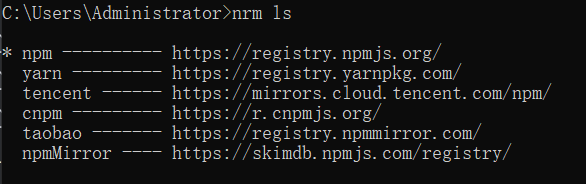

# 查看和操作源

## 使用npm

查看当前源：

```npm
npm get registry
```

设置淘宝镜像源：

```npm
npm config set registry http://registry.npm.taobao.org
```

设置官方源：

```npm
npm config set registry http://www.npmjs.org
```

## 使用nrm

通过npm安装nrm

```npm
npm i -g nrm
```

查看可以使用的源列表

```npm
nrm ls
```



**前面的*表示当前正在使用的源**

::: tip 备注

**v1.2.5版本会出现前面没有*，可以这样修改：**

在nrm安装目录下找到cli.js（C:\Users\Administrator\AppData\Roaming\nvm\v16.17.0\node_modules\nrm）

修改代码，把&&修改为||

```js
// 源代码
config(attrs, registry).then(() => {
                console.log('                        ');
                const newR = npm.config.get(FIELD_REGISTRY);
                var customRegistries = getCustomRegistry();
                Object.keys(customRegistries).forEach(key => {
                    delete customRegistries[key][FIELD_IS_CURRENT];
                });
                if (hasOwnProperty(customRegistries, name) && (name in registries || customRegistries[name].registry === registry.registry)) {
                    registry[FIELD_IS_CURRENT] = true;
                    customRegistries[name] = registry;
                }
                setCustomRegistry(customRegistries);
                printMsg(['', '   Registry has been set to: ' + newR, '']);
            }).catch(err => {
                exit(err);
            })
```

```js
// 修改后
config(attrs, registry).then(() => {
                console.log('                        ');
                const newR = npm.config.get(FIELD_REGISTRY);
                var customRegistries = getCustomRegistry();
                Object.keys(customRegistries).forEach(key => {
                    delete customRegistries[key][FIELD_IS_CURRENT];
                });
                if (hasOwnProperty(customRegistries, name) || (name in registries || customRegistries[name].registry === registry.registry)) {
                    registry[FIELD_IS_CURRENT] = true;
                    customRegistries[name] = registry;
                }
                setCustomRegistry(customRegistries);
                printMsg(['', '   Registry has been set to: ' + newR, '']);
            }).catch(err => {
                exit(err);
            })
```

v1.2.6版本如果不显示*，可以执行下nrm use taobao(或者其他源都可以)，这样就会正常显示
:::

切换源

```npm
nrm use xx
```


