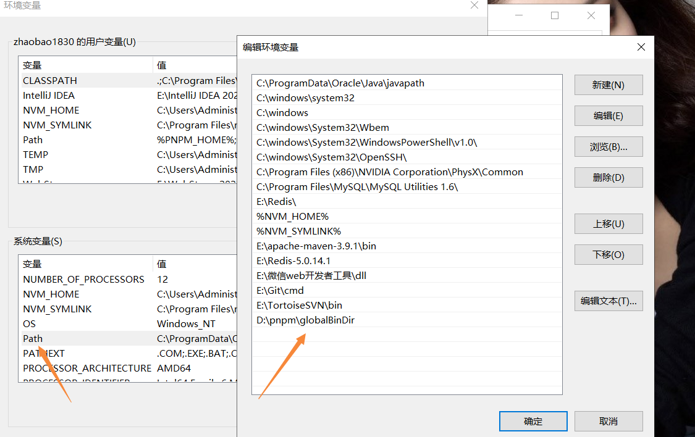

# pnpm add -g pnpm报错解决方案

## 报错

使用pnpm的时候，提示有最新版本，执行pnpm add -g pnpm后报如下错误：

```
ERROR Unable to find the global bin directory
Run "pnpm setup" to create it automatically, 
or set the global-bin-dir setting, 
or the PNPM_HOME env variable. The global bin directory should be in the PATH.

```

## 解决办法

1、在cmd中执行以下命令

```
pnpm config set store-dir "D:\pnpm\storeDir" # pnpm全局仓库路径(类似 .git 仓库)
pnpm config set global-dir "D:\pnpm\globalDir" # pnpm全局安装路径
pnpm config set global-bin-dir "D:\pnpm\globalBinDir" # pnpm全局bin路径
pnpm config set state-dir "D:\pnpm\state" # pnpm创建pnpm-state.json文件的目录
pnpm config set cache-dir "D:\pnpm\cache" # pnpm全局缓存路径

```

2、在环境变量中配置路径



3、执行pnpm add -g pnpm更新pnpm
