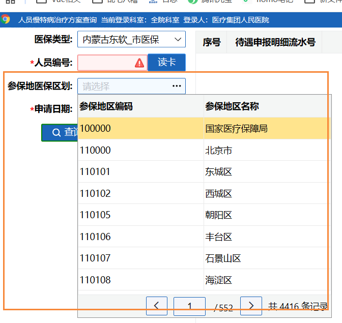

# 参保地医保区划



收费项目有多个页面使用参保地医保区划选择框，将相关的代码抽取为公共文件

## 文件地址

`@/applications/charge/webservice/med/otherOperation/personnelChronicDiseaseTreatmentInquiry/use-insured.js`

## 使用

1、引入use-insured文件

```js
import useInsured from '@/applications/charge/webservice/med/otherOperation/personnelChronicDiseaseTreatmentInquiry/use-insured.js'
```

2、注册页面使用的变量和方法

```js
// 参保地医保区划方法
const {
  insured,
  handelInsuAdmdvsPage
} = useInsured(queryParams)
```

3、template里使用组件

```textmate
<his-form-item label="参保地医保区划" labelwidth="120">
              <his-pop-table
                v-model="queryParams.insuAdmdvs"
                isshow
                :columns="insured.tableColumn"
                :data="insured.tableData"
                value-key="dicCode"
                label-key="dicName"
                :total="insured.total"
                width="400px"
                :loading="insured.loading"
                @page-change="handelInsuAdmdvsPage"
              />
            </his-form-item>
```

::: tip 备注
queryParams.insuAdmdvs是定义好的参保地医保区划的值

dicCode和dicName是接口返回的数据格式
:::

## 公共文件代码

```js
// 参保地医保区划相关方法
import {reactive, ref} from 'vue'
import { queryPageMedDicsApi } from '@/api/charge/in/admissionRegister'

export default function useInsured(queryParams) {
  // 参保地医保区划pop数据
  const insured = reactive({
    tableColumn: [
      { field: "dicCode", title: "参保地区编码" },
      { field: "dicName", title: "参保地区名称" },
    ],
    tableData: [],
    total: 0,
    loading: false,
    pageNum: 1,
    pageSize: 5,
    keyword: ''
  })

  // 参保地医保区划分页方法
  function handelInsuAdmdvsPage(condition, currentPage, pageSize) {
    insured.pageNum = currentPage
    insured.pageSize = pageSize
    insured.keyword = condition
    queryPageMedDics()
  }

  // 获取参保地医保区划数据
  function queryPageMedDics() {
    const param = {
      pageNum: insured.pageNum,
      pageSize: insured.pageSize,
      medInsurType: queryParams.value.medicalInsuranceType,
      dicType: 'insuplc_admdvs',
      keyword: insured.keyword
    }

    queryPageMedDicsApi(param).then((res) => {
      insured.tableData = res.data.rows
      insured.total = res.data.total
    })
  }

  return {
    insured,
    handelInsuAdmdvsPage
  }
}
```