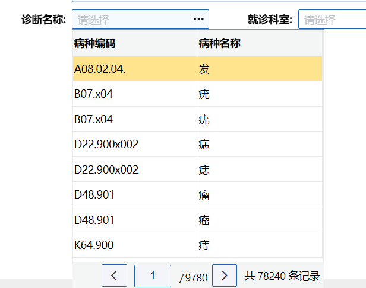
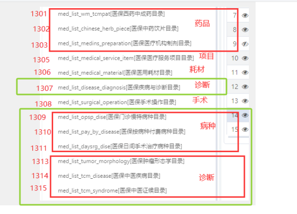

# charge（收费）项目中的诊断选择功能



收费项目有多个页面使用诊断选择框，将相关的代码抽取为公共文件

## 文件地址

charge（收费）项目中

`@/applications/charge/webservice/med/otherOperation/filingWithdraw/use-dise.js`

## 使用

1、引入use-insured文件

```js
import useDise from '@/applications/charge/webservice/med/otherOperation/filingWithdraw/use-dise.js'
```

2、注册页面使用的变量和方法

参考页面地址：

charge项目 `@/applications/charge/webservice/med/otherOperation/twoDiseasesOutpatientManagement/components/addOtherComponent.vue`

```js
// 诊断
const {
  medDiseaseCategoryPopObj,
  handelDiseCodepage
} = useDise({
  // 当前选择的医保类型数据
  currentMedicalObj: props.currentMedicalObj
})
```

3、template里使用组件

```textmate
<his-pop-table
            v-model="form.diseCode"
            v-model:label="form.diseName"
            isshow
            :columns="medDiseaseCategoryPopObj.tableColumn"
            :data="medDiseaseCategoryPopObj.tableData"
            value-key="diseCode"
            label-key="diseName"
            :total="medDiseaseCategoryPopObj.total"
            :loading="medDiseaseCategoryPopObj.loading"
            @page-change="handelDiseCodepage"
          />
```

## 公共文件代码

transNos的参数



```js
// 诊断相关方法
import {reactive} from 'vue'
import {medDiseaseCategoryPopApi} from '@/api/pay/medicareSettlement.js'

export default function useDise(paramObj) {
  const medDiseaseCategoryPopObj = reactive({
    tableColumn: [
      { field: 'diseCode', title: '病种编码' },
      { field: 'diseName', title: '病种名称' },
    ],
    tableData: [],
    total: 0,
    loading: false,
    pageNum: 1,
    pageSize: 5,
    userName: ''
  })

  function handelDiseCodepage(condition, currentPage, pageSize) {
    medDiseaseCategoryPopObj.pageNum = currentPage
    medDiseaseCategoryPopObj.pageSize = pageSize
    medDiseaseCategoryPopObj.userName = condition
    handleMedDiseaseCategoryPop()
  }

  function handleMedDiseaseCategoryPop() {
    let transNos = ['1307', '1309', '1310', '1311', '1313', '1314', '1315']
    medDiseaseCategoryPopObj.tableData = []
    medDiseaseCategoryPopApi({
      medicalInsuranceType: paramObj.currentMedicalObj.tagName,
      pageNum: medDiseaseCategoryPopObj.pageNum,
      pageSize: medDiseaseCategoryPopObj.pageSize,
      keyword: medDiseaseCategoryPopObj.userName,
      transNos: transNos,
    }).then((res) => {
      medDiseaseCategoryPopObj.tableData = res.rows
      medDiseaseCategoryPopObj.total = res.total
    })
  }

  return {
    medDiseaseCategoryPopObj,
    handelDiseCodepage
  }
}

```
