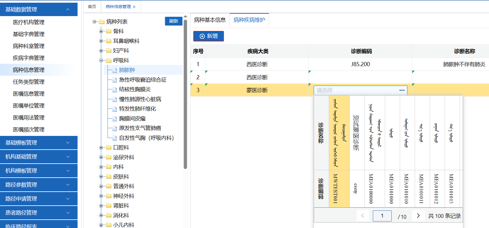
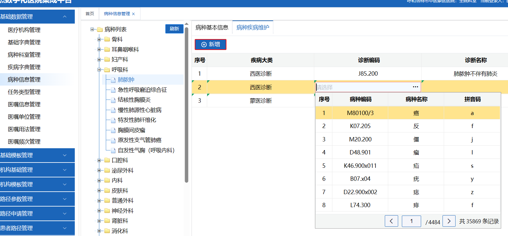

# his组件使用笔记

## his-grid

```textmate
<his-grid
  ref="gridMainRef"
  :columns="tableColumn"
  :data="tableData"
  :show-footer="false"
  :pager-config="pagerConfig"
  @page-change="handlePageChanged"
  style="overflow-y: hidden; flex: 1"
>
</his-grid>
```

### 合计
需要配置下面的三个属性，如果值显示的位置不对，查看footerspanmethod是否配置不对
```
:footer-span-method="footerspanmethod"
:show-footer="true"
:footer-data="footerData"
```

参考参考cp（临床路径项目） `pathComprehensiveQuery/pathUsageAnalysis/index.vue`页面

### 手动选中某一行

`$table.setCurrentRow(index)`

### 获取所有数据

`gridMainRef.value.grid.grid.getTableData().fullData`

### 获取选中的数据

`$gridMainRef.value.grid.grid.getCheckboxRecords()`

## his-edit-grid

### 例子

```textmate
<div>
  <his-type-button
    type="add"
    name="新增"
    @click="handleAdd"
  />
  <his-type-button
    type="del"
    isLoading="true"
    name="删除"
    @click="handleDel"
  />  
</div>    
<his-edit-grid
  ref="xGrid"
  v-bind="xGridOptions"
  :is-jump="true"
  :jump-columns="jumpColumns"
  :add-row-data="setnewRecord"
  @cell-click="cellClick"
>
</his-edit-grid>
```
his-edit-grid一般会和新增、删除按钮一起存在

### xGridOptions

显示内容的配置

### 按回车键每行切换/新增新列

需要配置is-jump和jump-columns

is-jump 开启隔列跳转

jump-columns 跳转的列

参考cp（临床路径项目）下的`applications/chineseHerbalMedicine/index.vue`页面

### 获取seq值

his-edit-grid组件里的seq值为虚拟值，想要获取，可以使用如下代码

```js
// 获取vue-grid的ref
const $table = xGrid.value.grid.grid;
// getTableData是vxe-grid提供的方法，获取grid里的所有值
arr = $table.getTableData().fullData;
// 使用vxe-grid提供的getRowSeq方法，可以获取到对应的seq值
// 获取到每行对应的seq值，赋值为seq
arr.forEach(row => {
  row.seq = $table.getRowSeq(row)
});
```

## his-type-date-picker

参考cp（临床路径项目） `pathComprehensiveQuery/analysisOfNormalOutlets/index.vue`页面

```textmate
 <his-type-date-picker
   ref="datePickerRef"
   v-model:startValue="inPathDateStart"
   :start-time="inPathDateStart"
   v-model:endValue="inPathDateEnd"
   :end-time="inPathDateEnd"
   type="range"
   format="yyyy-MM-dd"
/>
```

::: tip 备注
如果设置了默认值，但点击输入框的时候切换成了当前时间，大概率是设置的默认值格式有问题
:::

## his-type-mongolia-pop

### 蒙药诊断选择

参考cp（临床路径项目）`diagnosis/index.vue`页面

```textmate
<his-type-mongolia-pop
  style="width: 250px"
  isRetain
  v-model:label="row.zdCode"
  type="diagnosis"
  from="diagnosticEntry"
  :wtype="5"
  :params="{ isPathologyDiagnosis: 0 }"
  :disabled="row.diseaseBigType === ''"
  @onSelect="handelDiagDictClick($event, row)"
  @handleClear=" handleDialogClear($event, row)"
  />
```



西医诊断选择也是这个页面

```textmate
<his-pop-table
  v-model:label="row.zdCode"
  isshow
  :columns="tableDisColumn"
  :data="diseaseList"
  :pager-config="queryPopParams"
  :total="queryPopParams.total"
  value-key="name"
  label-key="code"
  @page-change="handelpage"
  @handle-focus="handleFocus(row)"
  @onSelect="popselect($event, row)"
  width="480px"
  style="width: 100%"
/>
```


