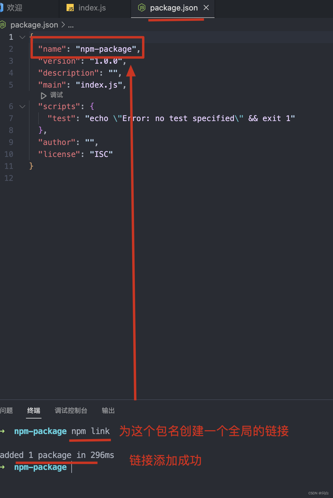
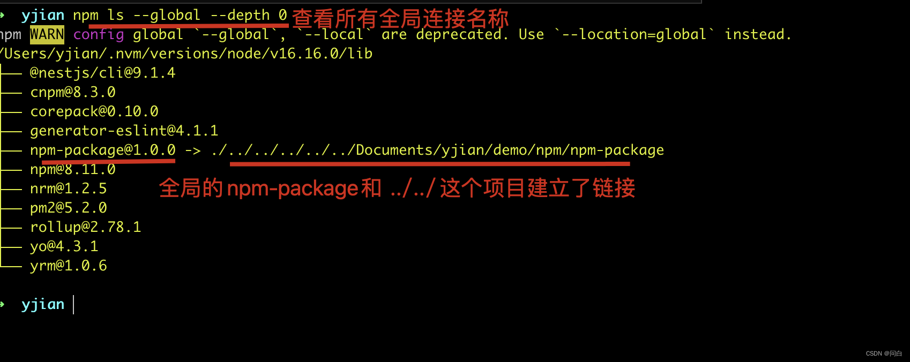
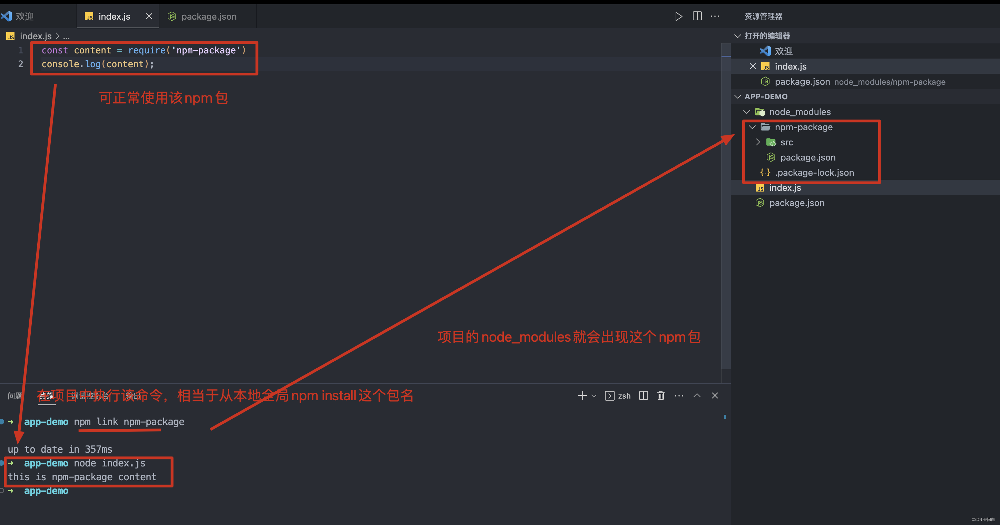
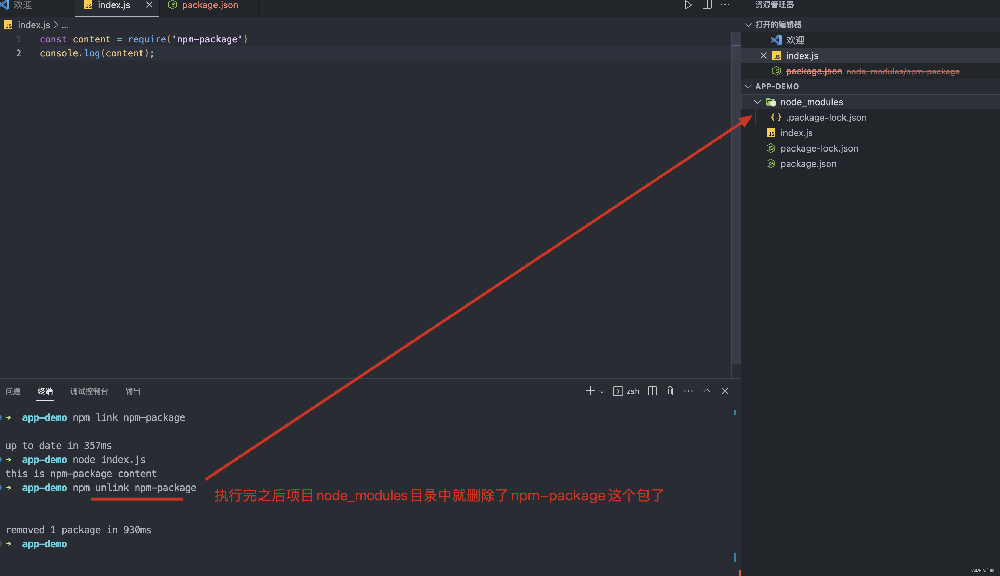
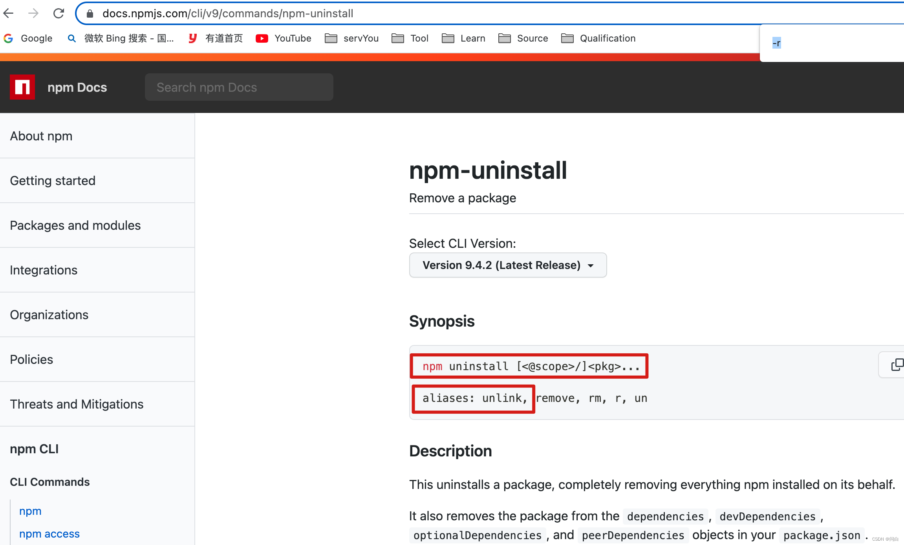
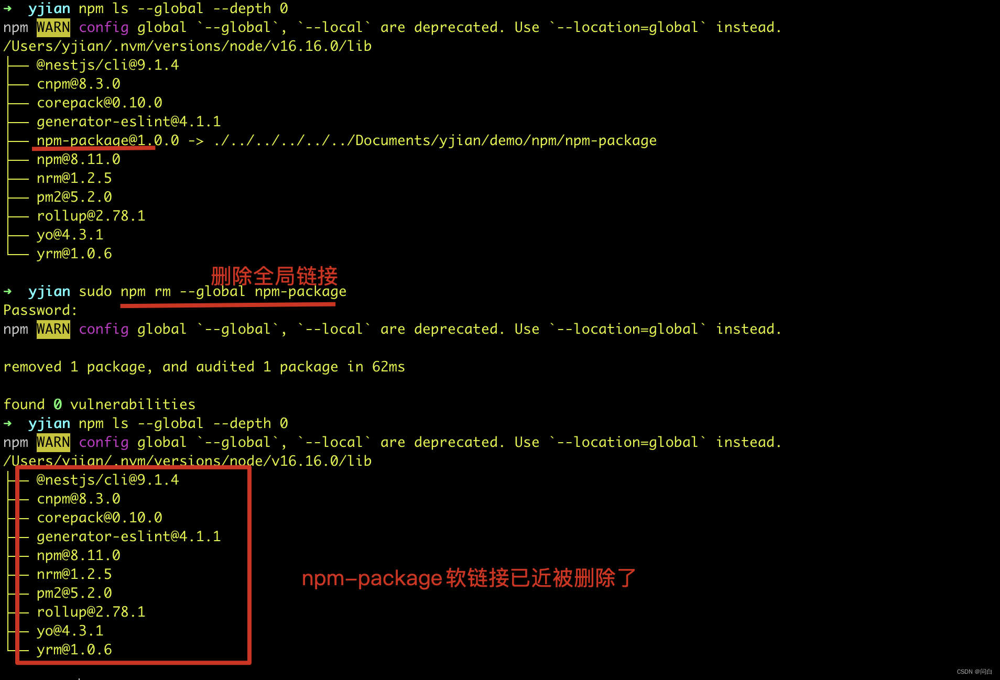
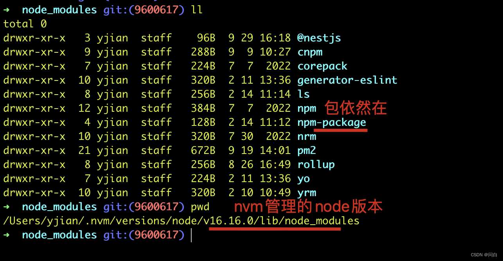
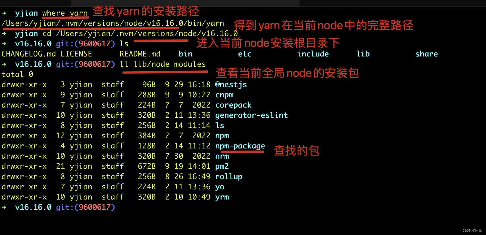
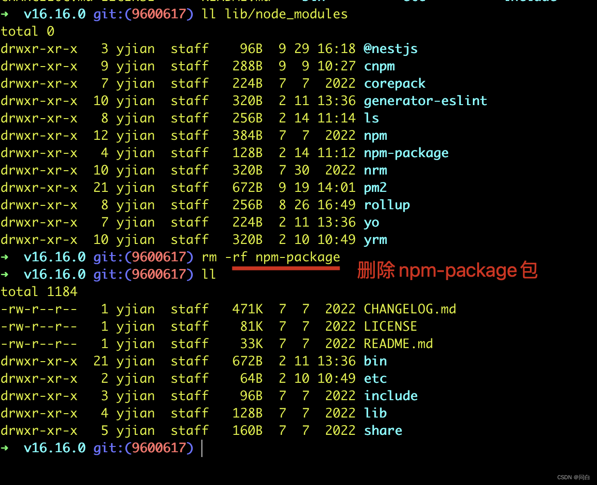
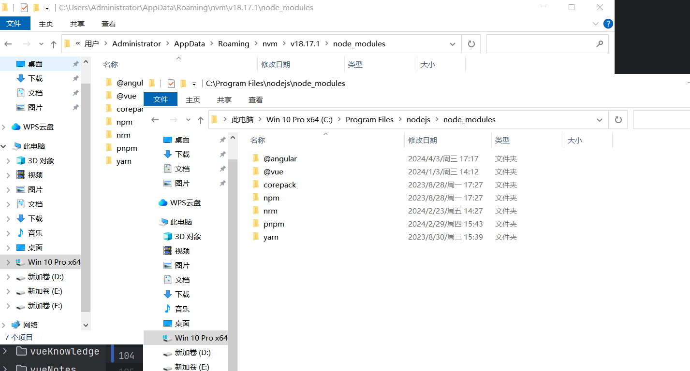

# npm link

转载地址：https://blog.csdn.net/weixin_38080573/article/details/129022742

## 需求

在开发npm包时，我们需要将npm包进行本地调试，如果这时不断的发布测试版本，然后再安装测试版本就会比价麻烦，测试我们就可以使用`npm link` 来创建一个软连接进行本地调试解决这个问题。

## 场景

比如我们现在在开发一个npm模块，名称为npm-package。然后在本地的app-demo这个应用中来使用这个模块。

## 创建链接

先进入npm-package项目根目录，然后执行`npm link` 命令

```
cd npm-package
npm link

```



在控制台执行下面命令来查看所有全局链接的名称

```
npm ls --global --depth 0 

```  



可以看到，在全局中npm-package已经和./…/…/…/…/…/Documents/yjian/demo/npm/npm-package建立了链接了

## 项目使用

进入app-demo 项目中，执行`npm link npm-package`命令从全局下载这个包到node_module中，之后就可以正常使用/调试这个包的功能了

::: tip 备注
npm link的npm-package，是package.json文件中name的值
:::



此时app-demo中的node_nodules是软链接过来的，如果我们修改npm-package里面的任何内容，都会同步到app-demo/node_modules中来的。这样我们调试起来就会非常的方便。

## 去除软连

进入项目app-demo根目录中，执行下面命令`npm unlink xxx` (xxx是npm包package.json文件中name字段的名称)

```
npm unlink npm-package

```



从[npm的文档](https://docs.npmjs.com/cli/v10/commands/npm-uninstall)中可以看到，其实npm unlink 就是npm uninstall的别名。



## 删除全局链接

执行`npm rm --global xx`（xx是npm包名）来删除全局的软连接

```
npm rm --global npm-package

```



本以为到这里就已近删除了，可是在app-demo中`npm link npm-package`还是可以安装成功，这就证明这个包还在。

打开对应版本node安装包的lib/node_modules发现果然还在



这里有个小技巧，如果不知道node的安装目录，可以在终端使用where 查找另一个全局安全的命令。

比如yarn

```
// 查找yarn在当前版本node中的完整安装路径
where yarn 

```

然后就可以找到当前node的安装路径，进而可以在lib/node_modules查看当前node中全局安装的包。



可以祭出终极一招，直接删除掉该文件夹即可



::: tip 备注
上面这是mac系统下的显示，windows系统下，全局安装的文件夹在C:\Program Files\nodejs\node_modules和C:\Users\Administrator\AppData\Roaming\nvm\v18.17.1\node_modules中

直接删除就行
:::



