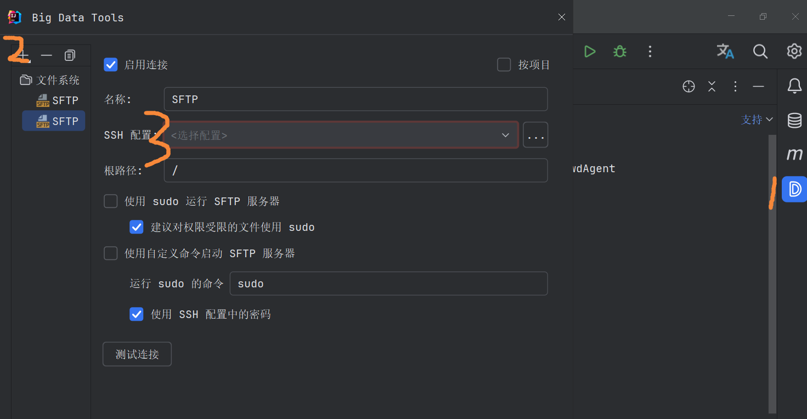
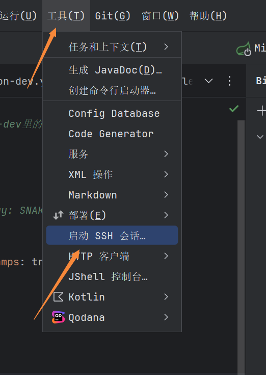
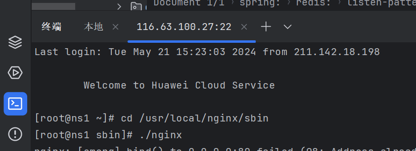

# linux服务器：连接、安装nginx、部署项目

## 使用IDEA进行连接

1、 SSH配置

新加SSH配置，输入主机、账号、密码

2、 SSH终端

选择之前在SSH配置的，编码改为UTF-8

3、安装Big Data Tools插件

4、打开Big Data Tools插件，配置SFTP



配置了SFTP，就可以操作服务器的文件

5、工具--启动SSH会话

这就可以输入命令





## 远程连接工具MobaXterm

远程连接linux服务器工具：官网地址是：[https://mobaxterm.mobatek.net/](https://mobaxterm.mobatek.net/)

### 新建连接


1、点击左上角Session按钮，创建一个新的连接

2、点击SSH

3、点击人物头像，编辑登录人信息


4、点击new，添加新登录人，输入name（随便起个名字）、账号、密码 


5、输入服务器地址、选择登录人、输入端口号，点击OK进行连接

### 安装nginx

参考地址：[https://blog.csdn.net/weixin_50003028/article/details/132567183](https://blog.csdn.net/weixin_50003028/article/details/132567183)

[https://www.cnblogs.com/javaxubo/p/17498337.html](https://www.cnblogs.com/javaxubo/p/17498337.html)

下面的记录是综合上面俩篇文章写的，文章里有些地方我执行的时候报错

1、下载nginx

```
wget -c http://nginx.org/download/nginx-1.24.0.tar.gz
```


2、安装nginx依赖

```
yum install -y gcc-c++	zlib zlib-devel	openssl openssl-devel pcre pcre-devel
```

3、解压安装包

```
tar -zxvf nginx-1.24.0.tar.gz
```

解压到根目录下


4、启动nginx

切换到/usr/local/nginx目录下，执行./nginx

```
cd /usr/local/nginx/sbin

./nginx
```

启动以后，在浏览器打开服务器地址，就可以看到nginx默认页面了

### 项目部署

1、将项目打包后，在根目录（这个不固定，自己选择）在新建nginxRun（文件夹名自己起），将打包的项目放到该文件夹下

2、修改配置文件，文件在/usr/local/nginx/conf/nginx.conf


3、重启nginx配置

```
cd /usr/local/nginx/sbin

./nginx -s reload  
```
