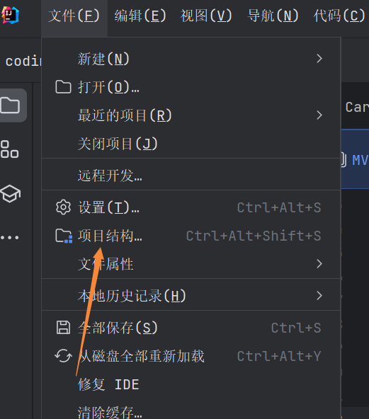
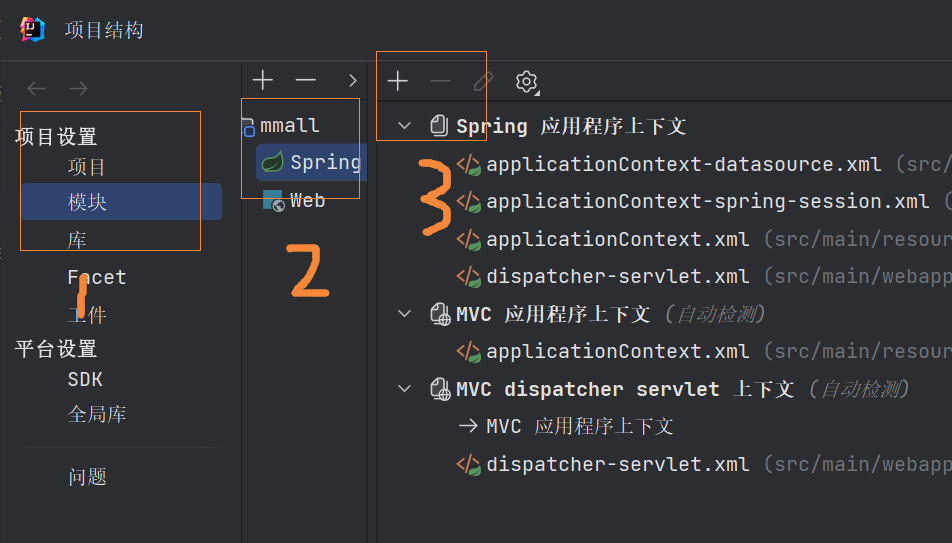
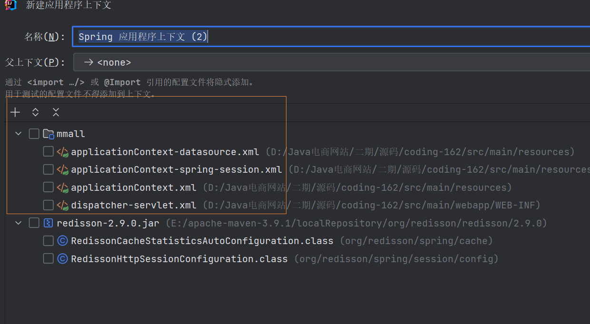

# Application context not configured for this file

使用IDEA打开spring boot项目，提示Application context not configured for this file

解决办法：

1、点击项目结构

2、点击模块，spring，加号

3、将红框内的都选中

::: tip 备注
我第一次打开项目没有spring，是点击IDEA右下角提示中的设置才显示的
:::
