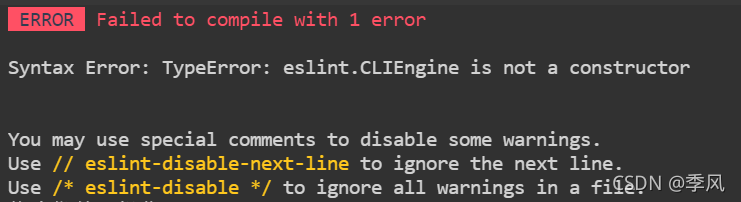
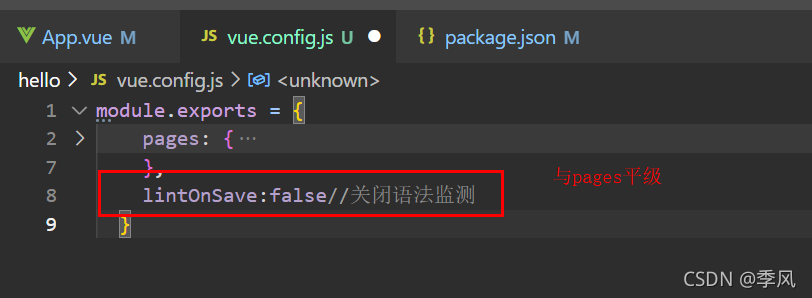

# Syntax Error: TypeError: eslint.CLIEngine is not a constructor

Error: TypeError: eslint.CLIEngine is not a constructor

You may use special comments to disable some warnings.
Use // eslint-disable-next-line to ignore the next line.
Use /* eslint-disable */ to ignore all warnings in a file.

解决办法：

第一种：在package.json文件里，删除"@vue/cli-plugin-eslint": "~4.5.0"插件，重新运行项目

第二种：打开vue.config.js加入以下代码

