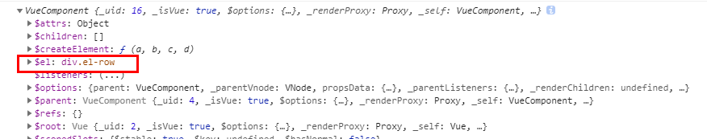
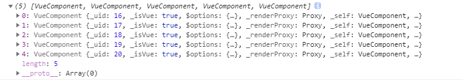
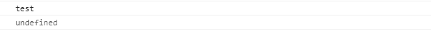

# Vue单文件组件中多个同名的ref属性，this.$refs的取值及其使用注意事项

**Vue官方文档**： ref 被用来给元素或子组件注册引用信息。引用信息将会注册在父组件的 $refs 对象上。如果在普通的 DOM 元素上使用，引用指向的就是 DOM 元素；如果用在子组件上，引用就指向组件实例。

**1 当同一组件内部，有多个同名ref引用时**

this.$refs[ref名称]指向文档流中靠下的组件或DOM节点，若是ref相同的组件或DOM节点间是父子关系，则指向父级组件或DOM节点。

**1.1 this.$refs[ref名称]指向文档流中靠下的组件或DOM节点：**

```vue
<template>
	<div class="container">
      <div class="form" ref="test">
        <el-input ref="test"></el-input>
      </div>
      <el-row ref="test"></el-row>
    </div>
</template>
```

this.$refs.test 指向：



1.2 若是ref相同的组件或DOM节点间是父子关系，则指向父级组件或DOM节点：

```vue
<template>
	<div class="container">
      <div class="form" ref="test">
        <el-input ref="test"></el-input>
      </div>
    </div>
</template>
```

this.$refs.test 指向：


**2 若ref用在v-for里**

当循环内的ref值不同时，需提供this.refs[ref名称][0]来获取该DOM节点或组件实例；当ref值相同时，this.$refs[ref名称]获取到的是该DOM节点或组件的数组。

**2.1 当循环内的ref值不同时，需提供this.$refs[ref名称][0]来获取该DOM节点或组件实例：**

```vue
<template>
	<div class="container">
      <div class="form" ref="test">
        <el-input ref="test"></el-input>
      </div>
      <el-row v-for="item in 5" :key="item" :ref="'test' + item"></el-row>
    </div>
</template>
```

this.$refs.test1 指向，可以看到它控制台中打印出是一个数组，只有一项即时引用指向的节点或组件

**2.2 当固定ref，值相同时，this.$refs[ref名称]获取到的是该DOM节点或组件的数组：**

```vue
<template>
	<div class="container">
      <div class="form" ref="test">
        <el-input ref="test"></el-input>
      </div>
      <el-row v-for="item in 5" :key="item" ref="test"></el-row>
    </div>
</template>
```

this.$refs.test 的指向，是同名DOM节点的数组，使用下表即可获取响应DOM节点或组件



**3 使用注意事项**

* ref 属性值接收一个字符串

* 因为 ref 本身是作为渲染结果被创建的，在初始渲染的时候你不能访问它们 - 它们还不存在

```vue
created () {
    console.log('test')
    console.log(this.$refs.test)
}
```

this.$refs.test 为 undefined，在mounted中可以访问



*并且它不是响应式的。这仅作为一个用于直接操作子组件的“逃生舱”——你应该避免在模板进行数据绑定或计算属性中访问 $refs。*

