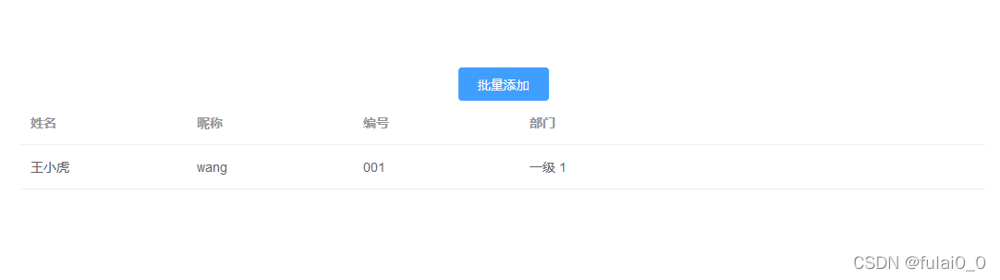
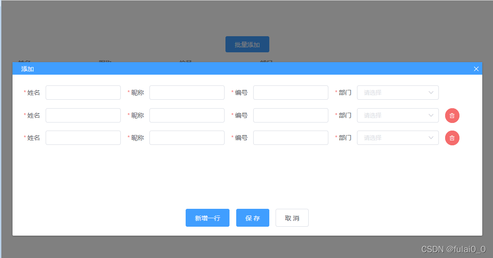
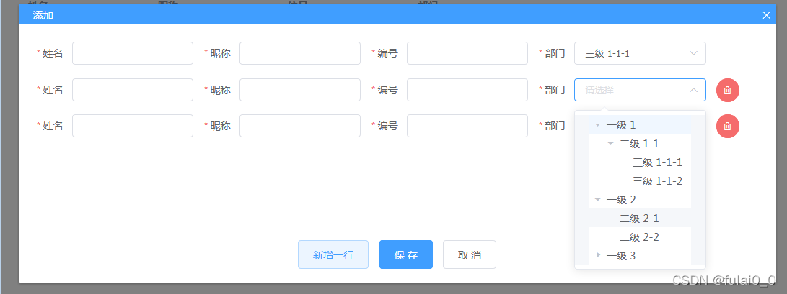
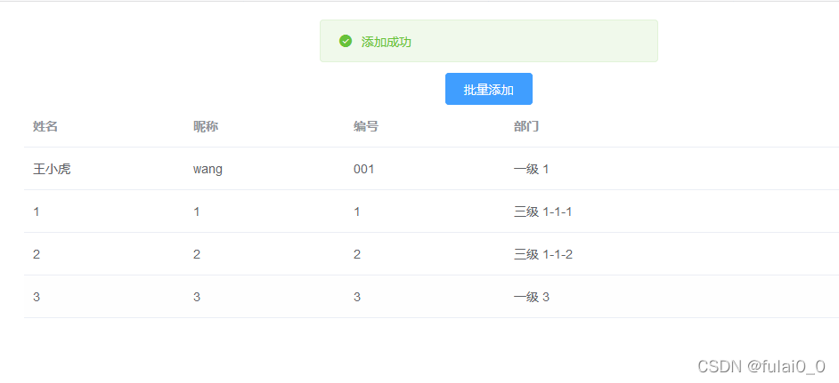

# Vue批量添加、删除数据的表单界面

**效果**









**功能**

1、批量保存多组数据。

2、支持删除数据

3、支持对数据进行表单检验

**思路**

1、每组数据做为一个form，将数据缓存到formArr数组中。

* 通过循环formArr，展示表单、控制表单

* <el-form>的属性rules与<el-form-item>的属性prop是一套的，rules指定表单用哪组检查规则（规则定义在data中声明），而prop则是指明当前表单项用rules的哪条规则。（具体实现可看完整代码）

* 表单结构中，formName为form对象的ref值，用于表单验证的时候，调用validate方法；其他为表单数据。

```vue
<el-row v-for="(form, index) in formArr" :key="index">
  <el-form
    label-position="right"
    label-width="50px"
    :model="form"
    :rules="infoRules"
    :ref="form.formName"
    :inline="true"
  >
    <el-form-item label="姓名" size="small" prop="name">
      <el-input v-model.trim="form.name"></el-input>
    </el-form-item>
    <el-form-item label="昵称" size="small" prop="nickname">
      <el-input v-model.trim="form.nickname"></el-input>
    </el-form-item>
    <el-form-item label="编号" size="small" prop="code">
      <el-input v-model.trim="form.code"></el-input>
    </el-form-item>
    <el-form-item label="部门" size="small" prop="branch">
      <el-select v-model="form.branch" placeholder="请选择"
        @focus="_ly_chooseBefore(index)"
        :ref="form.formName + '_select'"
      >
        <el-option :value="temp" style="height:auto">
          <el-tree
            :data="treeData"
            node-key="id"
            highlight-current
            :props="defaultProps"
            @node-click="_ly_chooseNode">
          </el-tree>
        </el-option>
      </el-select>
    </el-form-item>
      <el-button
        v-if="index!=0"
        type="danger"
        size="small"
        icon="el-icon-delete"
        circle
        @click="_ly_delFrom(index)"></el-button>
    <el-form-item>
    </el-form-item>
  </el-form>
</el-row>
```

```vue
    // 点击【保存】按钮后，如果每行的表单验证成功则存储数据
    _ly_ok () {
      let count = this.formArr.length // 记录当前有多少个表单
      for (var index in this.formArr) {
        var form = this.formArr[index]
        console.log(form)
        console.log(JSON.stringify(form))
        // 通过refs和表单名找到表单对象，通过自带的validate检查表单内容
        this.$refs[form.formName][0].validate((valid, obj) => {
          if (valid) {
            // 如果检查通过，则对count减1。
            // 当count为1时，表示是最后一个表单，则存储数据
            if (count-- === 1) {
              this._ly_save()
            }
          } else {
            console.log(obj)
            return false
          }
        })
      }
      console.log('_ly_ok:' + JSON.stringify(this.formArr))
    },
    // 存储表单数据
    _ly_save () {
      this.$message.success('添加成功')
      // 将数据传递给父组件。
      // 如果要将数据存储到后台，可在此处自行实现
      this.$emit('on-ok', this.formArr)
    },
    // 增加一行表单
    _ly_addFrom () {
      if (this.formArr.length >= 5) {
        this.$message.warning('最多只能添加5行')
        // 如果需要更多行，可以调整[dialog-content]的高度，或者将界面调整为允许滚动
        return
      }
 
      this.formArr.push({
        formName: 'myform' + (new Date()).getTime(), // myform1648431132399
        name: '',
        nickname: '',
        code: '',
        branch: ''
      })
    },
    // 删除一行表单
    _ly_delFrom (index) {
      console.log('index: ' + index)
      this.formArr.splice(index, 1)
    },
```

2、树形下拉框是通过select+tree组装而得的，选中效果需要重新实现。（参考了网上多个文章的例子）

* 首先，select绑定focus事件，并且设置ref。在点击select展开下拉框的时候，记录下当前点击的是第几行的select元素（全局变量currentSelectIndex存储）。

* 接着，对tree绑定noke-click事件，在回调函数中，拿到选择的data，通过this.formArr[currentSelectIndex].branch修改select的选择结果。

```vue
<el-select v-model="form.branch" placeholder="请选择"
  @focus="_ly_chooseBefore(index)"
  :ref="form.formName + '_select'"
>
  <el-option :value="temp" style="height:auto">
    <el-tree
      :data="treeData"
      node-key="id"
      highlight-current
      :props="defaultProps"
      @node-click="_ly_chooseNode">
    </el-tree>
  </el-option>
</el-select>
```

```vue
    // 点击select的时候，缓存下行号
    // 如果一行有多个树状结构的select，可以通过缓存列号，区分是哪个select
    _ly_chooseBefore (index) {
      console.log('_ly_chooseBefore:' + index)
      this.currentSelectIndex = index
    },
    // 选择树状结构的某个节点时，回调到这个函数
    _ly_chooseNode (data) {
      console.log('_ly_chooseNode:' + JSON.stringify(data))
      let index = this.currentSelectIndex
      if (index === -1) {
        return
      }
      // 通过缓存的行号，找到对应的表单，并且将数据存储起来。
      // 如果需要缓存更多的数据，可以在此处自行实现
      this.formArr[index].branch = data.label
 
      // 选择后收起下拉框
      let formName = this.formArr[index].formName
      this.$refs[formName + '_select'][0].blur() // myform1648431132399_select
    }
```
