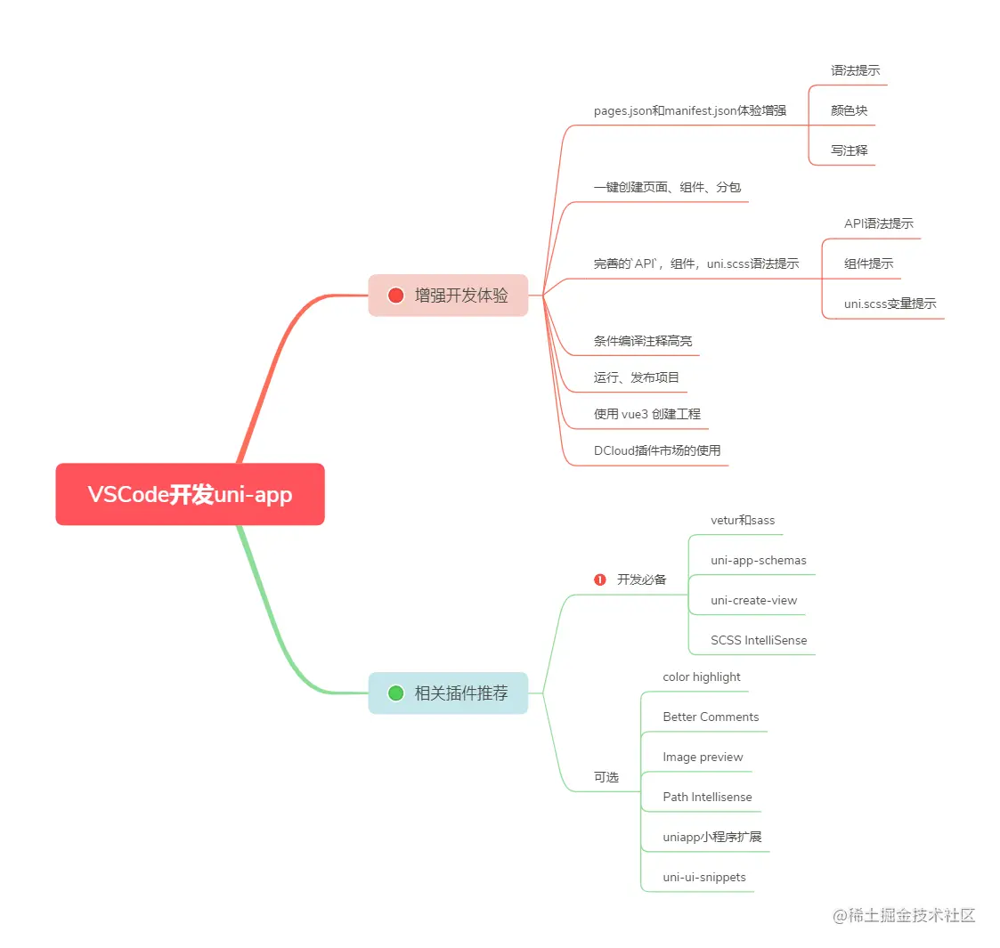
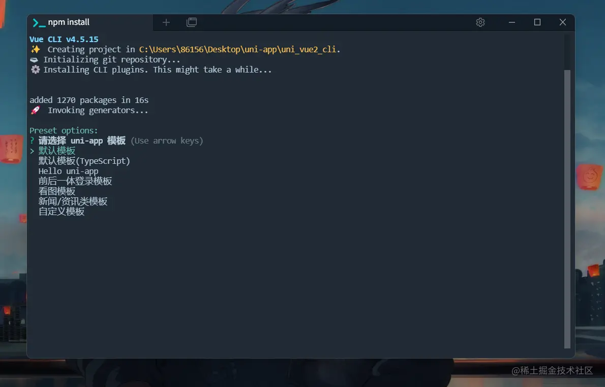
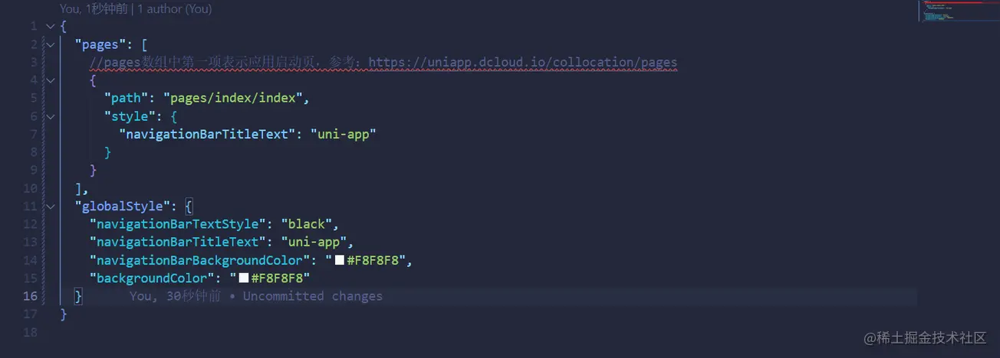
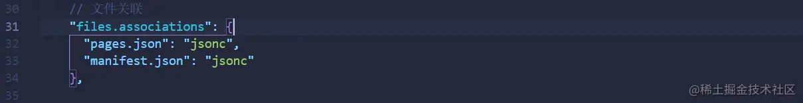
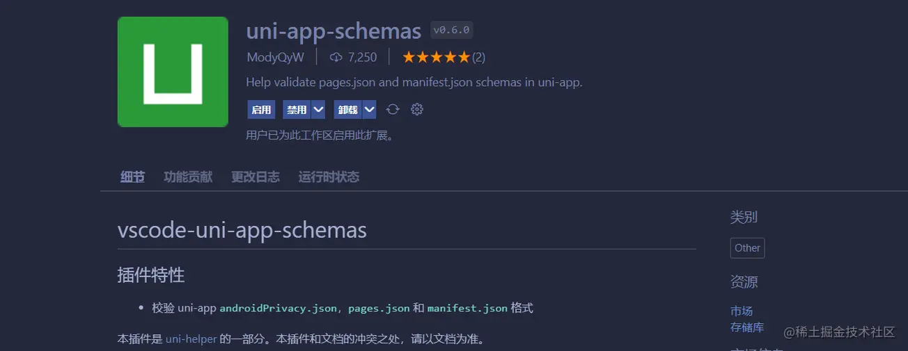
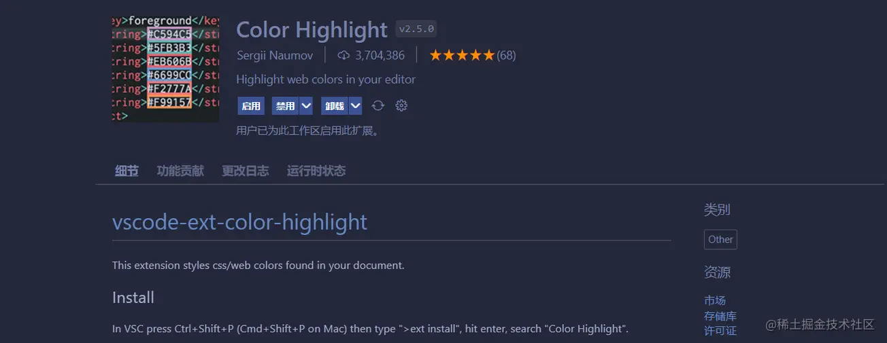
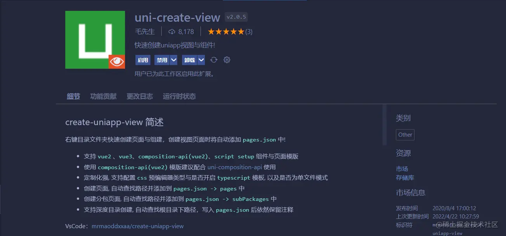
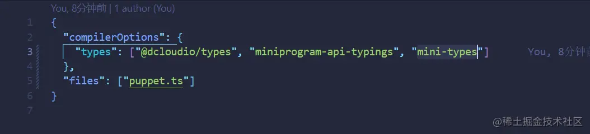

# 使用vscode开发uni-app项目

使用HBuilderX开发项目，导入全局样式变量不智能，所以使用vscode开发

参考文章：[https://blog.csdn.net/weixin_49865737/article/details/126342498](https://blog.csdn.net/weixin_49865737/article/details/126342498)



增强vscode开发uniapp带来的体验

* 增强pages.json和manifest.json开发体验（语法提示、颜色块、写注释）
* 一键创建页面、组件、分包
* 完善的API，组件，uni.scss语法提示
* 条件编译注释高亮

## 初始化项目

1、我们使用 vue2 创建工程作为示例，uni-app中Vue2版的组件库和插件也比较多，稳定、问题少

```
npm install -g @vue/cli@@4.5.15
```
 
::: tip 备注
Vue2创建的项目，脚手架版本要用@4的版本，用@5的版本运行项目会报错，这里推荐 @4.5.15
:::

2、创建项目

```
vue create -p dcloudio/uni-preset-vue 项目名称
```

选择默认版本



3、增强pages.json和manifest.json开发体验

我们打开pages.json和manifest.json，发现会报红，这是因为在json中是不能写注释的，而在jsonc是可以写注释的。



解决方案：我们把pages.json和manifest.json这两个文件关联到jsonc中，然后就以写注释了

在设置中打开settings.json，添加：



千万不要把所有json文件都关联到jsonc中，你感觉在json中都能写注释了，觉得更好用了，其实不然，json就是json，jsonc就是jsonc，这两个是不一样的，例如，你在package.json写注释VSCode是不报错了，但编译的时候还是会报错的，因为package.json就是不能写注释的。

4、语法提示



语法提示和简单校验的插件：uni-app-schemas

5、颜色块显示

VSCode在json文件是不显示像css中一样的颜色块，但有个插件可以帮我们做到。



6、一键创建页面、组件、分包

支持一键创建页面、组件、分包，并添加到paegs,json中



7、条件编译注释高亮


8、API语法提示

用Vue2创建的uni-app的cli项目默认是已经安装对应的Api语法提示，并且默认已经在tscongfig.json配置好了，有三个：

* @dcloudio/types，uni语法提示

* miniprogram-api-typings，微信小程序wx语法提示

* mini-types，支付宝小程序my语法提示



9、组件提示

接下来就是组件语法提示，如`<view>`、`<button>`等uni-app原生组件，这个需要我们手动安装对应的依赖包

```
npm i @dcloudio/uni-helper-json
```

如果你觉得还不够好用，你还可以安装第三方插件来提供和Hbuilder X一样的代码块，推荐插件：uniapp小程序扩展、uni-app-snippets

10、uni.scss变量提示

::: tip 备注
cli创建的uni-app项目，跟web项目一样，需要安装对应的sass模块，才能写scss。安装sass-loader，建议版本@10，否则可能会导致vue与sass的兼容问题而报错。
:::

```
npm i sass sass-loader@10 -D
```

安装SCSS IntelliSense插件，就可以提示你项目中scss文件中定义的变量了。


11、运行、发布项目

使用npm脚本或者执行命令
