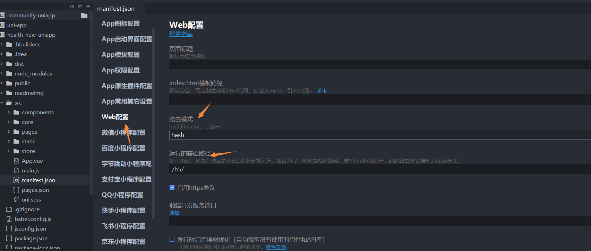
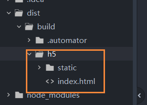

# uniapp打包项目

## 打包web

1、点击scr下的manifest.json



配置路由模式和运行的基础路径

（1）、路由模式可以选择hash和history俩种，如果是history，部署的时候需要进行额外的配置，可以参考这个文章：[nginx配置](https://zhaobao1830.github.io/zhaobao1830-notes/java/nginx/01.html#%E6%96%87%E4%BB%B6%E9%85%8D%E7%BD%AE)

加一行代码：try_files $uri $uri/ /index.html;

（2）、运行的基础路径默认是h5，打包以后项目所在的文件夹就是h5，如果是其他的文件名称，比如dist，那就进行修改成/dist/

2、点击发行--网站-PC Web或手机H5


网站标题可以用默认的，也可以自己修改

3、配置完成后点击发行按钮，生成打包文件



## 部署

h5文件夹里的文件就是uniapp打包h5后的文件，将其改名为apph5（这个名字必须和打包时候填写的运行的基础路径一致）

### tomcat

将apph5放到webapps文件夹，点击bin/startup.bat启动tomcat，在url里输入`http://localhost:8080/apph5/` 即可访问项目

::: tip 备注
路由模式为history模式打包的项目，刷新会报404，解决办法是在打包后的项目根目录新建`WEB-INF`文件夹，
在里面添加web.xml文件，
web.xml文件的内容为：
```
<?xml version="1.0" encoding="UTF-8"?>
<web-app xmlns="http://xmlns.jcp.org/xml/ns/javaee" xmlns:xsi="http://www.w3.org/2001/XMLSchema-instance"
  xsi:schemaLocation="http://xmlns.jcp.org/xml/ns/javaee
           http://xmlns.jcp.org/xml/ns/javaee/web-app_3_1.xsd"
  version="3.1" metadata-complete="true">
  <display-name>Router for Tomcat</display-name>
  <error-page>
    <error-code>404</error-code>
    <location>/index.html</location>
  </error-page>
</web-app>
```

这样刷新页面会正常显示，但会在控制台输出找不到页面（404）
:::


### nginx

将apph5文件夹放到nginx的nginxRun文件夹下，执行start nginx命令启动nginx

在url输入`http://192.168.3.30:92/apph5/` 打开项目

nginx配置文件

```
server {
            # 监听端口
            listen       92;
            #ip、备案过的域名、localhost
            server_name  192.168.3.30;

            # 存储路径是E:/nginx-1.22.1/nginxRun/apph5/
            # 请求路由映射，匹配拦截
            location ^~ /apph5/ {
                # 解决history模式下，刷新报错的bug
                try_files $uri $uri/ /apph5/index.html;
                # 请求位置
                root   E:/nginx-1.22.1/nginxRun;
                # 首页位置
                index  index.html;
            }
        }
```

::: tip 备注
url的访问路径，最后必须加上/，不然请求不到项目
:::

::: tip 备注
history模式，必须加上 `try_files $uri $uri/ /apph5/index.html;` 不然刷新会报404错误

因为访问的项目是在apph5文件夹下，所以`try_files $uri $uri/ /apph5/index.html;` 应该加上/apph5
:::
