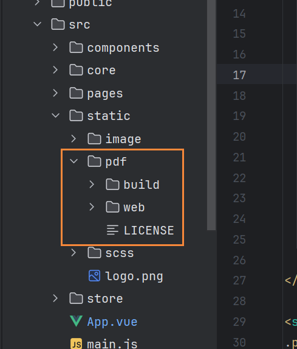
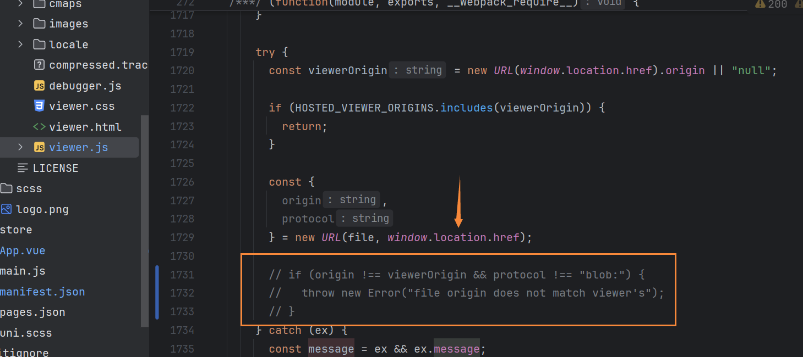

# uniapp微信公众号实现pdf预览

## 需求

现在有pdf链接地址，需要在微信公众号里预览

## 实现

1、下载[pdf.js](https://mozilla.github.io/pdf.js/)并解压

::: tip 备注
新版的pdf.js有问题，建议下载旧版的

3版本使用的时候，安卓可以正常预览，ios报错

现在项目中使用的是2版本
:::

2、将解压的文件放到static下，起名为pdf（这个自己定义）



::: tip 备注
必须放到static文件夹下，不然会获取不到
:::

3、新建vue组件

```
<template>
  <div class="physical-examination-detail normal-view">
    <view class="physical-examination-detail-container absolute-container">
      <web-view v-if="url" :src="url"></web-view>
    </view>
  </div>
</template>

<script>
  import NavBarComponent from '@/components/base/NavBar/NavBarComponent.vue'
  
  export default {
    name: "PhysicalExaminationDetail" ,
    components: {
      NavBarComponent
    },
    data() {
      return {
        viewerUrl: '/static/pdf/web/viewer.html',
        url: ''
      }
    },
    onLoad(options) {
      this.url = this.viewerUrl + '?file=' + `http://dhszyy.net/reporDetail/${options.examNo}`
    }
  }
</script>

<style scoped lang="scss">
.physical-examination-detail {
  .physical-examination-detail-container {
    top: 0;
    bottom: 0;
    background-color: $colorless_11;
  }
}
</style>

```

(1)、在data里定义viewerUrl（pdf.js里viewer.html的路径）和url（pdf展示的完整路径）

(2)、使用uniapp的[web-view](https://uniapp.dcloud.net.cn/component/web-view.html#web-view)组件进行展示

## 问题

1、file origin does not match viewer's错误

在 web/viewer.mjs 或者 web/viewer.js 中搜索 file origin does not match viewer's 并注释掉，不然会报跨域错误。



