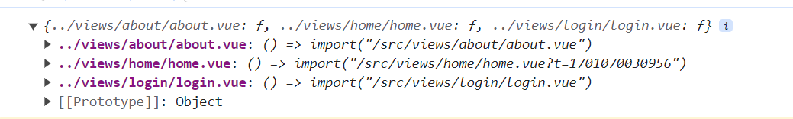

# vite实现动态路由

在项目中，我们有时候会实现动态路由

## webpack项目

```js
  const filePath = 'views/about/about.vue'
  const component = () => import(`@/${filePath}`)
```

## vite项目

vite项目中不能用上面的写法，必须通过`import.meta.glob`

```js
  const filePath = 'views/about/about.vue'
  
  // 获取views文件夹下的所有组件，并import引入
  const modules = import.meta.glob('../views/**/*.vue')
  // 获取对应的组件 
  const component = modules[`../${filePath}`]
```

::: tip 备注
[import.meta.glob](https://cn.vitejs.dev/guide/migration-from-v2.html#importmetaglob)获取当前文件夹下所有的组件，并import引入


:::
