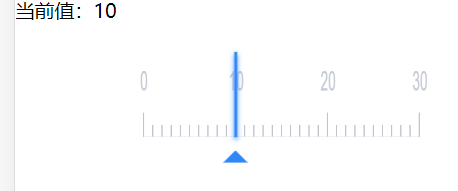
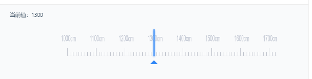
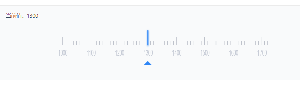

## ruler刻度尺



```vue
<template>
  <div
    class="md-ruler"
    @touchstart="$_startDrag"
    @touchend="$_stopDrag"
  >
    <canvas
      class="md-ruler-canvas"
      ref="canvas"
    ></canvas>
    <div
      class="md-ruler-cursor"
      :class="[isStepTextBottom && 'md-ruler-cursor-bottom']"
    ></div>
    <div class="md-ruler-arrow"></div>
  </div>
</template>

<script>
  import Scroller from './scroller'
  import { throttle, noop } from './index'

  export default {
    name: 'md-ruler',
    emits: ['update:modelValue', 'change'],
    props: {
      modelValue: { // 双向绑定的值
        type: Number,
        default: 0
      },
      scope: { // 刻度尺范围
        type: Array,
        default: () => [0, 100]
      },
      step: { // 刻度尺每一大格步数
        type: Number,
        default: 10
      },
      unit: { // 刻度尺每一小格步数
        type: Number,
        default: 1
      },
      min: { // 最小可滑动位置
        type: Number,
        default: 0
      },
      max: { // 最大可滑动位置
        type: Number,
        default: 100
      },
      stepTextPosition: { // Step标志位置 可选'top', 'bottom'
        type: String,
        default: 'top',
        validator: val => ['top', 'bottom'].includes(val)
      },
      stepTextRender: { // 自定义step文案 自定义函数应该返回字符串
        type: Function,
        default: noop
      }
    },
    data() {
      return {
        clientHeight: 60,
        scroller: null,
        ratio: 2,
        isInitialed: false,
        isDragging: false,
        isScrolling: false,
        x: 0,
        scrollingX: 0,
        blank: 30 // unit blank
      }
    },
    computed: {
      unitCount() {
        const { scope: [min, max], unit } = this
        return Math.ceil((max - min) / unit)
      },
      canvasWidth() {
        return this.$refs.canvas.clientWidth * this.ratio
      },
      realMin() {
        const { scope, min } = this
        const [left, right] = scope
        if (min > right) {
          return left
        }
        return min > left ? min : left
      },
      realMax() {
        const { scope, max } = this
        const [left, right] = scope
        if (left > max) {
          return right
        }
        return max > right ? right : max
      },
      blankLeft() {
        const { scope, realMin, unit, blank } = this
        const [min] = scope
        return Math.ceil((realMin - min) / unit) * blank
      },
      blankRight() {
        const { scope, realMax, unit, blank } = this
        const [, max] = scope
        return Math.ceil((max - realMax) / unit) * blank
      },
      isStepTextBottom() {
        return this.stepTextPosition === 'bottom'
      }
    },
    watch: {
      modelValue() {
        if (this.isScrolling) {
          return
        }
        this.scrollingX = 0
        this.isScrolling = true
        const x = this.$_initX()
        this.$_draw(x)
        this.scroller.scrollTo(x, 0, true)
      }
    },
    mounted() {
      const { $refs } = this
      // without watch ctx
      this.ctx = $refs.canvas.getContext('2d')
      this.$_initCanvas()
      this.x = this.canvasWidth
      this.$_initScroller()
    },
    methods: {
      // MARK: private methods
      $_initCanvas() {
        const { ratio, ctx, canvasWidth, clientHeight, $refs } = this
        const { canvas } = $refs
        canvas.width = canvasWidth
        canvas.height = clientHeight * ratio
        const scale = 1 / ratio
        ctx.scale(scale, 1)
      },
      $_initScroller() {
        const { blankLeft, blankRight, blank, unitCount, canvasWidth, clientHeight } = this
        const drawFn = throttle(this.$_draw, 10)
        const scroller = new Scroller(
          left => {
            if (this.isInitialed) {
              drawFn(left)
            } else {
              this.$_draw(left)
            }
          },
          {
            scrollingX: true,
            scrollingY: false,
            snapping: true,
            snappingVelocity: 1,
            animationDuration: 200,
            inRequestAnimationFrame: true,
            scrollingComplete: () => {
              this.isScrolling = false
            }
          }
        )

        // set real scroll width
        const innerWidth = unitCount * blank + canvasWidth - blankLeft - blankRight
        const x = this.$_initX()
        this.$_draw(x)
        scroller.setDimensions(canvasWidth, clientHeight, innerWidth, clientHeight)
        scroller.setSnapSize(blank, 0)
        scroller.scrollTo(x, 0, false)
        this.scroller = scroller
        this.isInitialed = true
      },
      $_initX() {
        const { modelValue, scope, realMin, realMax, unit, blank, unitCount, canvasWidth } = this
        const [min] = scope
        this.x = canvasWidth - Math.ceil((realMin - min) / unit) * blank
        if (modelValue <= realMin) {
          return 0
        } else if (modelValue >= realMax) {
          return unitCount * blank
        } else {
          return Math.ceil((modelValue - realMin) / unit) * blank
        }
      },
      $_draw(left) {
        left = +left.toFixed(2)
        const { ctx, ratio, scrollingX, canvasWidth, clientHeight } = this
        this.scrollingX = left
        this.x += scrollingX - left
        // clear canvas
        const scale = ratio * ratio
        ctx.clearRect(0, 0, canvasWidth * scale, clientHeight * scale)
        this.$_drawLine()
      },
      $_drawLine() {
        const { ctx, x, scope, step, unit, ratio, blank, unitCount, isStepTextBottom } = this
        const { blankLeft, blankRight, canvasWidth } = this
        const [scopeLeft] = scope
        const _fontSize = 22
        const _y = 120 - (isStepTextBottom ? _fontSize + 40 : 0)
        const _stepUnit = Math.round(step / unit)
        ctx.lineWidth = 2
        ctx.font = `${_fontSize *
          ratio}px DIN Alternate, "Helvetica Neue",Helvetica,"PingFang SC","Hiragino Sans GB","Microsoft YaHei","微软雅黑",Arial,sans-serif`
        for (let i = 0; i <= unitCount; i++) {
          const _x = x + i * blank
          if (_x < 0 || _x > canvasWidth * 2) {
            continue
          }
          // over range use another color
          const outRange = _x < x + blankLeft || _x > x + 1 + unitCount * blank - blankRight
          if (outRange) {
            ctx.fillStyle = '#E2E4EA'
            ctx.strokeStyle = '#E2E4EA'
          } else {
            ctx.fillStyle = '#C5CAD5'
            ctx.strokeStyle = '#858B9C'
          }
          ctx.beginPath()
          ctx.moveTo(_x, _y)
          if (i % _stepUnit === 0) {
            // draw text
            const text = this.$_matchStepText(scopeLeft + unit * i)
            const textOffset = String(text).length * _fontSize / 2
            ctx.fillText(text, _x - textOffset, _fontSize * ratio + (isStepTextBottom ? 70 : 0))
            // draw line
            ctx.lineTo(_x, _y - 40)
          } else {
            ctx.lineTo(_x, _y - 20)
          }
          ctx.stroke()
        }
        // draw base line
        ctx.strokeStyle = '#E2E4EA'
        ctx.beginPath()
        ctx.moveTo(x, _y)
        ctx.lineTo(x + unitCount * blank, _y)
        ctx.stroke()
        this.$_updateValue()
      },
      $_matchStepText(step) {
        const match = this.stepTextRender(step)
        return match !== undefined && match !== null ? match : step
      },
      $_startDrag(event) {
        if (this.isDragging) {
          return
        }
        event.preventDefault()
        event.stopPropagation()
        this.scroller.doTouchStart(event.touches, event.timeStamp)
        this.isDragging = true
        this.isScrolling = true
        window.addEventListener('touchmove', this.$_onDrag)
      },
      $_onDrag(event) {
        event.preventDefault()
        event.stopPropagation()
        if (!this.isDragging) {
          return
        }
        this.scroller.doTouchMove(event.touches, event.timeStamp, event.scale)
      },
      $_stopDrag(event) {
        event.preventDefault()
        event.stopPropagation()
        this.isDragging = false
        this.scroller.doTouchEnd(event.timeStamp)
        window.removeEventListener('touchmove', this.$_onDrag)
      },
      $_updateValue() {
        if (!this.isInitialed) {
          return
        }
        const { x, scope: [min], realMin, realMax, unit, blank, canvasWidth } = this
        if (x > canvasWidth) {
          this.$_onInput(realMin)
          return
        }
        const _x = x >= 0 ? Math.abs(x - canvasWidth) : Math.abs(x) + canvasWidth
        let modelValue = min + Math.round(_x / blank) * unit
        modelValue > realMax && (modelValue = realMax)
        modelValue < realMin && (modelValue = realMin)
        this.$_onInput(modelValue)
      },
      // MARK: events handler, 如 $_onButtonClick
      $_onInput(value) {
        this.$emit('update:modelValue', value)
        this.$emit('change', value)
      }
    }
  }
</script>

<style scoped lang="scss">
  .md-ruler{
    position: relative;
    padding: 36px 0 20px;
    width: 100%;
    height: 142px;
    box-sizing: border-box;
    .md-ruler-canvas{
      width: 100%;
      height: 60px;
    }
    .md-ruler-cursor{
      z-index: 10;
      position: absolute;
      top: 26px;
      left: 50%;
      width: 2px;
      height: 70px;
      transform: translate(-50%);
      background-color: #2F86F6;
      box-shadow: 0 2px 4px #2F86F6;
    }
    .md-ruler-cursor-bottom{
      height: 40px;
    }
    .md-ruler-arrow{
      z-index: 10;
      position: absolute;
      bottom: 25px;
      left: 50%;
      border-bottom: 10px solid #2F86F6;
      border-left: 10px solid transparent;
      border-right: 10px solid transparent;
      transform: translate(-50%);
    }
  }
</style>

```

### Props

| 参数        | 说明            | 类型     | 可选值               | 默认值 |
|-------------  |---------------- |--------|-------------------- |-----|
| v-model  | 双向绑定的值 | Number | — | 0   |
| scope  | 刻度尺范围 | Number[]  | — | [0, 100] |
| step  | 刻度尺每一大格步数 | Number | — | 10  |
|  unit   | 刻度尺每一小格步数 | Number | — | 1   |
|  min | 最小可滑动位置 | Number | — | 100 |
| max | 最大可滑动位置 | Number | — | 0   |
| stepTextPosition  | Step标志位置 | String | 'top', 'bottom' | 'top'  |
| stepTextRender  | 自定义step文案 | Function | 自定义函数应该返回字符串 | noop    |

详细的文档地址：[https://didi.github.io/mand-mobile/#/zh-CN/docs/components/business/ruler](https://didi.github.io/mand-mobile/#/zh-CN/docs/components/business/ruler)

## 使用

### 基本
```vue
<template>
  <div class="md-example-child md-example-child-single-component">
    <p>当前值：{{ value }}</p>
    <div class="container">
      <md-ruler
        :scope="scope"
        :step="100"
        :unit="10"
        v-model="value"
      ></md-ruler>
    </div>
  </div>
</template>

<script>
import {Ruler} from 'mand-mobile'

export default {
  name: 'ruler-demo-0',
  /* DELETE */
  title: '基本',
  titleEnUS: 'Basic',
  message: '请在移动设备中扫码预览',
  messageEnUS: 'Please scan QR code and preview on mobile device',
  /* DELETE */
  components: {
    [Ruler.name]: Ruler,
  },
  data() {
    return {
      value: 1000,
      scope: [1000, 2000],
    }
  },
}

</script>

<style lang="stylus" scoped>
.md-example-child-single-component
  .container
    margin 0 auto
    width 640px
</style>

```

### 自定义step展示文案



```vue
<template>
  <div class="md-example-child md-example-child-single-component">
    <p>当前值：{{ value }}</p>
    <div class="container">
      <md-ruler
        v-model="value"
        :scope="scope"
        :step="100"
        :unit="10"
        :step-text-render="stepTextRender"
      ></md-ruler>
    </div>
  </div>
</template>

<script>
import {Ruler} from 'mand-mobile'

export default {
  name: 'ruler-demo',
  /* DELETE */
  title: '自定义step展示文案',
  titleEnUS: 'Custom step text',
  message: '请在移动设备中扫码预览',
  messageEnUS: 'Please scan QR code and preview on mobile device',
  /* DELETE */
  components: {
    [Ruler.name]: Ruler,
  },
  data() {
    return {
      value: 1300,
      scope: [1000, 2000],
    }
  },
  methods: {
    stepTextRender(step) {
      return step + 'cm'
    },
  },
}

</script>

<style lang="stylus" scoped>
  .md-example-child-single-component
    .container
      margin 0 auto
      width 640px
</style>

```

### 自定义step展示位置



```vue
<template>
  <div class="md-example-child md-example-child-single-component">
    <p>当前值：{{ value }}</p>
    <div class="container">
      <md-ruler
        v-model="value"
        step-text-position="bottom"
        :scope="scope"
        :step="100"
        :unit="10"
      ></md-ruler>
    </div>
  </div>
</template>

<script>
import {Ruler} from 'mand-mobile'

export default {
  name: 'ruler-demo',
  /* DELETE */
  title: '自定义step展示位置',
  titleEnUS: 'Custom step positon',
  message: '请在移动设备中扫码预览',
  messageEnUS: 'Please scan QR code and preview on mobile device',
  /* DELETE */
  components: {
    [Ruler.name]: Ruler,
  },
  data() {
    return {
      value: 1300,
      scope: [1000, 2000],
    }
  },
}

</script>

<style lang="stylus" scoped>
  .md-example-child-single-component
    .container
      margin 0 auto
      width 640px
</style>

```
