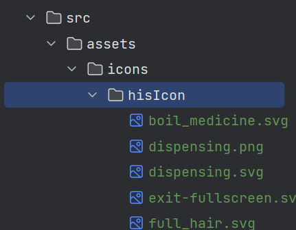

# svg

在vite里通过[vite-plugin-svg-icons](https://github.com/vbenjs/vite-plugin-svg-icons)动态使用svg图片

## 步骤

**第一、安装vite-plugin-svg-icons插件**

```
npm i vite-plugin-svg-icons -D
// 或者
yarn add vite-plugin-svg-icons -D
// 或者
pnpm i vite-plugin-svg-icons -D
```

**第二、在main.js引入**

```js
import 'virtual:svg-icons-register'
```

**第三、新建svg图片文件夹**



**第四、vite.config.js配置**

```js
import { defineConfig } from 'vite'
import { resolve } from 'path'
import vue from '@vitejs/plugin-vue'
import { createSvgIconsPlugin } from 'vite-plugin-svg-icons'

// https://vitejs.dev/config/
export default defineConfig({
  plugins: [
    vue(),
    createSvgIconsPlugin({
      // 指定要查找的文件夹
      iconDirs: [resolve(process.cwd(), 'src/assets/icons')],
      // 指定symbolId
      symbolId: 'icon-[dir]-[name]'
    })
  ]
})

```

**第五、封装svg组件**

```vue
<template>
  <svg
    :class="svgClass"
    aria-hidden="true"
    :style="{ width: size + 'px', height: size + 'px' }"
  >
    <use :href="svgName" :fill="color"/>
  </svg>
</template>

<script setup>
  import { computed } from 'vue'
  
  const props = defineProps({
    prefix: {
      type: String,
      default: 'icon'
    },
    // 文件夹
    folder: {
      type: String,
      default: ''
    },
    // svg尺寸
    size: {
      type: String,
      default: '14'
    },
    // svg样式
    iconClass: {
      type: String,
      default: ''
    },
    // svg名称
    iconName: {
      type: String,
      required: true
    },
    color: {
      type: String,
      default: '#333'
    }
  })
  
  const svgClass = computed(() => {
    return props.iconClass ? 'svg-icon ' + props.iconClass : 'svg-icon'
  })
  
  const svgName = computed(() => {
    if (props.folder) {
      return `#${props.prefix}-${props.folder}-${props.iconName}`
    } else {
      return `#${props.prefix}-${props.iconName}`
    }
  })
</script>

<style lang="scss" scoped>

</style>

```

**第六、使用**

```vue
<template>
  <div>
    <his-svg-icon
      :icon-class="iconClass"
      :icon-name="iconName"
      folder="hisIcon"
      size="18"
      color="red"
    ></his-svg-icon>
  </div>
</template>

<script setup>
  import HisSvgIcon from '@/components/base/HisSvgIcon/index.vue'
  import { ref } from 'vue'
  
  const iconClass = ref('pub_add_class')
  const iconName = ref('pub_add')
</script>

<style scoped>

</style>

```

## 总结

这种使用svg的方法，有个缺点，项目里会有很多svg图片
