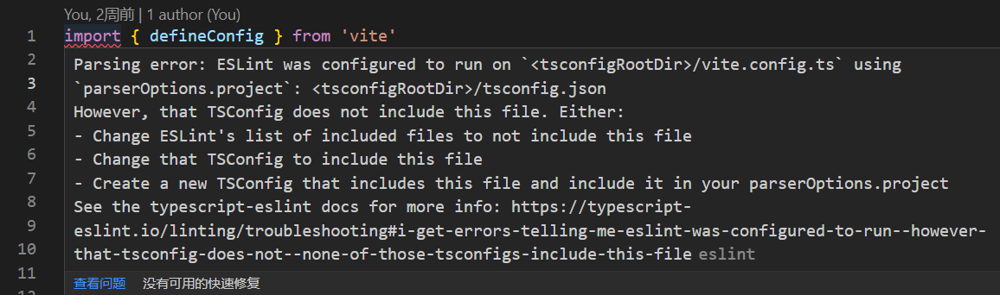

# eslint配置

## 基础配置

```js
module.exports = {
  root: true,
  env: {
    node: true,
  },
  extends: ["plugin:vue/essential", "@vue/standard"],
  rules: {
    'no-console': process.env.NODE_ENV === 'production' ? 'warn' : 'off',
    'no-debugger': process.env.NODE_ENV === 'production' ? 'warn' : 'off',
    "space-before-function-paren": 0, // 忽略空格
    "vue/script-indent": [ // script区域缩进俩格
      "error",
      2,
      {
        // script标签缩进设置
        baseIndent: 1,
        switchCase: 0,
        ignores: []
      }
    ],
    indent: ["error", 2],
    semi: ["error", "never"], // 无分号
    'camelcase': 0, // 忽略强制驼峰命名
    "no-trailing-spaces": 0 // 忽略语句后面出现的空格
  },
  overrides: [
    {
      files: ["*.vue"],
      rules: {
        indent: "off"
      }
    }
  ],
  parserOptions: {
    parser: "@babel/eslint-parser"
  }
};

```

::: tip 温馨提示
需安装插件 @babel/eslint-parser

安装方式：

$ npm install eslint @babel/core @babel/eslint-parser --save-dev

$ yarn add eslint @babel/core @babel/eslint-parser -D
:::

## vite+vue3+ts

.eslintrc.cjs

```js
module.exports = {
  root: true,
  env: {
    browser: true,
    es2021: true
  },
  extends: [
    'plugin:vue/vue3-essential',
    'standard-with-typescript',
    'eslint:recommended',
    'plugin:@typescript-eslint/recommended'
  ],
  parser: 'vue-eslint-parser',
  parserOptions: {
    parser: '@typescript-eslint/parser',
    ecmaVersion: 6,
    sourceType: 'module',
    ecmaFeatures: {
      modules: true
    },
    requireConfigFile: true,
    extraFileExtensions: ['.vue'],
    tsconfigRootDir: __dirname,
    project: [
      './tsconfig.json',
      './vite.config.ts'
    ]
  },
  plugins: [
    'vue',
    '@typescript-eslint'
  ],
  rules: {
    'no-console': process.env.NODE_ENV === 'production' ? 'warn' : 'off',
    'no-debugger': process.env.NODE_ENV === 'production' ? 'warn' : 'off',
    'space-before-function-paren': 0, // 忽略空格
    semi: ['error', 'never'], // 无分号
    'vue/script-indent': [ // script区域缩进俩格
      'error',
      2,
      {
        // script标签缩进设置
        baseIndent: 1,
        switchCase: 0,
        ignores: []
      }
    ],
    indent: 'off',
    camelcase: 0, // 忽略强制驼峰命名
    'no-trailing-spaces': 0, // 忽略语句后面出现的空格
    'no-mixed-spaces-and-tabs': 0,
    'no-tabs': 'off',
    'no-use-before-define': 'off',
    '@typescript-eslint/explicit-function-return-type': 'off',
    '@typescript-eslint/promise-function-async': 'off',
    // 关闭名称校验
    'vue/multi-word-component-names': 'off'
  }
}

```

tsconfig.json

```json
{
  "compilerOptions": {
    "target": "ESNext",
    "useDefineForClassFields": true,
    "module": "ESNext",
    "moduleResolution": "Node",
    "strict": true,
    "jsx": "preserve",
    "resolveJsonModule": true,
    "isolatedModules": true,
    "esModuleInterop": true,
    "lib": ["ESNext", "DOM"],
    "skipLibCheck": true,
    "noEmit": true,
    "baseUrl": "./",
    "paths": {
      "@/*": [
        "src/*"
      ]
    }
  },
  "include": [
    "src/**/*.ts",
    "src/**/*.d.ts",
    "src/**/*.tsx",
    "src/**/*.vue",
    "vite.config.ts"
  ],
  "references": [{ "path": "./tsconfig.node.json" }]
}

```
1、[typescript-eslint](https://typescript-eslint.io/getting-started) 给typescript使用的eslint

安装：

```npm
npm install --save-dev @typescript-eslint/parser @typescript-eslint/eslint-plugin eslint typescript
```

使用时候复制上面的代码就行

2、parser: 'vue-eslint-parser'必须引入，不然解析html标签会报错，原因不详

官网地址：[https://www.npmjs.com/package/vue-eslint-parser](https://www.npmjs.com/package/vue-eslint-parser)

3、tsconfigRootDir的值为__dirname，[文档](https://typescript-eslint.io/linting/typed-linting)

4、[extraFileExtensions](https://typescript-eslint.io/linting/troubleshooting) 对vue文件进行扩展

5、ESLint was configured to run on `<tsconfigRootDir>/vite.config.ts` using `parserOptions.project`: `<tsconfigRootDir>/tsconfig.json`



解决办法：

.eslintrc.cjs

```js
parserOptions: {
  project: [
    './vite.config.ts'
  ]
}
```

tsconfig.json

```json
"include": [
  "vite.config.ts"
]
```

相关的插件：

```json
"devDependencies": {
    "@typescript-eslint/eslint-plugin": "^5.57.1",
    "@typescript-eslint/parser": "^5.57.1",
    "@vitejs/plugin-vue": "^4.1.0",
    "eslint": "^8.37.0",
    "eslint-config-standard-with-typescript": "^34.0.1",
    "eslint-plugin-import": "^2.27.5",
    "eslint-plugin-n": "^15.6.1",
    "eslint-plugin-promise": "^6.1.1",
    "eslint-plugin-vue": "^9.10.0",
    "vite": "^4.2.0",
    "vite-plugin-eslint": "^1.8.1",
    "vue-eslint-parser": "^9.1.1",
}
```
