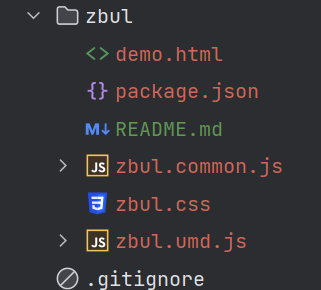

## 全局button组件

全局定义button组件，使用的时候不需要再单独引入

BasicButton.vue

```vue
<template>
  <van-button type="success">点击</van-button>
</template>

<script>
  import { defineComponent } from 'vue'

  export default defineComponent({
    name: 'AButton'
  })
</script>
<script setup>

</script>

<style scoped lang="scss">

</style>

```

index.js

```js
import { withInstall } from '@/utils'
import button from './BasicButton.vue'

export const Button = withInstall(button)

```

utils.js

```js
export const withInstall = (component, alias) => {
  const comp = component
  comp.install = (app) => {
    // 注册全局组件
    app.component(comp.name, component)
    if (alias) {
      // 注册全局属性
      app.config.globalProperties[alias] = component
    }
  }
  return component
}
```

## 使用

### 组件复制到项目中使用

registerGlobComp.js

将调用全局组件的方法放在这个js文件
```js
import { Button } from './Button'

export function registerGlobComp(app) {
  app.use(Button)
}
```

::: tip 温馨提示
使用插件的方式来注册全局组件
:::

main.js

在main.js里调用registerGlobComp方法

```js
const app = createApp(App)

// 注册全局组件
registerGlobComp(app)
```

::: tip 温馨提示
在index.js里调用withInstall方法注册组件后，可以在组件里引用后使用
:::

组件里直接使用

```vue
  <a-button></a-button>
```

### 组件发包到npm

1、编写组件代码

上面已经完成

2、将组件使用install发布，就是上面index.js的操作

3、在项目的package.json文件的scripts里添加打包命令

```json
"package": "vue-cli-service build --target lib ./src/package/index.js --name zbul --dest zbul"
```

```json
 "scripts": {
    "serve": "vue-cli-service serve",
    "build": "vue-cli-service build",
    "lint": "vue-cli-service lint",
    "package": "vue-cli-service build --target lib ./src/package/index.js --name zbButton --dest zbButton"
  }
```

打包命令解释：

* --target lib 关键字 指定打包的目录

上面的./src/package/index.js是引入组件并注册的文件

* --name 打包后的文件名字

* --dest 打包后的文件夹名称



4、执行npm run package进行打包

5、将cmd切换到打包完成的文件夹里

6、新加package.json文件，在里面配置version，每次更新后都要更改version，不然发布的时候会报错

```json
{
  "name": "zbButton",
  "version": "1.0.0",
  "description": "",
  "main": "zbButton.common.js",
  "scripts": {
    "test": "echo \"Error: no test specified\" && exit 1"
  },
  "keywords": [],
  "author": "",
  "license": "ISC"
}
```

7、新加README.md文件，编写组件的相关信息

```md
# zbButton

自定义的组件库：zb-button

```

8、执行npm login登录账号（源必须是npm的，如要修改，请[查看博客](https://zhaobao1830.github.io/zhaobao1830-notes/fronKnowledge/node/#%E4%BD%BF%E7%94%A8nrm)）

9、执行npm publish发布

10、在项目里执行npm i XX，下载发布的包

11、在main.js里引入并注册（注册方法参考上面的组件复制到项目中使用），就可以在组件里使用了
