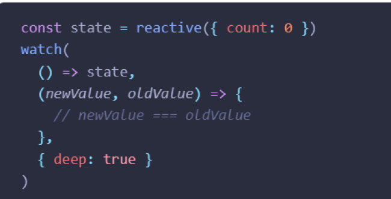
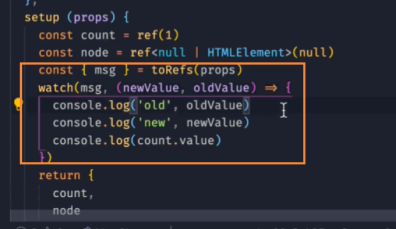

# watch和watchEffect

## watchEffect

官网：[https://cn.vuejs.org/api/reactivity-core.html#watcheffect](https://cn.vuejs.org/api/reactivity-core.html#watcheffect)

watchEffect是立即执行函数，页面渲染后就执行，并响应式地追踪其依赖

vue在页面退出，执行了销毁操作时，会把effect销毁

第一个参数就是要运行的副作用函数。这个副作用函数的参数也是一个函数，用来注册清理回调。清理回调会在该副作用下一次执行前被调用，可以用来清理无效的副作用，例如等待中的异步请求

比如在watchEffect函数中发起axios请求，如果请求结果没有返回，可以在请求方法后面进行取消操作

第二个参数是一个可选的选项，可以用来调整副作用的刷新时机或调试副作用的依赖。

默认情况下，侦听器将在组件渲染之前执行。设置 `flush: 'post'` 将会使侦听器延迟到组件渲染之后再执行。

flush可选值为：'pre' | 'post' | 'sync' // 默认：'pre'

备注：如果想在watchEffect中监听组件上的ref，可以把flush设置为'post'

因为[ref](https://cn.vuejs.org/api/built-in-special-attributes.html#ref)本身是作为渲染函数的结果来创建的，必须等待组件挂载后才能对它进行访问。

## watch

官网：[https://cn.vuejs.org/api/reactivity-core.html#watch](https://cn.vuejs.org/api/reactivity-core.html#watch)

watch如果想监听reactive里的单个值，可以用getter函数或者toRefs

## watch和watchEffect对比

watch可以获取数据变化前后的值

watch 在响应数据初始化时是不会执行回调函数的(可以通过设置immediate:true立即执行回调)，watchEffect 在响应数据初始化时就会立即执行回调函数。
