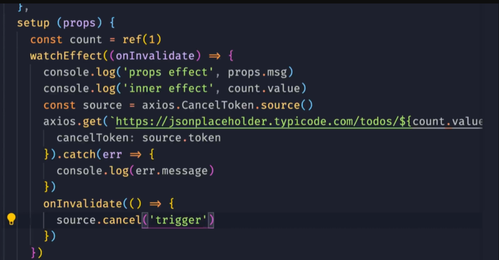
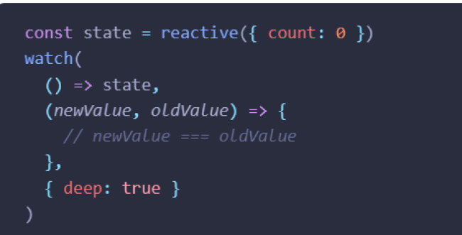

# watch和watchEffect

## watchEffect

官网：[https://cn.vuejs.org/api/reactivity-core.html#watcheffect](https://cn.vuejs.org/api/reactivity-core.html#watcheffect)

watchEffect是立即执行函数，页面渲染后就执行，并响应式地追踪其依赖

vue在页面退出，执行了销毁操作时，会把effect销毁

wactchEffect第二个参数，可以用来终止副作用函数

比如在watchEffect函数中发起axios请求，如果请求结果没有返回，可以用第二个参数取消

## watch

官网：[https://cn.vuejs.org/api/reactivity-core.html#watch](https://cn.vuejs.org/api/reactivity-core.html#watch)

watch如果想监听reactive里的单个值，可以用getter函数或者toRefs

## watch和watchEffect对比

懒执行副作用：就是watch我们可以自己控制什么时候执行副作用，watchEffect是页面渲染后就会执行

watch可以获取数据变化前后的值
