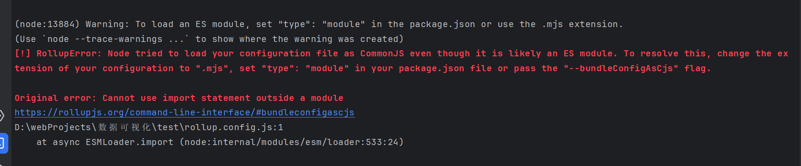
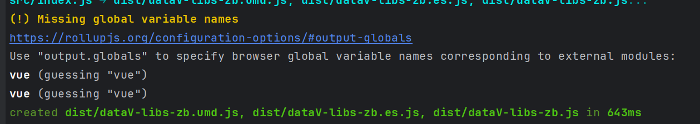

# Rollup

## 概述

[Rollup](https://www.rollupjs.com/) 是一个 JavaScript 模块打包工具，可以将多个小的代码片段编译为完整的`库和应用`。

## 安装

```npm
npm install --global rollup
```

## 使用

项目地址1(这个版本有点老)：[https://github.com/zhaobao1830/ts-axios-zb](https://github.com/zhaobao1830/ts-axios-zb)

项目地址2(最新版本): [https://github.com/zhaobao1830/datav-libs-zb](https://github.com/zhaobao1830/datav-libs-zb)

rollup.config.js

```js
import json from '@rollup/plugin-json'
import typescript from 'rollup-plugin-typescript2'
import commonjs from '@rollup/plugin-commonjs'
import { nodeResolve } from '@rollup/plugin-node-resolve'
import sourceMaps from 'rollup-plugin-sourcemaps'
import vue from 'rollup-plugin-vue'
import css from 'rollup-plugin-css-only'

const pkg = require('./package.json')

const libraryName = 'axios-zb'

export default {
  input: `src/index.ts`,
  output: [
    { file: pkg.main, format: 'umd', sourcemap: true },
    { file: pkg.module, format: 'es', sourcemap: true }
  ],
  plugins: [
    json(),
    typescript({ useTsconfigDeclarationDir: true }),
    commonjs(),
    nodeResolve(),
    sourceMaps(),
    vue(),
    css({ output: 'bundle.css' })
  ],
  // Indicate here external modules you don't want to include in your bundle (i.e.: 'lodash')
  external: [],
  watch: {
    include: 'src/**'
  }
}

```

::: tip 备注
pkg.main、pkg.module是在package.json文件里定义的打包后输出文件，例如：dist/axios.umd.js、dist/axios.es5.js，这块可以自己定义
:::

## 插件

1、[@rollup/plugin-babel](https://www.npmjs.com/package/@rollup/plugin-babel) 用于转换es代码

2、[@rollup/plugin-json](https://www.npmjs.com/package/@rollup/plugin-json) 将.json文件转换为ES6模块

3、[rollup-plugin-typescript2](https://www.npmjs.com/package/rollup-plugin-typescript2) 处理typeScript

4、[@rollup/plugin-commonjs](https://www.npmjs.com/package/@rollup/plugin-commonjs) 用于将CommonJS模块转换为ES6

5、[@rollup/plugin-node-resolve](https://www.npmjs.com/package/@rollup/plugin-node-resolve) rollup默认只能处理相对路径的模块，使用这个插件可以引入node_modules中的模块，rollup中
配置该插件后，打包的时候可以将项目中

::: tip 备注
封装组件会使用到第三方插件，别人在使用组件打包后的代码，需要将差三分插件也安装，这样太麻烦

解决办法是：在封装组件的项目里的rollup.config.js文件里，加入
:::

6、[rollup-plugin-vue](https://www.npmjs.com/package/rollup-plugin-vue) vue插件

7、[rollup-plugin-css-only](https://www.npmjs.com/package/rollup-plugin-css-only) css插件

8、[@rollup/plugin-babel](https://www.npmjs.com/package/@rollup/plugin-babel)

[@babel/core](https://www.npmjs.com/package/@babel/core)

[@babel/preset-env](https://www.npmjs.com/package/@babel/preset-env)

这三个插件一起用，将es6以上的代码转换成es5

配置:

rollup.config.js

```js
// 用于将es6以上的代码转换成es5
import { babel } from '@rollup/plugin-babel'

plugins: [
  babel(
    {
      babelHelpers: 'bundled',
      exclude: 'node_modules/**'
    })
]
```

.babelrc

```
{
  "presets": [
    "@babel/env"
  ]
}

```

9、[@rollup/plugin-terser](https://www.npmjs.com/package/@rollup/plugin-terser) 对代码进行压缩

## 问题

1、 Warning: To load an ES module, set "type": "module" in the package.json or use the .mjs extension.



原因是：默认情况下，rollup处理的是commonJs格式，这要求项目的所有js文件里，导入导出要用module.export和require。当js文件里使用了import和
export的时候，就会报错

解决办法：

第一种、package.json文件里，不加type或设置type为commonJS。项目的js文件里导入导出用module.export和require

第二种、package.json文件里，设置type为module，项目的js文件里导入导出用import和export

2、Missing global variable names



错误原因：在rollup.config.js里通过`external: ['vue']`配置了外部引用，缺少全局变量

解决办法：在output里的输出配置里加上：

```js
globals: {
        'vue': 'vue'
      }
```

效果如下：

```js
  output: [
  // umd格式，浏览器和node环境都可以用
  {
    file: pkg.browser,
    name: libraryName,
    format: 'umd',
    sourcemap: true,
    globals: {
      'vue': 'vue'
    }
  },
  // es 新的打包格式，在html中引用的时候，需要加type="module"
  {
    file: pkg.module,
    format: 'es',
    sourcemap: true,
    globals: {
      'vue': 'vue'
    }
  },
  // 打包成IIFE（自执行函数格式，可以直接在浏览器使用，通过script标签引用）
  {
    file: pkg.iife,
    name: libraryName,
    format: 'iife',
    sourcemap: true,
    globals: {
      'vue': 'vue'
    }
  }
]
```

## 知识点

### 打包格式种类

1、ESM (ES Modules): 使用 ES 模块的格式进行打包，适用于现代浏览器和支持 ES6 模块的环境。可以通过 output.format 设置为 'es'或'esm‘（这俩种我都试过可以）

2、CJS (CommonJS): 使用 CommonJS 的格式进行打包，适用于 Node.js 环境和一些旧版浏览器。可以通过 output.format 设置为 'cjs'。

3、UMD (Universal Module Definition): 使用 UMD 的格式进行打包，支持在不同的环境中使用（浏览器、Node.js），既可以作为全局变量使用，也可以作为模块导入。可以通过 output.format 设置为 'umd'。

4、AMD (Asynchronous Module Definition): 使用 AMD 的格式进行打包，适用于浏览器环境中使用 AMD 加载器加载模块。可以通过 output.format 设置为 'amd'。

5、IIFE (Immediately Invoked Function Expression): 使用 IIFE 的自执行函数格式进行打包，将模块包裹在一个立即执行的函数中。适用于直接在浏览器中使用，通过 `<script>` 标签引入。可以通过 output.format 设置为 'iife'。

6、SystemJS: 使用 SystemJS 的模块加载器格式进行打包，可以在浏览器和 Node.js 环境下加载。可以通过 output.format 设置为 'system'。

::: tip 备注
我一般打包方式选1、3、5
:::
