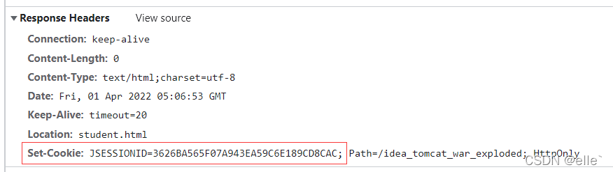
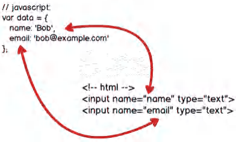
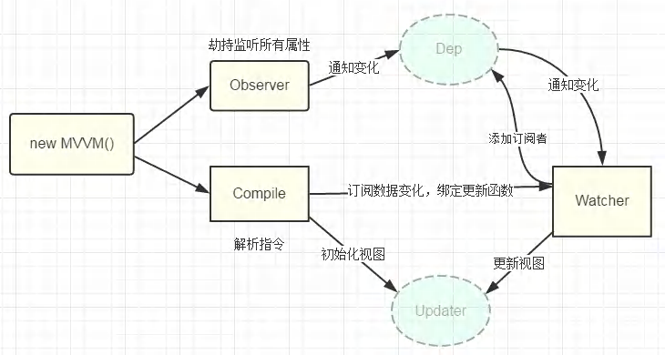
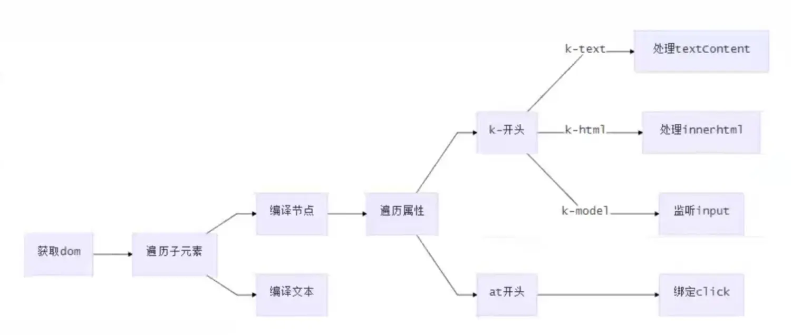
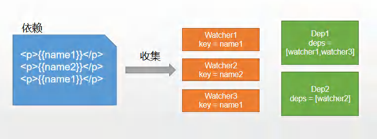

# 双向数据绑定

## 什么是双向数据绑定

我们先从单向绑定切入，单向绑定非常简单，就是把`Model`绑定到`View`，当我们用Js代码更新`Model`时，`View`就会自动更新双向绑定，

在单向绑定的基础上，用户更新了`View`，`Model`的数据也自动被更新了，这种情况就是双向绑定



当用户填写表单时，`View`的状态就被更新了，如果此时可以自动更新`Model`的状态，那就相当于我们把`Model`和`View`做了双向绑定，关系图如下：



## 双向绑定的原理是什么

我们都知道Vue是双向数据绑定的框架，由三部分组成：

* 数据层（Model）：应用的数据及业务逻辑

* 视图层（View）：应用的展示效果，各类UI组件

* 业务逻辑层（ViewModel）：框架封装的核心，它负责将数据与视图关联起来

上面的分层的架构方案，就是MVVM，核心功能就是“双向数据绑定”

### 理解ViewModel

主要职责：

* 数据变化后更新视图

* 视图变化后更新数据

由俩个部分组成：

* 监听器（Observer）：对所有数据的属性进行监听

* 解析器（Compiler）：对每个元素节点的指令进行扫描和解析，根据指令模板替换数据以及绑定相应的更新函数

## 实现双向绑定

我们以`Vue`为例，先来看下`Vue`中的双向流程是什么：

1、`new vue(）`首先执行初始化，对`data`中定义的值执行响应化处理，这个过程发生在`Observer`中

2、同时对模板执行编译，找到其中动态绑定的数据，从`data`中获取并初始化视图，这个过程发生在`Compile`中

3、同时定义一个更新函数和Watcher，将来对应数据变化时Watcher会调用更新函数

4、由于`data`的某个`key`在一个视图中可能出现多次，所以每个`key`都需要一个管家`Dep`来管理多个`Watcher`

5、当`data`中定义的值发生变化，会首先找到对应的Dep，通知所有`Watcher`执行更新函数

流程图如下：



### 实现

#### 新建Vue构造函数

对data数据进行初始化，将data代理到vm上，执行编译

```js
class Vue { 
  constructor(options) { 
  this.$options = options; 
  this.$data = options.data; 
 
  // 对data选项做响应式处理
  observe(this.$data); 
 
  // 代理data到vm上
  proxy(this); 
 
  // 执行编译
  new Compile(options.el, this); 
  } 
}
```

对data选项做响应式处理的具体操作

```js
function observe(obj) {
  if (typeof obj !== "object" || obj === null) {
    return;
  }
  new Observer(obj);
}

class Observer {
  constructor(value) {
    this.value = value;
    this.walk(value);
  }
  walk(obj) {
    Object.keys(obj).forEach((key) => {
      defineReactive(obj, key, obj[key]);
    });
  }
}
```

#### 编译Compile

对每个元素节点的指令进行扫描跟解析，根据指令模板替换数据，以及绑定相应的更新函数



```js
class Compile {
  constructor(el, vm) {
    this.$vm = vm;
    this.$el = document.querySelector(el); // 获取dom
    if (this.$el) {
      this.compile(this.$el);
    }
  }
  compile(el) {
    const childNodes = el.childNodes;
    Array.from(childNodes).forEach((node) => { // 遍历子元素
      if (this.isElement(node)) { // 判断是否为节点
        console.log("编译元素" + node.nodeName);
      } else if (this.isInterpolation(node)) {
        console.log("编译插值文本" + node.textContent); // 判断是否为插值文本 
        {{}}
      }
      if (node.childNodes && node.childNodes.length > 0) { // 判断是否有子元素
        this.compile(node); // 对子元素进行递归遍历
      }
    });
  }
  isElement(node) {
    return node.nodeType === 1;
  }
  isInterpolation(node) {
    return node.nodeType === 3 && /\{\{(.*)\}\}/.test(node.textContent);
  }
}
```

#### 依赖收集

视图中会用到`data`中的某个`key`（就是data里定义的属性），这称为依赖。同一个`key`可能出现多次（即一个组件里多个地方调用data里的同一个属性），每次都需要收集起来并用`Watcher`维护，此过程称为依赖

收集。多个`Watcher`我们用一个`Dep`来管理，`Dep`里有俩个方法，一是收集`Watcher`，二是循环调用`Watcher`的更新方法（这是当数据改变的时候，会触发此方法）



::: tip 备注
一个组件的data里定义三个属性，那就有是三个Dep，每个Dep对应一个属性，用key值区分

每个Dep里有一个或多个Watcher，Watcher的数量取决于组件里使用几次

Watcher里包含key值和对应的更新函数
:::

实现思路：

1、`defineReactive`时为每一个`key`创建一个`De`p实例

2、初始化视图时读取某个`key`，例如`name1`，创建一个`watcher1`

3、在创建`watcher`的时候，会触发`name1`的`getter`方法，这样就会将`watcher1`添加到`name1`对应的`Dep`中

4、当`name1`更新时，`setter`触发，便可通过对应`Dep`通知里面的`Watcher`更新

依赖收集，创建Dep实例

```js
function defineReactive(obj, key, val) {
  this.observe(val);
  const dep = new Dep();
  Object.defineProperty(obj, key, {
    get() {
      Dep.target && dep.addDep(Dep.target);// Dep.target就是Watcher的实例
      return val;
    },
    set(newVal) {
      if (newVal === val) return;
      dep.notify(); // 通知dep执行更新方法
    },
  });
}
```

Dep

```js
class Dep {
  constructor() {
    this.deps = []; // 依赖管理
  }
  addDep(watcher) {
    this.deps.push(watcher); // 将watcher添加到deps数组里
  }
  notify() {
    this.deps.forEach((dep) => dep.update()); // 循环数组，调用Watcher实例里的uodate方法
  }
}
```

Watcher

```js
class Watcher {
  constructor(vm, key, updater) {
    this.vm = vm
    this.key = key
    this.updaterFn = updater

    // 创建实例时，把当前实例指定到Dep.target静态属性上
    Dep.target = this
    // 读一下key,触发一次依赖收集
    vm[key]
    // 置空
    Dep.target = null
  }

  // 执行dom更新函数，由dep调用
  update() {
    this.updaterFn.call(this.vm, this.vm[this.key])
  }
}
```

### 简写版双向数据绑定

html

```html
<!DOCTYPE html>
<html lang="en">
<head>
   <meta charset="UTF-8">
   <title>Title</title>
</head>
<body>
<div id="app">
   <h3>姓名是：{{name}}</h3>
   <h3>年龄是：{{age}}</h3>
   <h3>info.a的值是：{{info.a}}</h3>
   <div>name的值：<input type="text" v-model="name"></div>
   <div>info.a的值：<input type="text" v-model="info.a"></div>
</div>
<script src="vue.js"></script>
<script>
   const vm = new Vue({
       el:'#app',
       data:{
           name:"zhangsan",
           age:20,
           info:{
               a:'a1',
               c:'c1'
          }
      }
  })

   console.log(vm)
</script>
</body>
</html>
```

vue.js

```js
class Vue {
  constructor(options) {
    this.$data = options.data

    //调用数据劫持的方法
    observe(this.$data);

    //属性代理
    Object.keys(this.$data).forEach((key)=>{
      Object.defineProperty(this, key,{
        enumerable:true,
        configurable:true,
        get() {
          return this.$data[key];
        },
        set(newValue) {
          this.$data[key] = newValue;
        }
      })
    })

    //调用模板编译
    compile(options.el, this);
  }
}
function observe(obj){
  //使用递归给多层对象属性都添加getter,setter方法
  if (!obj || typeof obj!== 'object') {
    return
  }

  const dep = new Dep();

  //通过Object.keys(obj)获取到当前obj的每个属性
  Object.keys(obj).forEach((key)=>{
    let value = obj[key]
    //把value这个子节点进行递归
    observe(value)
    Object.defineProperty(obj,key,{
      enumerable:true,
      configurable:true,
      get() {
        //从watcher构造函数那里跳过来执行这里，因为那里给vm取值赋值会触发这里的函数
        //Dep.target
        //只要在这里执行了这一行，那么被new出来的watcher实例就被放在dep.subs数组中了
        Dep.target && dep.addSub(Dep.target);
        return value
      },
      set(newVal) {
        value = newVal
        observe(value);
        //通知每一个订阅者
        dep.notify();
      }
    })
  })
}

/**
 * 模板编译
 * @param el 是option.el 这里是#app
 * @param vm vue实例，就是这个this
 */
function compile(el,vm){
  vm.$el = document.querySelector(el);    //把这个DOM元素挂载到vm实例上
  //创建文档碎片
  const fragment = document.createDocumentFragment();
  //把原DOM树上的所有元素都放进文档碎片中
  while (childNode = vm.$el.firstChild){
    fragment.append(childNode);
  }
  //在这里进行模板编译
  modelReplace(fragment);

  /**
   * 定义模板编译函数
   * 由于变量提升，方法提升，所以即使定义到外层，调用的时候也可以征程调用
   * @param node
   */
  function modelReplace(node) {
    //定义一个正则表达式,匹配插值表达式
    const regMustache = /\{\{\s*(\S+)\s*\}\}/;
    //证明当前的节点是文本子节点，需要进行正则替换
    if (node.nodeType === 3){
      //文本子节点是一个DOM对象，想要获取其内容，需要调用节点的textContent属性获取
      // console.log(node.textContent);
      const text = node.textContent;
      //进行字符串的正则匹配
      const execResult = regMustache.exec(text);
      // console.log(execResult)
      if (execResult){
        // console.log(vm[execResult[1]])
        //把所有属性的值都将进行一个reduce遍历
        const value = execResult[1].split('.').reduce((newObj,key)=>{
          return newObj[key]}, vm);
        // console.log(value);
        //把通过reduce遍历得到的值赋值给node.textContent
        node.textContent = text.replace(regMustache,value);
        //在这里创建Watcher实例
        new Watcher(vm, execResult[1],(newValue)=>{
          node.textContent = text.replace(regMustache,newValue);
        })
      }
      //终止递归条件
      return;
    }
    //判断当前的node节点是否为INPUT输入框
    if (node.nodeType === 1 && node.tagName.toUpperCase() === 'INPUT'){
      // const attrs = node.attributes;
      // console.log(attrs);
      //把伪数组转换成真的数组
      const attrs = Array.from(node.attributes);
      //查找是否具备v-model这个属性
      const findResult = attrs.find((value) => value.name === 'v-model');
      // console.log(findResult)
      if (findResult){
        //获取到当前v-model的属性的值
        const expStr = findResult.value
        // console.log(expStr);
        const value = expStr.split('.').reduce((newObj,key)=>newObj[key],vm);
        // console.log(res);
        node.value = value;
        //创建Watcher实例，把更新的方法放在里面
        new Watcher(vm, expStr,(newVal)=>{
          node.value = newVal;
        })

        //监听文本框的输入事件，拿到文本框最新的值更新到vm上
        node.addEventListener('input',(e)=>{
          // console.log(e.target.value)
          //通过拿到倒数第二项，然后使用[]的形式进行赋值
          //对数组进行分割
          const keyArr = expStr.split('.');
          //slice截取数组，不包括右区间
          const obj = keyArr.slice(0,keyArr.length-1).reduce((newObj,key)=>{return newObj[key]},vm);
          //赋值
          obj[keyArr[keyArr.length-1]] = e.target.value;
        })
      }
    }

    //不是文本节点,可能是一个DOM元素，需要进行递归处理
    node.childNodes.forEach((child)=>{modelReplace(child)});
  }

  //把文档碎片的内容放到文档上
  vm.$el.appendChild(fragment);
}

//发布者类(收集Watcher订阅者类)
class Dep {
  constructor() {
    //所有的watcher都被存到这个数组中
    this.subs = [];
  }
  //往数组里面追加watcher
  addSub(watcher){
    this.subs.push(watcher);
  }
  //通知
  notify(){
    this.subs.forEach((watcher) => {
      watcher.update()
    })
  }
}

class Watcher {
  /**
   * @param vm   vm中保存着最新的数据
   * @param key  在vm上众多的数据中，根据key来确定更新哪一个值，在new watcher期间，指定watcher对应的数据的名字
   * @param cb   如何去更新自己
   */
  constructor(vm, key, cb) {
    this.vm = vm;
    this.key = key;
    this.cb = cb;
    //在构造函数里面把watcher存到数组里面
    //下面三行代码吧创建的额watcher实例存到Dep实例的subs数组中
    Dep.target = this;      //this就是watcher实例
    //这一行代码主要是让他去触发getter方法
    key.split('.').reduce((newObj,k)=>newObj[k],vm);    //每一次创建实例，会在这里取一次值给vm，会触发getter
    Dep.target = null;
  }
  //能让发布者通知我
  update(){
    //把新的值传给回调函数,新的值来自于this.key
    const value = this.key.split('.').reduce((newObj,key) => {
      return newObj[key]
    }, this.vm)
    this.cb(value);
  }
}

```
