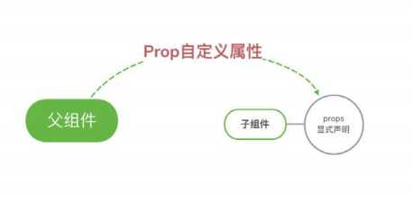

# Vue组件之间的通信方式有哪些？

## 组件间通信的概念

我们把**组件间通信**进行拆分：

* 组件

* 通信

组件是`vue`最强大的功能之一，`vue`中每一个`.vue`我们都可以视为一个组件。

通信指的是发送者通过某种媒体以某种格式来传递信息到收信者以达到某个目的。

组件间通信即指组件（`.vue`）通过某种方式来传递信息以达到某个目的。

举个例子，我们在使用`UI`库中的`List`组件，会往`List`组件中传递某个信息，这本质上就形成了组件之间的通信

## 组件间通信解决了什么

通信的本质是信息同步。

`vue`中，每个组件之间都有独自的作用域，组件间的数据是无法共享的，但实际开发工作中我们常常需要让组件之间共享数据，这也是

组件通信的目的，让它们相互之间能进行通信，这也才能构成一个有机的完整系统

## 组件间通信的方案

### props传递数据



* 适用场景：父组件传递数据给子组件
* 子组件设置`props`属性，接收父组件传递过来的参数

`Children.vue`组件

```vue
props: {
  item: {
    type: Object,
    default() {
      return {}
    }
  }
}
```

`Father.vue`组件

```vue
<Children :item="{}"/>
```

### $emit触发自定义事件

* 适用场景：子组件传递数据给父组件
* 子组件通过`$emit`触发自定义事件，`$emit`第一个参数是父组件接收的方法名，第二个参数
