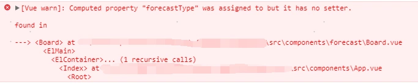
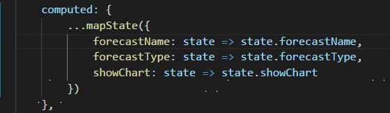

# Computed property "XXX" was assigned to but it has no setter

原因：

1、组件中v-model=“XXX”，而XXX是vuex state中的某个变量

2、vuex中是单项流，v-model是vue中的双向绑定，但是在computed中只通过get获取参数值，没有set无法改变参数值

解决办法：

1、在computed里给对应的变量添加get、set方法

2、将v-model="XXX"改成:value="XXX" 只用来展示
