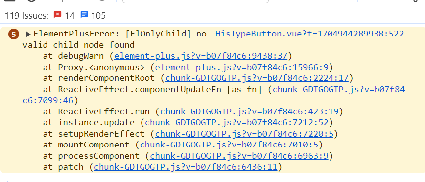

# ElementPlusError: [ElOnlyChild] no valid child node found

## 错误信息



## 原因分析

该组件里使用了el-tooltip组件，在el-tooltip组件的子组件上有if判断，当if为false的时候，子组件为空，就会报这个错误

```
<el-tooltip
  :disabled="!disabled"
      :content="tipContent ? tipContent : '不可新增'"
      placement="top"
      effect="dark"
    >
      <his-button
        v-if="type === 'add'"
        :hotkey="hotkey"
        type="primary"
        :disabled="disabled"
        :name="name ? name : '新增'"
        v-bind="$attrs"
        suffix-icon="pub_add"
        :is-loading="false"
        @click="onclick"
      />    
</el-tooltip>
```

## 解决办法

将if判断换到el-tooltip上

```
<el-tooltip
   v-if="type === 'add'"
  :disabled="!disabled"
  :content="tipContent ? tipContent : '不可新增'"
  placement="top"
  effect="dark"    
    >
      <his-button
        :hotkey="hotkey"
        type="primary"
        :disabled="disabled"
        :name="name ? name : '新增'"
        v-bind="$attrs"
        suffix-icon="pub_add"
        :is-loading="false"
        @click="onclick"
      />    
</el-tooltip>
```

::: tip 备注
会引发上面问题的组件有el-popover、el-tooltip
:::
