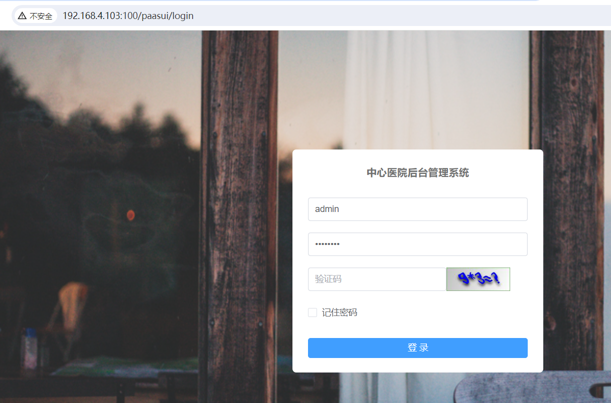
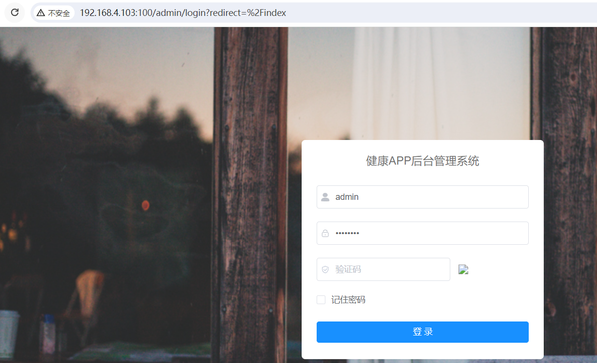

# nginx将vue项目部署在二级目录下

## 需求

将vue项目打包，部署在nginx服务器中的二级目录下，同一个请求地址进入，通过在Url后加不同的路径，打开不同的项目

比如请求地址是：http://192.168.4.103:100，当输入http://192.168.4.103:100，打开dist项目，输入http://192.168.4.103:100/paasui，打开paasui项目，
输入http://192.168.4.103:100/admin，打开admin项目

## 打包项目

### vue-cli脚手架

1、修改vue.config.js中的publicPath

如果项目部署在根目录下，值为"./"

```js
// 公共路径(必须有的)
  publicPath: "./"
```

如果项目部署在二级目录下，值为二级目录名，这里取名admin

```js
publicPath: "/admin/"
```

2、修改vue.config.js中的outputDir

这是打包后的文件名，默认是dist，将其设置为何上面目录名一致，即admin

3、修改router/index.js配置文件，添加base字段，值为二级目录名：admin

这里使用的是vue-router3版本

```js
export default new Router({
  mode: 'history', // 去掉url中的#
  base: 'admin', // 二级目录路径
  routes: constantRoutes
})
```

### vite脚手架

这个项目的二级目录为paasui

1、修改vite.config.js中的base

vite脚手架里publicPath改成了base

```js
base: process.env.NODE_ENV === 'production' ? '/paasui/' : '/'
```

2、修改vite.config.js里的outDir

```js
build:
  outDir: 'paasui' // 指定输出路径
```

3、修改router/index.js配置文件

这里使用的事vue-router4

```js
const router = createRouter({
  history: createWebHistory('/paasui/'),
  routes: constantRoutes
})
```

在createWebHistory/createWebHashHistory里添加二级目录名

## nginx配置

```
server {
        # 监听端口
        listen       100;
        #ip、备案过的域名、localhost
        server_name  192.168.4.103;
        # 请求路由映射，匹配拦截

            location / {
              # 解决history模式下，刷新报错的bug
              try_files $uri $uri/ /index.html;
              # 请求位置
              root E:/nginx-1.22.1/nginxRun/dist;
              # 首页位置
              index  index.html;
            }

            location /paasui {
              # 解决history模式下，刷新报错的bug
              try_files $uri $uri/ /paasui/index.html;
              # 请求位置
              alias E:/nginx-1.22.1/nginxRun/paasui/;
              # 首页位置
              index  index.html;
            }

            location /admin {
              # 解决history模式下，刷新报错的bug
              try_files $uri $uri/ /admin/index.html;
              # 请求位置
              alias E:/nginx-1.22.1/nginxRun/admin/;
              # 首页位置
              index  index.html;
            }
    }
```

::: tip 备注
nginx设置二级目录的时候，第一个用root，后面的用alias，并且文件夹路径最后要有/
:::

启动nginx，

在浏览器输入：http://192.168.4.103:100/passui， 显示的passui项目



在浏览器输入：http://192.168.4.103:100/admin， 显示的admin项目


