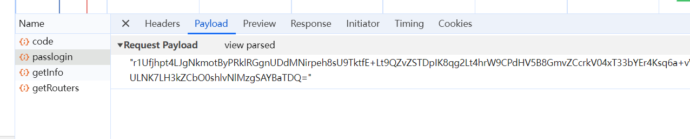

# 对参数使用CryptoJS进行加密，使用axios传递到后端解密报错

## 问题

对参数使用CryptoJS进行加密，传递到后端解密报错

## 原因

axios设置的content-type为application/json;charset=UTF-8，**在传递参数的时候转换成字符串，加密后的参数会在首尾添加双引号**

点击view source查看

## 解决

后端接收到参数，将首尾的双引号去掉后解密

::: tip 备注
axios低版本（0.2版本），content-type为application/json;charset=UTF-8时，传递参数不会在首尾加双引号，现在还不知道为什么
:::
