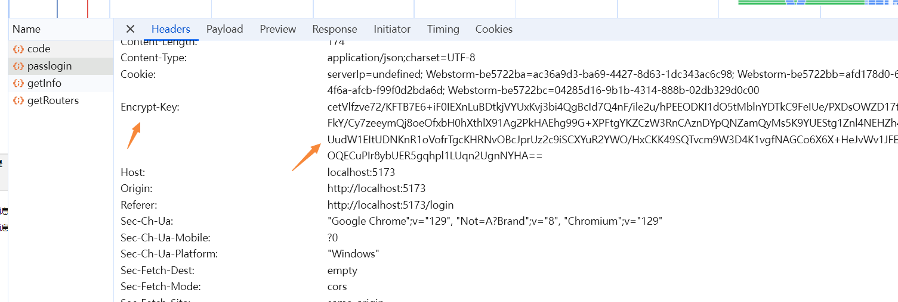
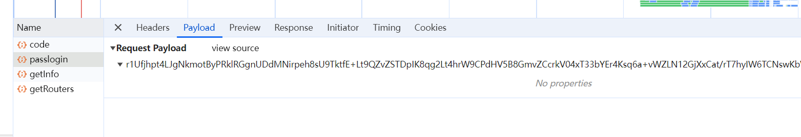

# 使用crypto-js对接口参数进行加密

## 需求

在post请求中，将参数使用crypto-js进行加密，传递给后端

## 实现

1、下载[jsencrypt](https://www.npmjs.com/package/jsencrypt)(基于 RSA 算法,能够对数据进行加密和解密)、[crypto-js](https://www.npmjs.com/package/crypto-js)(加密库，复杂加密用这个)

2、封装jsencrypt.js

```js
import JSEncrypt from 'jsencrypt/bin/jsencrypt.min'

const publicKey = import.meta.env.VITE_APP_RSA_PUBLIC_KEY

const privateKey = import.meta.env.VITE_APP_RSA_PRIVATE_KEY

// 加密
export function encrypt(txt) {
  const encryptor = new JSEncrypt()
  encryptor.setPublicKey(publicKey) // 设置公钥
  return encryptor.encrypt(txt) // 对数据进行加密
}

// 解密
export function decrypt(txt) {
  const encryptor = new JSEncrypt()
  encryptor.setPrivateKey(privateKey) // 设置私钥
  return encryptor.decrypt(txt) // 对数据进行解密
}

```

3、封装crypto.js

```js
import CryptoJS from 'crypto-js'

/**
 * 随机生成32位的字符串
 * @returns {string}
 */
const generateRandomString = () => {
  const characters = 'ABCDEFGHIJKLMNOPQRSTUVWXYZabcdefghijklmnopqrstuvwxyz0123456789'
  let result = ''
  const charactersLength = characters.length
  for (let i = 0; i < 16; i++) {
    result += characters.charAt(Math.floor(Math.random() * charactersLength))
  }
  return result
}

/**
 * 随机生成aes 密钥
 * @returns {string}
 */
export const generateAesKey = () => {
  return CryptoJS.enc.Utf8.parse(generateRandomString())
}

/**
 * 加密base64
 * @returns {string}
 */
export const encryptBase64 = (str) => {
  return CryptoJS.enc.Base64.stringify(str)
}

/**
 * 解密base64
 */
export const decryptBase64 = (str) => {
  return CryptoJS.enc.Base64.parse(str)
}

/**
 * 使用密钥对数据进行加密
 * @param message
 * @param aesKey
 * @returns {string}
 */
export const encryptWithAes = (message, aesKey) => {
  const encrypted = CryptoJS.AES.encrypt(message, aesKey, {
    mode: CryptoJS.mode.ECB,
    padding: CryptoJS.pad.Pkcs7
  })
  return encrypted.toString()
}

/**
 * 使用密钥对数据进行解密
 * @param message
 * @param aesKey
 * @returns {string}
 */
export const decryptWithAes = (message, aesKey) => {
  const decrypted = CryptoJS.AES.decrypt(message, aesKey, {
    mode: CryptoJS.mode.ECB,
    padding: CryptoJS.pad.Pkcs7
  })
  return decrypted.toString(CryptoJS.enc.Utf8)
}
```

4、request.js核心代码

```js
import {encryptBase64, encryptWithAes, generateAesKey} from '@/utils/crypto.js'
import {encrypt} from '@/utils/jsencrypt.js'

const encryptHeader = 'encrypt-key'

service.interceptors.request.use(config => {
  // 是否需要加密
  const isEncrypt = 'true'

  // VITE_APP_ENCRYPT表示是否需要加密
  if (import.meta.env.VITE_APP_ENCRYPT === 'true') {
    // 当开启参数加密
    if (isEncrypt && (config.method === 'post' || config.method === 'put')) {
      // 生成一个 AES 密钥
      const aesKey = generateAesKey()
      // 对秘钥加密，赋值给headers里的encryptHeader
      config.headers[encryptHeader] = encrypt(encryptBase64(aesKey))
      // 对参数进行加密
      config.data = typeof config.data === 'object' ? encryptWithAes(JSON.stringify(config.data), aesKey) : encryptWithAes(config.data, aesKey)
    }
  }
})
```

效果：




