# 博客基于Algolia实现全站搜索功能

## 前言

我的博客是基于[vuepress2](https://v2.vuepress.vuejs.org/zh/)搭建的，内置的搜索只会提取文档的标题（h1、h2、h3）构建搜索索引，搜索的内容不全，所以换成[Algolia DocSearch](https://v2.vuepress.vuejs.org/zh/reference/plugin/docsearch.html)来
实现搜索功能

## Algolia

[Algolia](https://docsearch.algolia.com/)是一个数据库实时搜索服务，能够提供毫秒级的数据库搜索服务，并且其服务能以 API 的形式方便地布局到网页、客户端、APP 等多种场景。

VuePress 的官方文档就是使用的 Algolia 搜索，使用 Algolia 搜索最大的好处就是方便，它会自动爬取网站的页面内容并构建索引，你只用申请一个 Algolia 服务，在网站上添加一些代码，就像添加统计代码一样，然后就可以实现一个全文搜索功能。

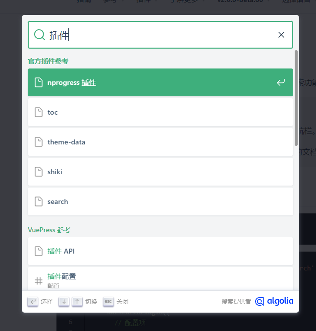

### Algolia DocSearch

[Algolia DocSearch](https://www.algolia.com/developers/code-exchange/frontend-tools/docsearch/) 是 Algolia 提供的自动化的全文搜索服务，DocSearch 会定时爬取指定网站（通常就是我们的文档网站）上的内容，自动构建搜索索引，不需要繁琐的配置，操作简单，用户只需要用相关的 API 直接调用就行了。

### 基本原理

Algolia 服务器会 **定期抓取** 我们指定的 文档地址 中的内容进行分析并 建立索引，这样在网站搜索框中输入关键词后，前端会调用 Algolia DocSearch 的接口并显示搜索结果。这些请求、结果显示的相关逻辑都封装好了，我们要做的就是按要求插入代码、配置好网站样式以及搜索框

### 使用要求

Algolia DocSearch 提供的免费服务是需要申请的，当我们的网站满足下列条件时，Algolia 那边的工作人员才会让我们的申请通过：

* 我们必须是云文档网站的 所有者，网站必须是 公开的。

* 网站内容必须是 开源项目的技术文档 或 技术博客。

* 网站申请服务时必须有 完整稳定的设计和内容，即确认网站做好生产准备。

## 配置Algolia DocSearch步骤

### 申请Algolia DocSearch服务

前往[Algolia DocSearch Apply](https://docsearch.algolia.com/apply/)，填写网址、邮箱、代码仓库信息，然后申请

::: tip 备注
这里填写的网站地址必须是公开的、且设计完整、内容稳定。如果网站还处于测试阶段，申请通过的概率很小。
:::

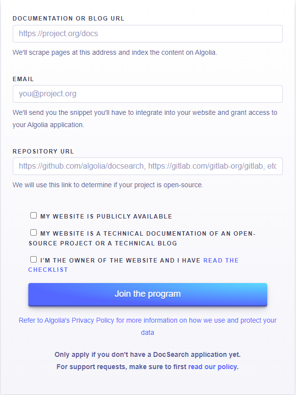

### 回复确认邮件

申请通过后，Algolia DocSearch 官方会发送确认邮件到上一个步骤中填写的邮箱，收到后需要回复一下这个网站是我们负责开发维护的，并且可以修改网站代码。

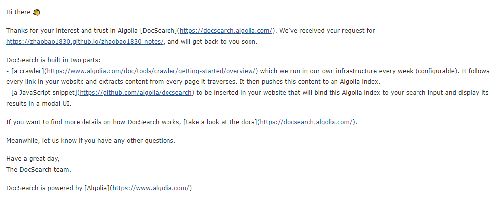

回复邮件内容：

```
Thanks!

I am the maintatiner of the website, I can modify the code.
```

### 接收邮件并配置

通过确认后，Algolia DocSearch 会再发一封使用邮件，其中包含 appId、apiKey 和 indexName，用于在网站生成框架中配置使用。

::: tip 备注
每次新创建Crawler，会生成新的apiKey，配置代码的时候，请确定好apiKey是哪个，不一定是邮件里发的
:::

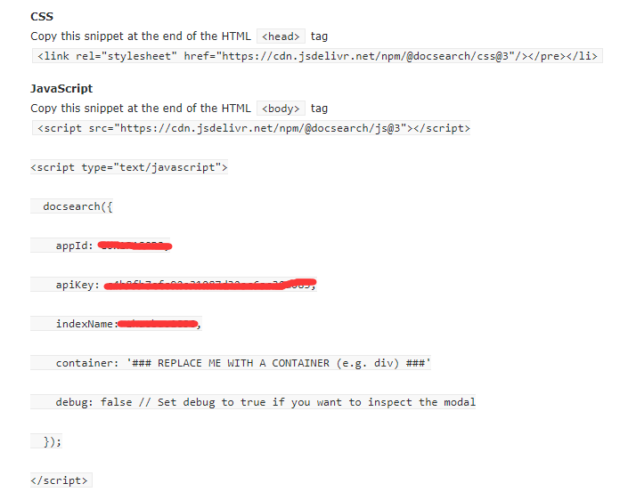

该邮件还会提供接受邀请的链接，前往该链接重新设置密码后（账号是申请时填的邮箱），即可登录 [Algolia](https://www.algolia.com/)。

配置代码：

./vuepress/config.ts

```ts
import { docsearchPlugin } from '@vuepress/plugin-docsearch'

plugins: [
  docsearchPlugin({
    appId: '自己的appId',
    apiKey: '自己的apiKye',
    indexName: '自己的xindexName',
    locales: {
      '/': {
        placeholder: '搜索',
        translations: {
          button: {
            buttonText: '搜索',
            buttonAriaLabel: '搜索'
          },
          modal: {
            searchBox: {
              resetButtonTitle: '清除查询条件',
              resetButtonAriaLabel: '清除查询条件',
              cancelButtonText: '取消',
              cancelButtonAriaLabel: '取消'
            },
            startScreen: {
              recentSearchesTitle: '搜索历史',
              noRecentSearchesText: '没有搜索历史',
              saveRecentSearchButtonTitle: '保存至搜索历史',
              removeRecentSearchButtonTitle: '从搜索历史中移除',
              favoriteSearchesTitle: '收藏',
              removeFavoriteSearchButtonTitle: '从收藏中移除'
            },
            errorScreen: {
              titleText: '无法获取结果',
              helpText: '你可能需要检查你的网络连接'
            },
            footer: {
              selectText: '选择',
              navigateText: '切换',
              closeText: '关闭',
              searchByText: '搜索提供者'
            },
            noResultsScreen: {
              noResultsText: '无法找到相关结果',
              suggestedQueryText: '你可以尝试查询',
              reportMissingResultsText: '你认为该查询应该有结果？',
              reportMissingResultsLinkText: '点击反馈'
            }
          }
        }
      }
    }
  })
]
```


## 后台管理数据

申请 Algolia DocSearch 成功后，我们可以前往 [Algolia](https://www.algolia.com/) 管理自己的后台数据。

一、登陆账户，点击右上角的“[Dashboard](https://www.algolia.com/dashboard)” 按钮前往后台

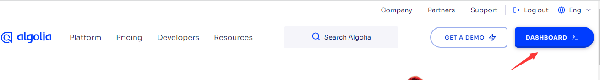

二、点击左侧列表里的"Search"，可以查看对应的 “indexName” 数据，如果 “Browse” 里面没有显示数据，那么说明 DocSearch 的爬虫有点问题，导致没有生成对应的 Records：

三、前往[Algolia 的爬虫后台](https://crawler.algolia.com/admin/crawlers)，点击右侧的Carwlers列表中对应的Carwler

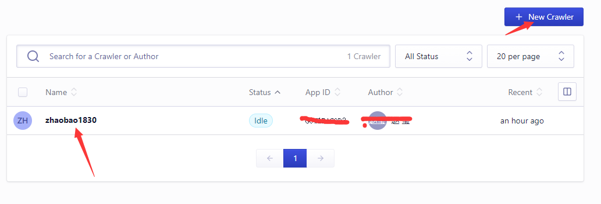

::: tip 备注
可以创建新的crawler
:::
四、如果Records为0，说明爬虫配置有问题，可以点击左侧的Editor进行修改

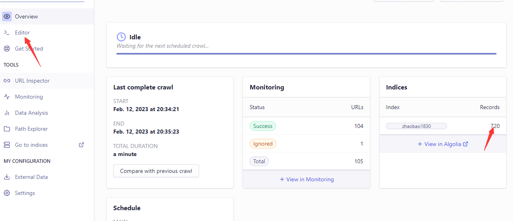

五、修改Editor里的配置，修改完后点击右侧的URL Tester进行测试

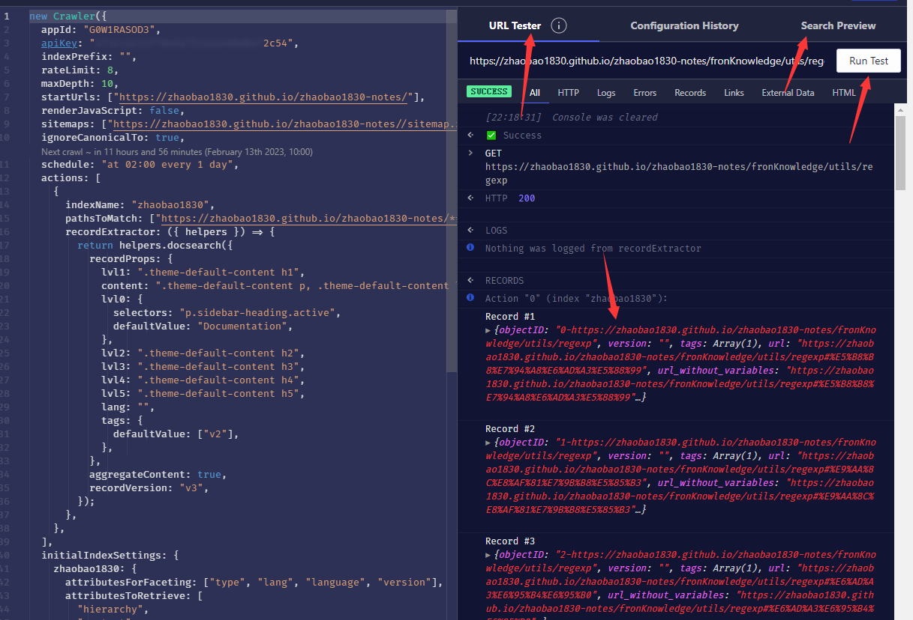

如果出现右侧的Record列表，说明配置正确；

还可以点击Search Preview进行测试

测试通过后点击右上角的save

六、更新抓取的数据

Overview页面点击右上角的Restart crawling按钮重新抓取数据，Records不为0，说明成功，这是打开自己的网站，搜索应该是成功的

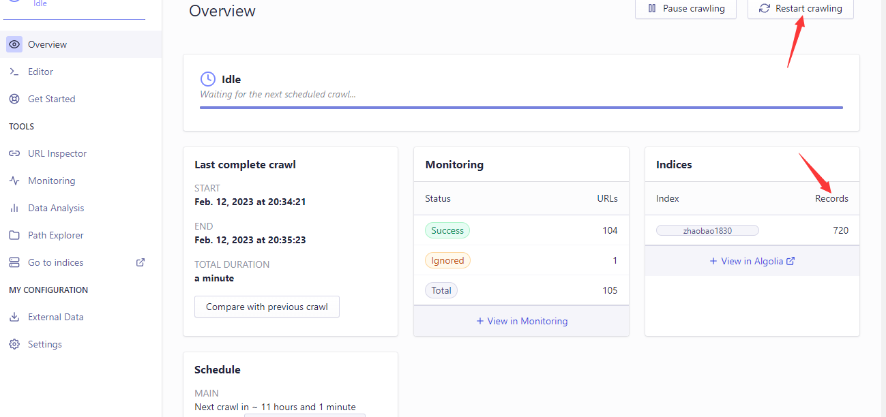

## 问题集

一、docsearch插件安装失败

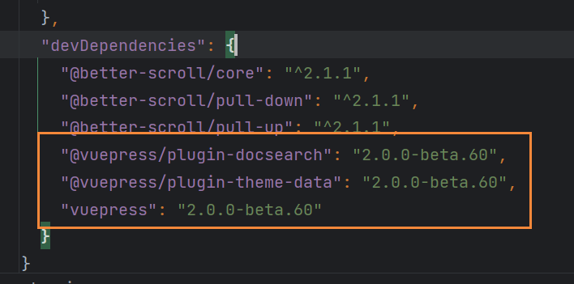

原因：版本不一致

将vuepress、docsearch、theme-data插件都设定为2.0.0-beta.60版本

二、在Editor和Settings页面修改api key失败

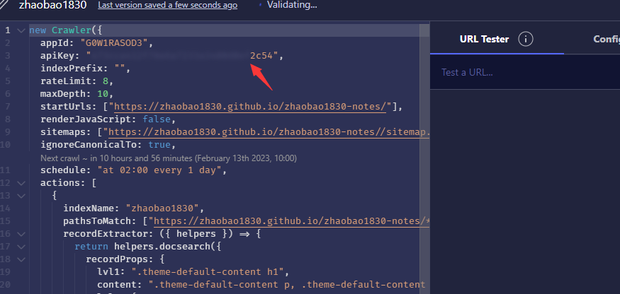

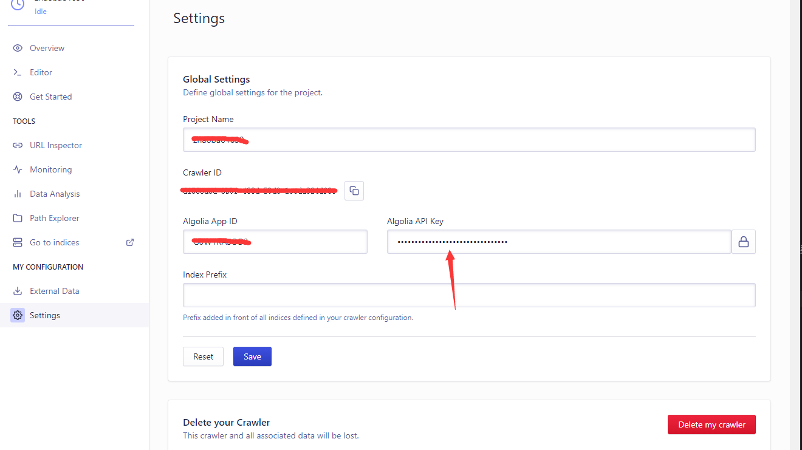

原因：api key是创建Crawler时生成的，不能修改

三、Records为0

原因：爬虫配置有问题

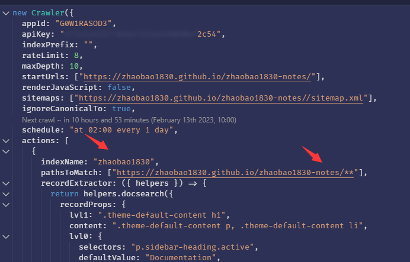

1、indexName配置不对，可以去Settings页面查看，indexName和Project Name是一致的

2、pathsToMatch里会在网址名后加docs，把docs去掉

```ts
pathsToMatch: ["https://zhaobao1830.github.io/zhaobao1830-notes/docs/**"]
```

四、在爬虫管理平台测试成功，但网站里搜索还是没有结果

原因：f12，查看indexName是否一致，有可能配置了Index Prefix（在Settings页面查看和修改），查询的时候indexName是其他的值

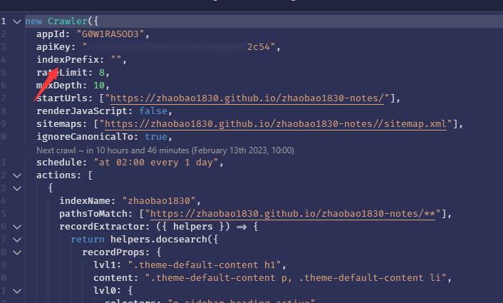


