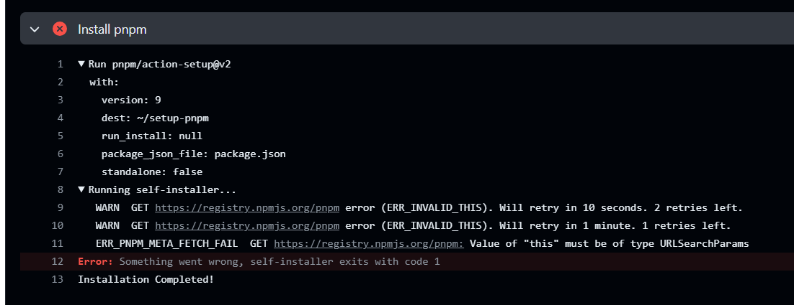

# 项目在github上自动部署，执行Install pnpm报错

## 问题：

在使用github actions部署博客时，突然出现以下报错：



## 解决：

1、查看docs.yml里pnpm和node的配置

```
      # 安装 pnpm
      - name: Install pnpm
        uses: pnpm/action-setup@v2
        with:
          version: 8

      # 设置 node 版本
      - name: Set node version to 18
        uses: actions/setup-node@v3
        with:
          node-version: 18
          cache: 'pnpm'
```

可以看到pnpm版本是8，node版本是18

2、将pnpm版本升到9，node版本升到20，测试发现还是报错

3、在github上的pnpm的[Issues](https://github.com/pnpm/action-setup/issues/135#issuecomment-2206861174)里找到解决办法

将`pnpm/action-setup@v2`改为`pnpm/action-setup@v4`成功解决问题

```
      # 安装 pnpm
      - name: Install pnpm
        uses: pnpm/action-setup@v4
        with:
          version: 9

      # 设置 node 版本
      - name: Set node version to 18
        uses: actions/setup-node@v3
        with:
          node-version: 18
          cache: 'pnpm'
```
