# 微信公众号网页授权：获取用户openid和基本信息

## 相关文档

[网页授权微信文档地址](https://developers.weixin.qq.com/doc/offiaccount/OA_Web_Apps/Wechat_webpage_authorization.html)

[微信开放文档-调试微信网页授权](https://developers.weixin.qq.com/doc/offiaccount/OA_Web_Apps/Web_Developer_Tools.html#%E8%B0%83%E8%AF%95%E5%BE%AE%E4%BF%A1%E7%BD%91%E9%A1%B5%E6%8E%88%E6%9D%83)

参考地址：[https://blog.csdn.net/snowball_li/article/details/121152187](https://blog.csdn.net/snowball_li/article/details/121152187)

## 需求

使用Vue开发微信公众号项目，需要实现微信公众号授权功能（用户手动同意），并获取用户的基本信息

## 前置准备

在公众号管理平台进行操作

1、接口配置信息

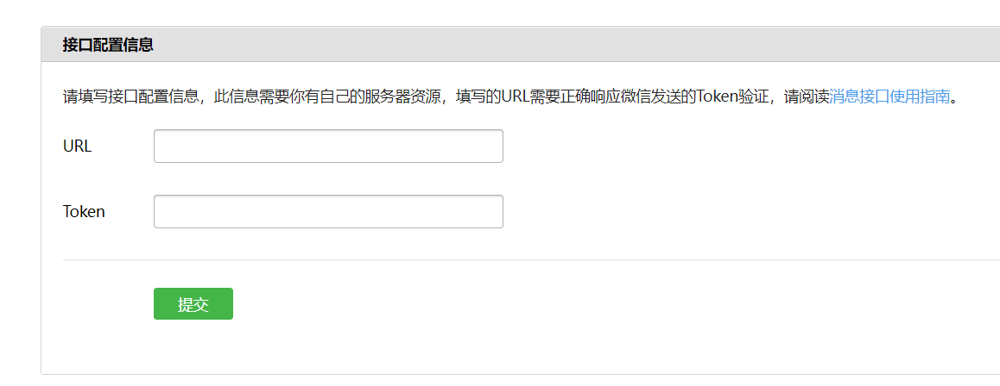

2、JS接口安全域名

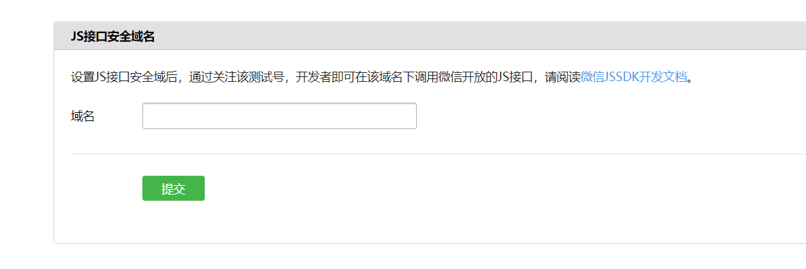

3、授权回调域名

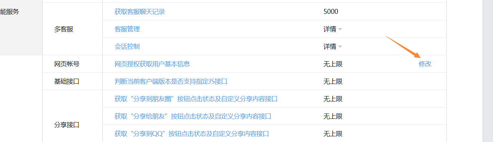

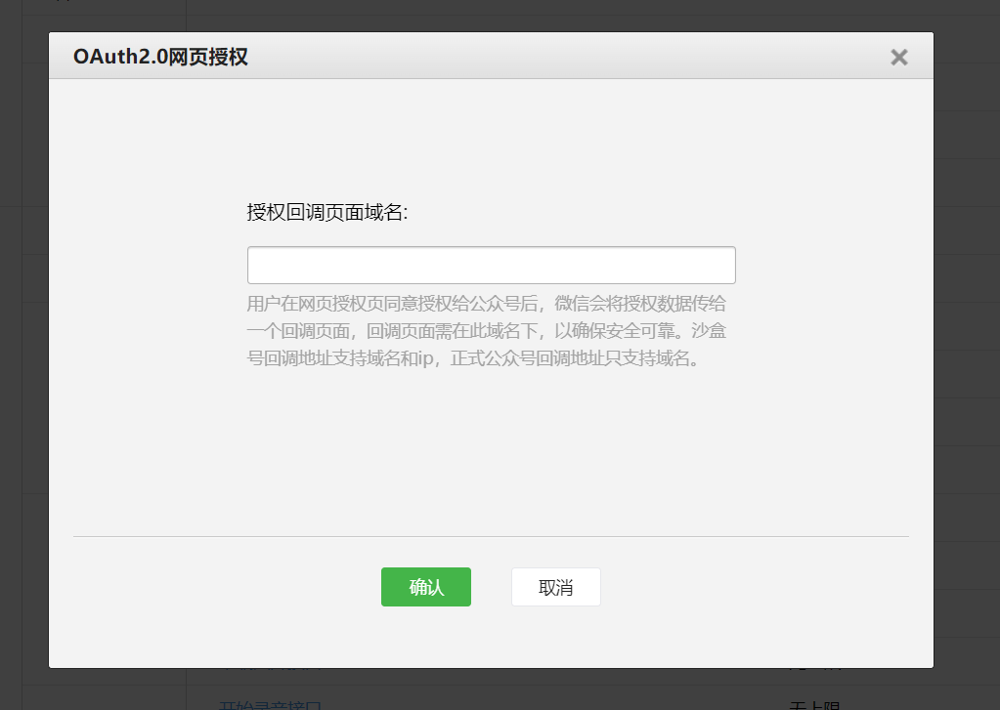

::: tip 备注
这里面填写的回调域名，就是授权时候，请求微信接口里redirect_uri的值
:::

## 网页授权

通过微信公众号网页授权获取微信可提供的相关的用户信息，包括openid、昵称、unionid等，供实现业务逻辑

网页授权分为；静默授权和非静默授权

静默授权：以snsapi_base为scope发起的网页授权，无感知的

非静默授权：以snsapi_userinfo为scope发起的网页授权，需要用户手动同意

::: tip 备注
对于已关注公众号的用户，如果用户从公众号的会话或者自定义菜单进入本公众号的网页授权页，即使是scope为snsapi_userinfo，也是静默授权，用户无感知。
:::

## 网页授权流程

分为四步：

1、引导用户进入授权页面同意授权，获取code

2、通过code换取网页授权access_token（与基础支持中的access_token不同）

3、如果需要，开发者可以刷新网页授权access_token，避免过期

4、通过网页授权access_token和openid获取用户基本信息（支持UnionID机制）

## 开发记录

项目环境：vue3 + vite

### 判断是否是微信环境

```js
// 判断是否是微信环境
const isWechat = ()=> {
    return String(navigator.userAgent.toLowerCase().match(/MicroMessenger/i)) === "micromessenger";
}
```

### 用户授权方法

```js
 function userAuthorization() {
    window.location.href = 'https://open.weixin.qq.com/connect/oauth2/authorize?appid=wx4250eeefa5931c46&redirect_uri=http%3A%2F%2F18483629676.gnway.cc%2Findex.html%23%2Fhome&response_type=code&scope=snsapi_userinfo&state=STATE#wechat_redirect'
  }
```

::: tip 备注
在页面里调用userAuthorization方法，会打开微信自带的授权页面

点击同意后，会跳回倒redirect_uri配置的地址，该地址需要用urlEncode处理
:::

### 获取url里的code参数

```js
  function getQueryString(name) {
    let paramsObj = {}
    let url = decodeURIComponent(window.location.search || window.location.hash)
    let strs
    if (url.indexOf('?') !== -1) {
      // hash模式进此判断
      if (window.location.hash) {
        strs = url.split('?')[1].toString().split('&')
        // history模式
      } else {
        strs = url.substr(1).split('&')
      }
      // 循环遍历并添加到对象中
      for (let i = 0; i < strs.length; i++) {
        paramsObj[strs[i].split('=')[0]] = strs[i].split('=')[1]
      }
    }
    return paramsObj[name]
  }
```

### code换取用户信息

将url中的code值传递给后端，在后端调用相应方法，换取access_token，再通过access_token换取用户的信息，并返回给前端

这部分操作可以看[官方文档](https://developers.weixin.qq.com/doc/offiaccount/OA_Web_Apps/Wechat_webpage_authorization.html#%E7%9B%AE%E5%BD%95)

Java调用微信提供的方法，可以使用httpclient，也可以使用微信官方封装的jdk（本质是对httpclient的二次封装）

### 授权图示

首次授权

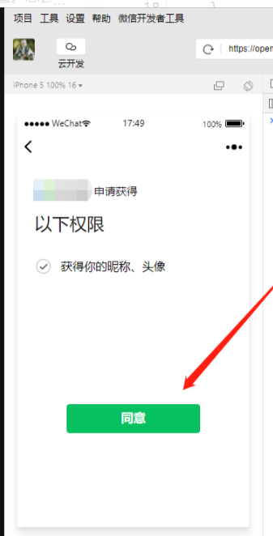

近期已授权，再次登录的时候，不用再点击授权

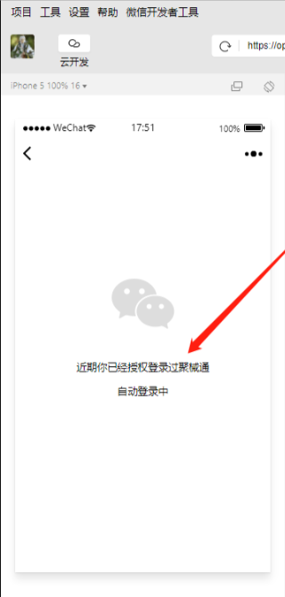

## 开发遇到的问题

### 未绑定未公众号的开发者

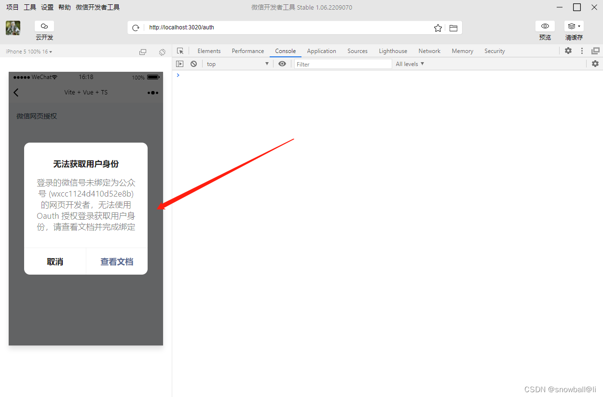

解决办法：

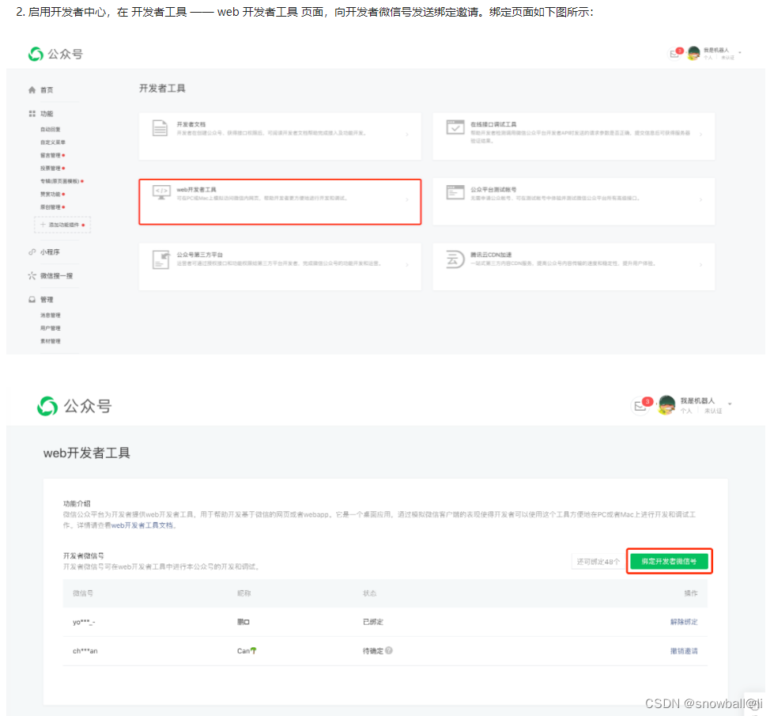

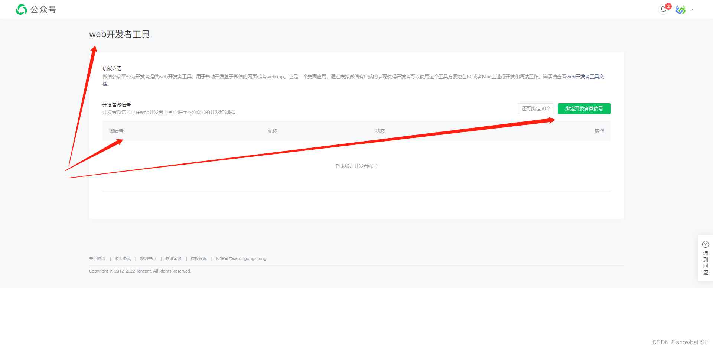

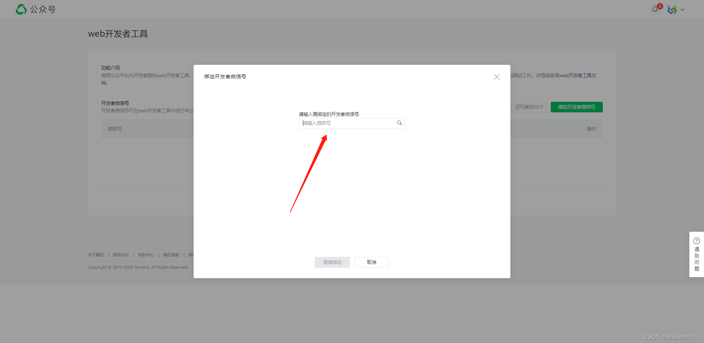

### 未开启微信公众号接收功能

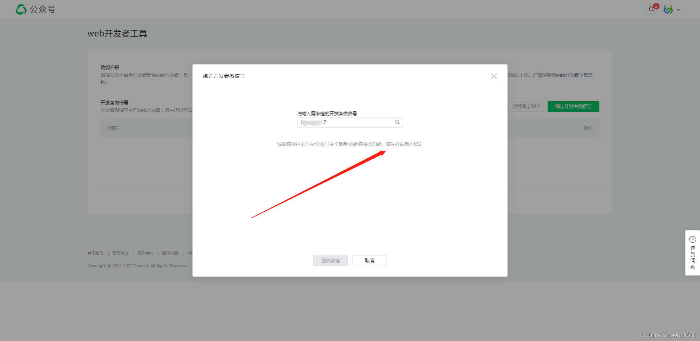

解决办法：

1、手机微信找到“公众平台安全助手”，点击右上角的icon

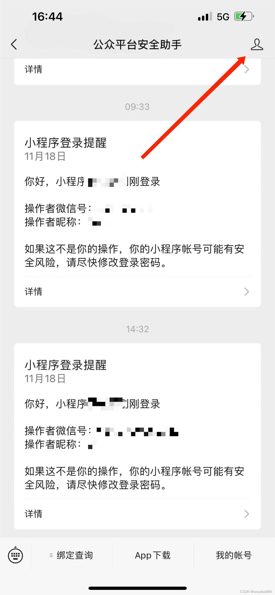

2、点击右上角icon

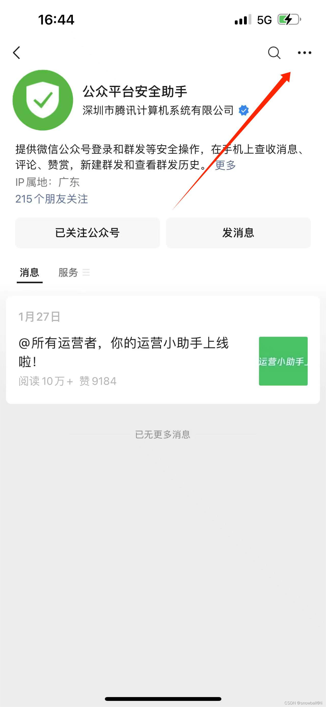

3、点击设置

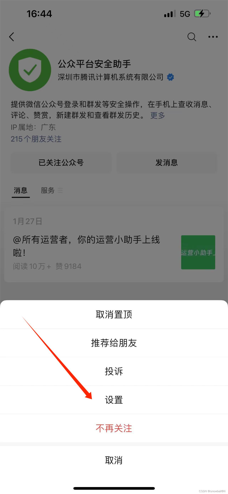

4、关闭消息免打扰、接收消息推送

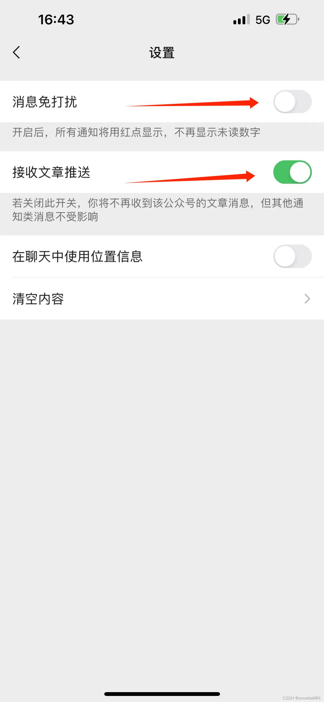

5、绑定后再次操作

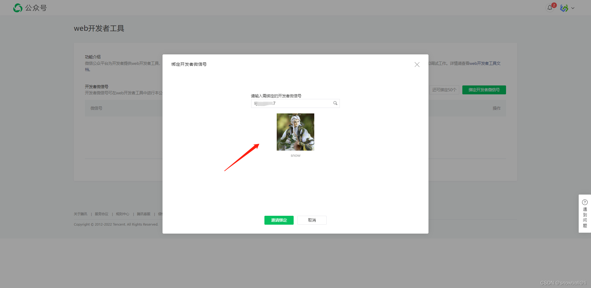

6、邀请后手机收到推送消息

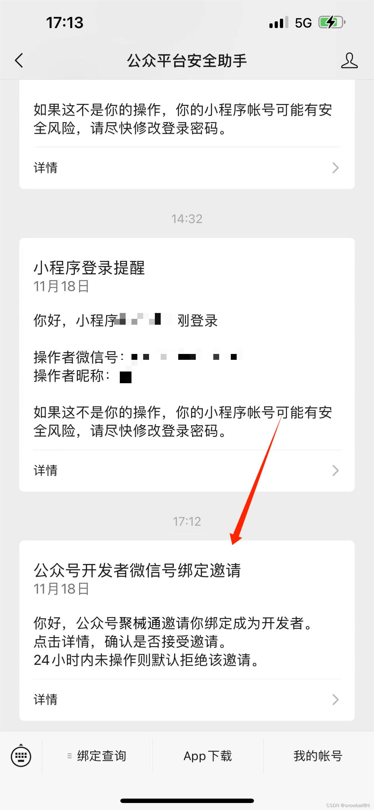

7、点击，绑定公众号开发者成功

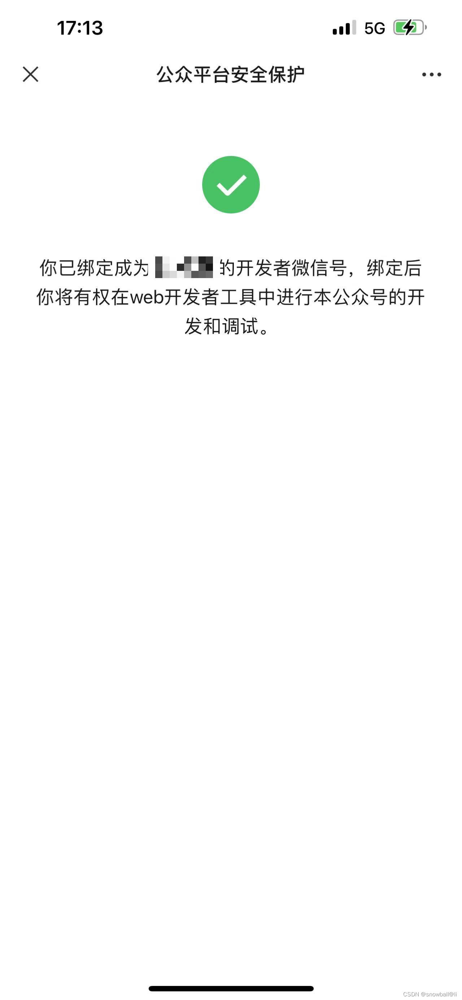

