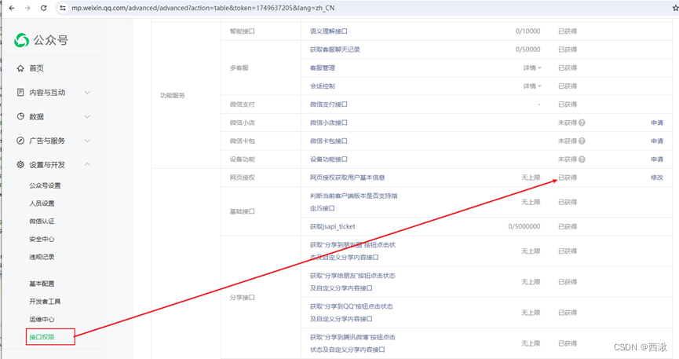

# 微信公众号--JSAPI支付

官网地址：[https://pay.weixin.qq.com/docs/merchant/apis/jsapi-payment/direct-jsons/jsapi-prepay.html](https://pay.weixin.qq.com/docs/merchant/apis/jsapi-payment/direct-jsons/jsapi-prepay.html)

参考网站：[https://blog.csdn.net/qq_43890604/article/details/136938311](https://blog.csdn.net/qq_43890604/article/details/136938311)

## 微信公众号配置

官网地址：[https://mp.weixin.qq.com/cgi-bin/home](https://mp.weixin.qq.com/cgi-bin/home)

### 开通网页授权域名



### 暴露网络授权域名


### 获取基本配置中的AppID、AppSecret


### 微信支付关联商户号


## 微信支付配置

官网地址：[https://pay.weixin.qq.com/](https://pay.weixin.qq.com/)

### 配置API证书 获取证书序列号


### 获取正式序列号


### 设置APIV3秘钥


### 产品中心—开通JSAPI支付


### 添加支付域名配置


### 暴露域名


### AppId账号设置-商户关联公众号


## 程序配置

必要配置信息：
公众号appId
公众号appSecret
商户id
证书序列号
商户API秘钥

### 配置yml文件


### 微信支付平台下载的秘钥证书放入项目resources目录下


## 相关代码

### 引入相关js


### JSAPI下单

后端调用微信提供的接口，生成预支付交易单

### JSAPI调起支付

前端调用微信提供的方法，调起微信支付

```js
// 统一支付方法
  function callPay(data) {
    if (typeof WeixinJSBridge == 'undefined') {
      if (document.addEventListener) {
        document.addEventListener('WeixinJSBridgeReady', onBridgeReady(data), false)
      } else if (document.attachEvent) {
        document.attachEvent('WeixinJSBridgeReady', onBridgeReady(data))
        document.attachEvent('onWeixinJSBridgeReady', onBridgeReady(data))
      }
    } else {
      onBridgeReady(data)
    }
  }

function onBridgeReady(data) {
  /* eslint-disable */
  WeixinJSBridge.invoke('getBrandWCPayRequest', {
      'appId': data.appId,     //公众号ID，由商户传入
      'timeStamp': data.timeStamp,     //时间戳，自1970年以来的秒数
      'nonceStr': data.nonceStr,      //随机串
      'package': data.packageVal,
      'signType': data.signType,     //微信签名方式：
      'paySign': data.paySign //微信签名
    },
    function(res) {
      if (res.err_msg === 'get_brand_wcpay_request:ok') {
        showToast('支付成功!')
      } else if (res.err_msg === 'get_brand_wcpay_request:cancel') {
        showToast('支付过程中用户取消!')
      } else if (res.err_msg === 'get_brand_wcpay_request:fail') {
        showToast('支付失败!')
      }
    })
}
```

## 开发遇到的问题

### 没有调起支付页面

点击支付没有反应

解决办法：

1、微信提供的支付必须在微信环境下，如果不是在微信环境下，不会调起支付

2、查看参数是否有问题，如果调起支付的接口参数传递错误，也不会调起支付
